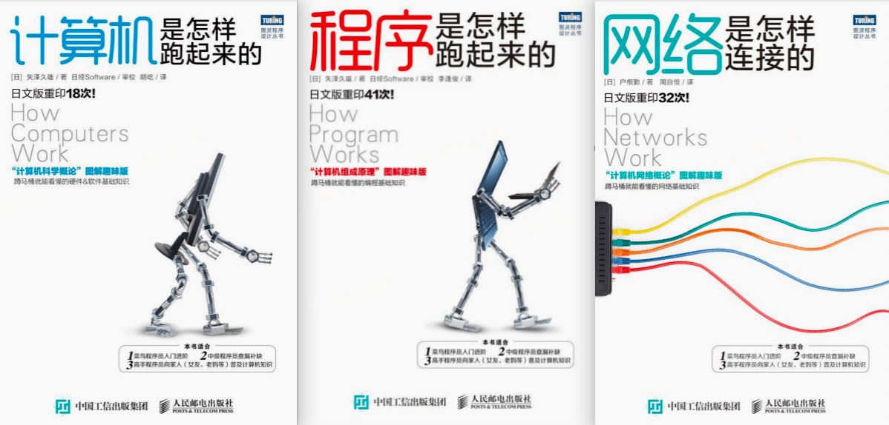

学习了三本书，以下是学习总结

# 计算机是怎样跑起来的

## 计算机的三大原则

### 三大原则

1. 计算机是个执行输入、计算、输出的机器
2. 程序是指令和数据的集合
3. 计算机的处理方式有时和人们的思维习惯不同

### 计算机不断进步接近人类

​	编程方法也在进化，进化的成果是诞生了两种编程方法，面向组件编程（Component Based Programming）和面向对象编程（Object Oriented Programming）。这两者的进化目标一致，都是使程序员可以在编程中继续沿用人类创造事物时的方法。面向组件编程的方法是通过将组件（程序的零件）组装到一起完成程序；面向对象编程的方法是先如实地对现实世界的业务建模，之后再把模型搬到程序中。使用符合人类思维习惯的编程方法，可以实现高效率的开发。

## 制造一台微机

## 算法

## 数据结构

# 程序是怎样跑起来的

# 网络是怎样连接的

