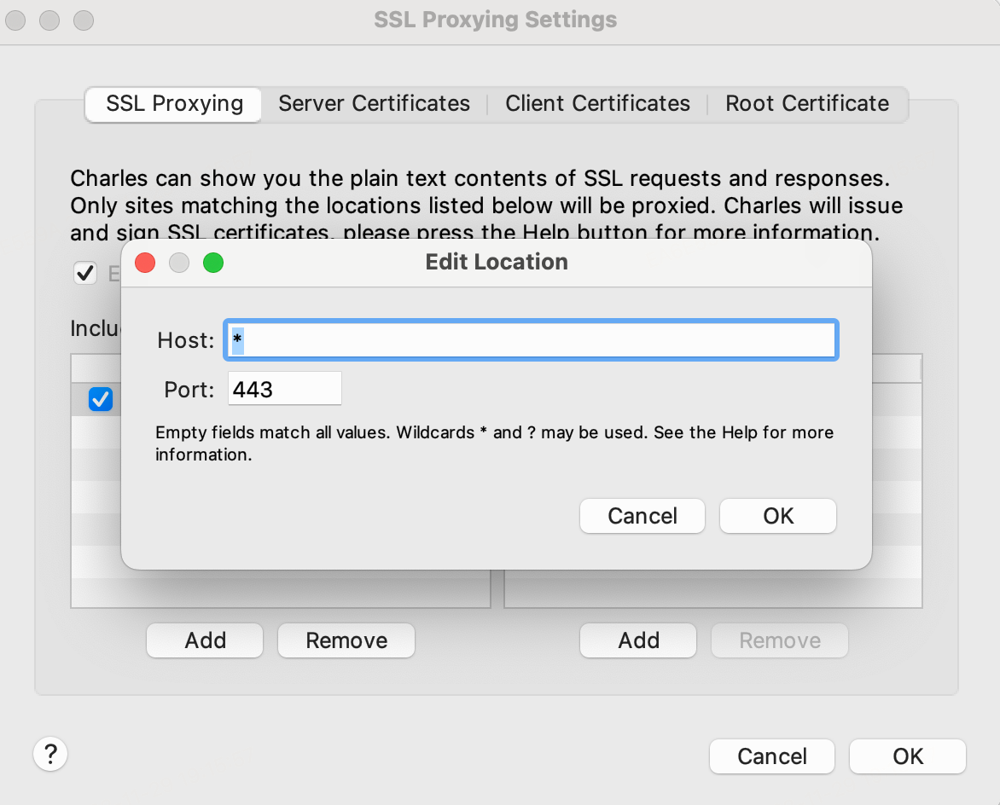
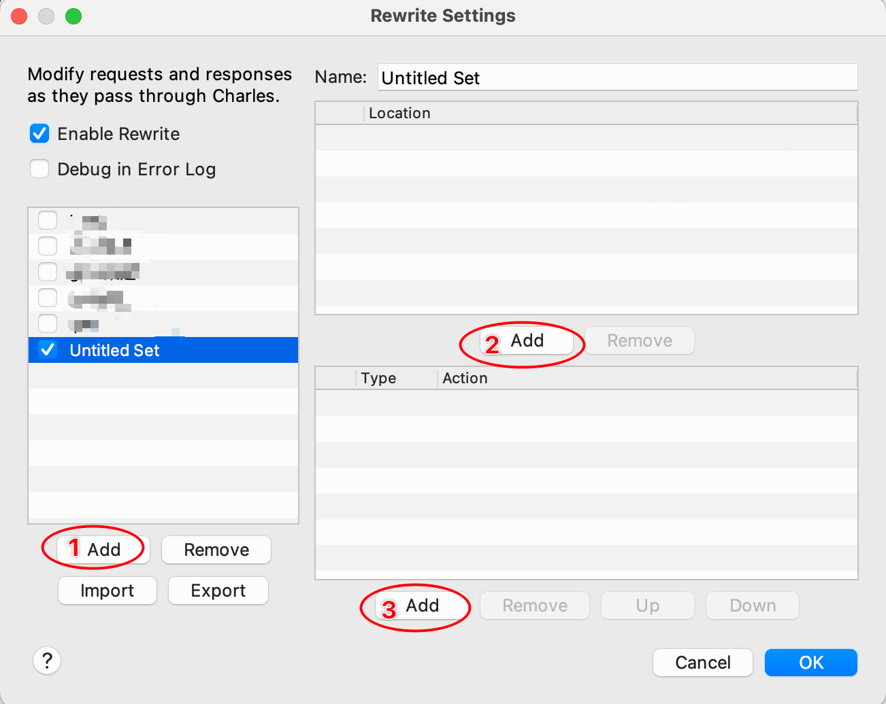
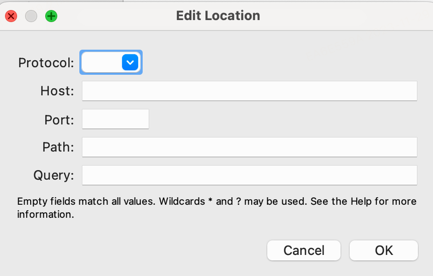
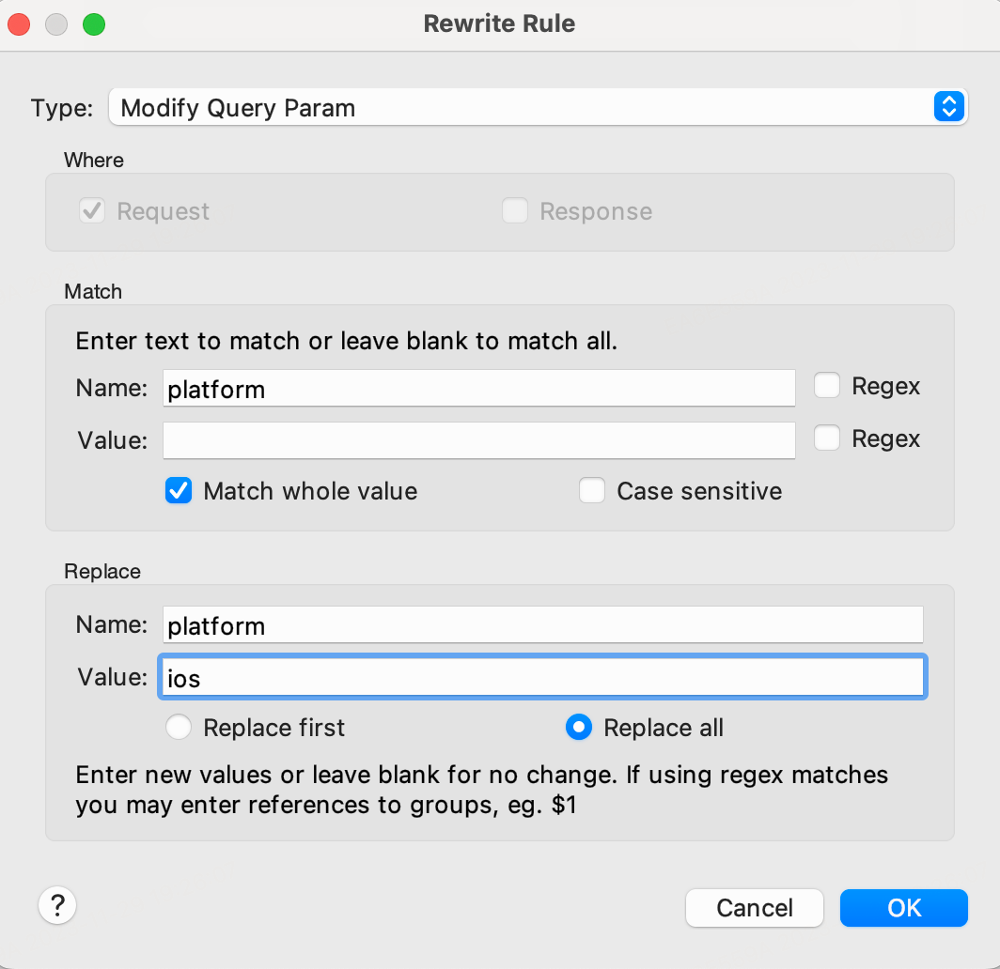
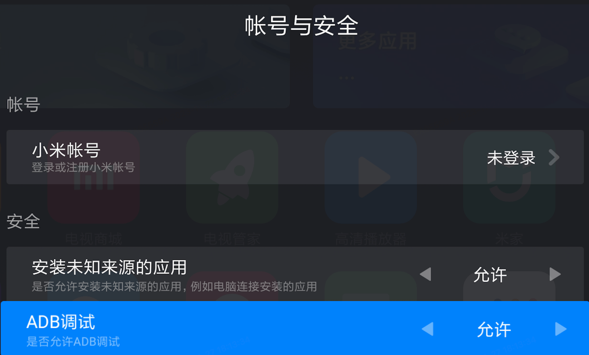

* TOC
{:toc}

## charles

### 安装charles

[charles官网](https://www.charlesproxy.com/)

### charles配置


### 如何抓取https请求

 `Proxy/SSL Proxying Settings`



### rewrite

修改或重写网络请求的入参

`Tools/Rewrite`



1. 新增一个配置

2. Edit Location

   直接确认对所有Host、Port、Path都生效

   

3. Rewrite Rule

可以对Header、Host、Path、URL、Query Param等进行增删改操作，用户调试后端接口

- Add Header
- Modify Header
- Remove Header
- Host
- Path
- URL
- Add Query Param
- Modify Query Param
- Remove Query Param
- Response Status
- Body

比如下面的配置可以将接口query入参的platform字段都改成ios：



### remote

`Tools/Map Local`

用本地的json文件mock接口返回值，用于调试客户端功能


## 手机抓包


## 电视抓包

首先在电视上开启adb调试功能，不同型号的电视开启方式不同

- 天猫魔盒不支持

- 小米盒子在设置-关于-产品型号 按ok键五次，然后设置-账号与安全中，在安全-ADB调试选择允许

  

  然后在mac上通过adb调试电视实现抓包功能


## adb

### mac安装adb


```sh
brew install --cask android-platform-tools
```

### adb命令

- 连接设备安装app

```sh
// 连接盒子
adb connect 盒子ip

// 测试是否连接
adb devices

// 安装软件
adb install  xx.apk

// 覆盖原版本的安装
adb install -r xx.apk
```

- 设置代理抓包

  设置代理

```sh
adb shell settings put global http_proxy 电脑IP:8888
```

​	移除代理

```sh
adb shell settings delete global http_proxy
adb shell settings delete global global_http_proxy_host
adb shell settings delete global global_http_proxy_port
adb reboot 
```

可以在终端设置如下alias

```sh
alias adb-proxy='adb shell settings put global http_proxy'
alias adb-unproxy='tvunproxy(){adb shell settings delete global http_proxy;adb shell settings delete global global_http_proxy_host;adb shell settings delete global global_http_proxy_port;adb reboot;};tvunproxy'
```

然后执行 `adb-proxy ip:8888`设置代理，执行`adb-unproxy`移除代理

- 截图发到电脑

```sh
adb shell screencap -p /sdcard/01.png

adb pull /sdcard/01.png ~/Downloads
```

同样可以设置alias

```sh
alias adb-cap="adb shell screencap -p /sdcard/01.png && adb pull /sdcard/01.png ~/Downloads"
```


### Q&A

- device offline 怎么解决

1.重启adb服务

```sh
adb kill-server

adb start-server
```


2.盒子设置里先关闭adb 再重新开启 

```sh
adb reconnect offline
```

- more than one device/emulator

把模拟器关掉

