* TOC
{:toc}

> [高并发系统设计](https://time.geekbang.org/column/intro/100035801?tab=catalog)课堂笔记

以一个商城系统为例

最简单的架构：前端一台 Web 服务器运行业务代码，后端一台数据库服务器存储业务数据

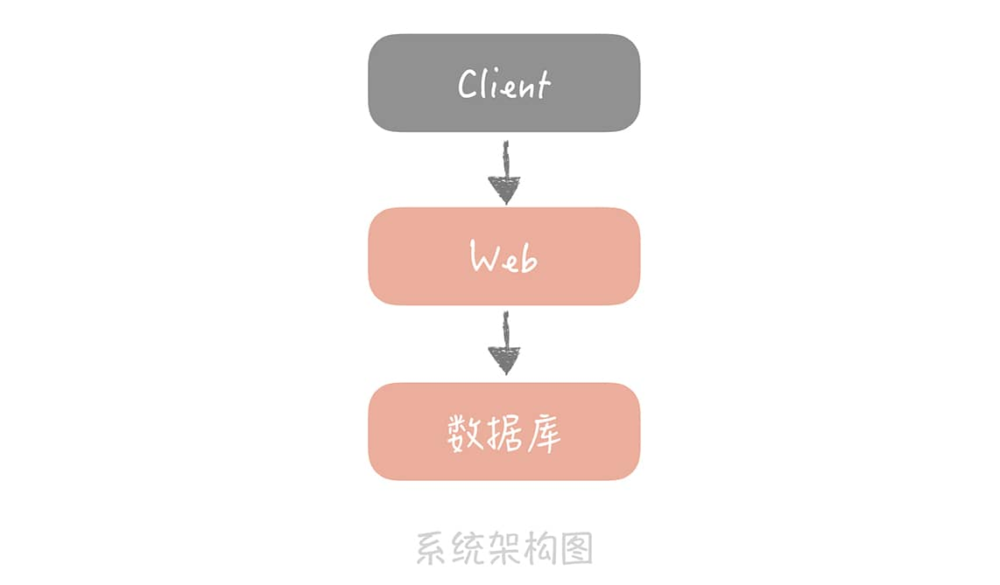

运营同学做了一次全网的流量推广。这一推广很快带来了一大波流量，但这时，系统的访问速度开始变慢。分析程序的日志之后，你发现系统慢的原因出现在和数据库的交互上。因为你们数据库的调用方式是先获取数据库的连接，然后依靠这条连接从数据库中查询数据，最后关闭连接释放数据库资源。这种调用方式下，每次执行 SQL 都需要重新建立连接，所以你怀疑，是不是频繁地建立数据库连接耗费时间长导致了访问慢的问题。

## 连接池

为了解决这个问题，采用了数据库连接池

这是一种常见的软件设计思想，叫做池化技术，它的核心思想是空间换时间，期望使用预先创建好的对象来减少频繁创建对象的性能开销，同时还可以对对象进行统一的管理，降低了对象的使用的成本，总之是好处多多。

现在的架构图如下：

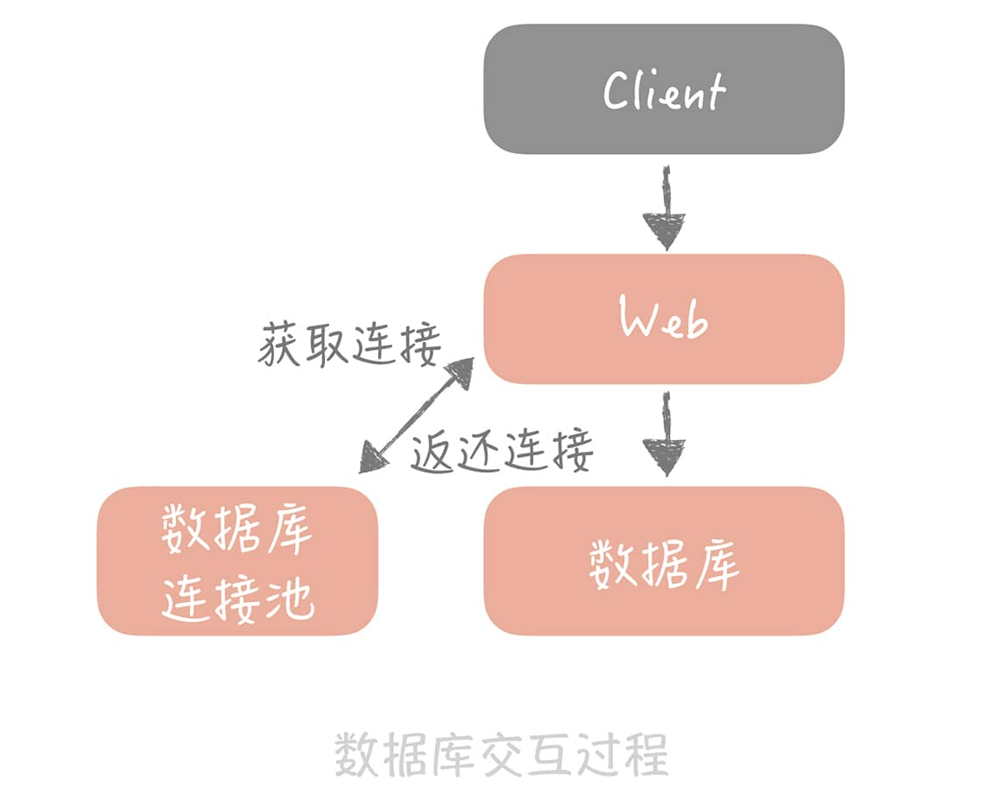

## 主从复制

我们优先考虑数据库如何抵抗更高的查询请求，那么首先你需要把读写流量区分开，因为这样才方便针对读流量做单独的扩展，这就是我们所说的主从读写分离。通过主从分离和一主多从部署抵抗增加的数据库流量。

1. 主从读写分离以及部署一主多从可以解决突发的数据库读流量，是一种数据库横向扩展的方法；2. 读写分离后，主从的延迟是一个关键的监控指标，可能会造成写入数据之后立刻读的时候读取不到的情况；3. 业界有很多的方案可以屏蔽主从分离之后数据库访问的细节，让开发人员像是访问单一数据库一样，包括有像 TDDL、Sharding-JDBC 这样的嵌入应用内部的方案，也有像 Mycat 这样的独立部署的代理方案。

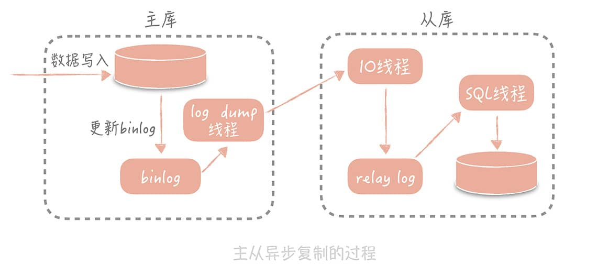

数据库代理

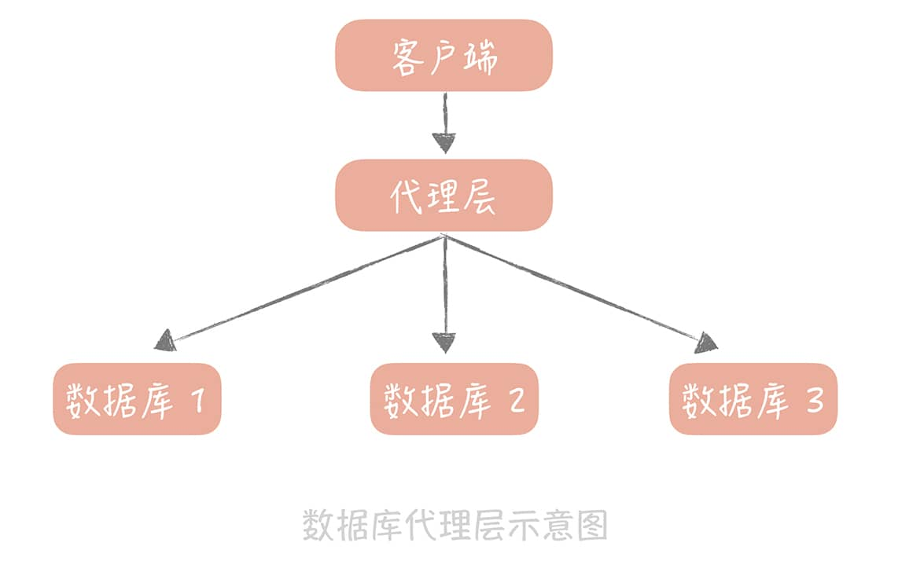

主从分离后，架构为：

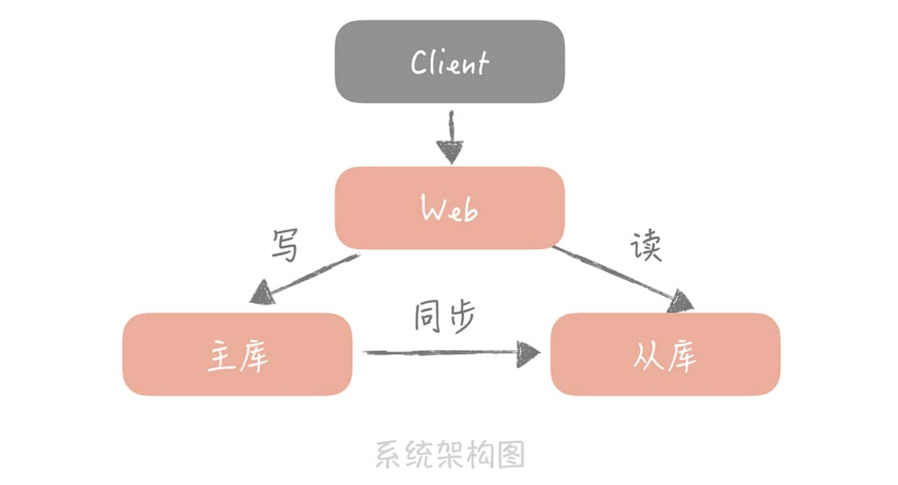

## 分库分表

订单量突破5kw

- 如何提升查询性能呢？
- 如何让数据库系统支持如此大的数据量呢？
- 如何做到不同模块的故障隔离呢？
- 如何来处理更高的并发写入请求呢？

要解决这些问题，你所采取的措施就是对数据进行分片。这样可以很好地分摊数据库的读写压力，也可以突破单机的存储瓶颈，而常见的一种方式是对数据库做“分库分表”。

数据库分库分表的方式有两种：一种是垂直拆分，另一种是水平拆分。

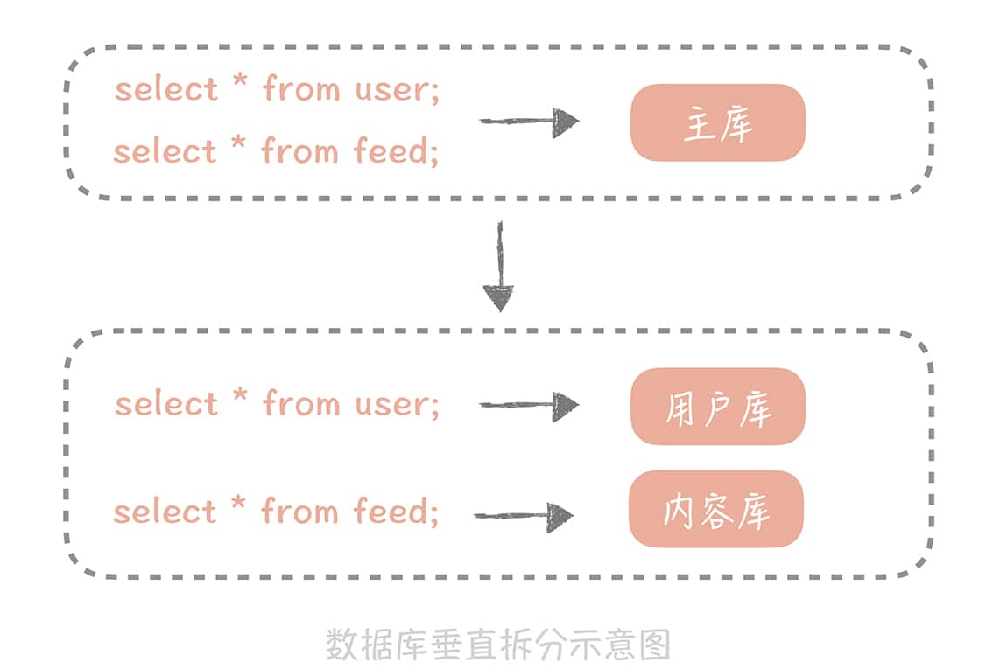

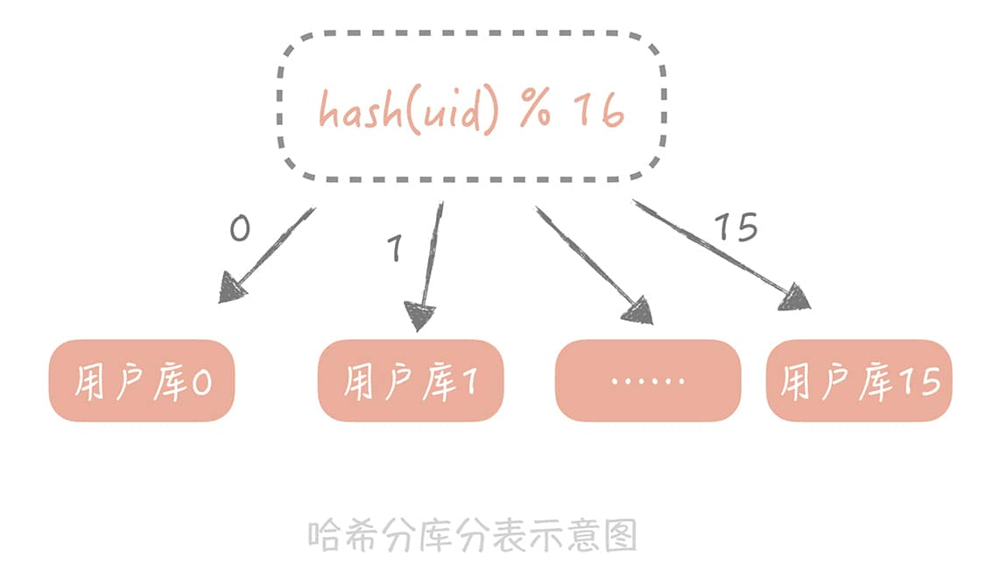

架构为：

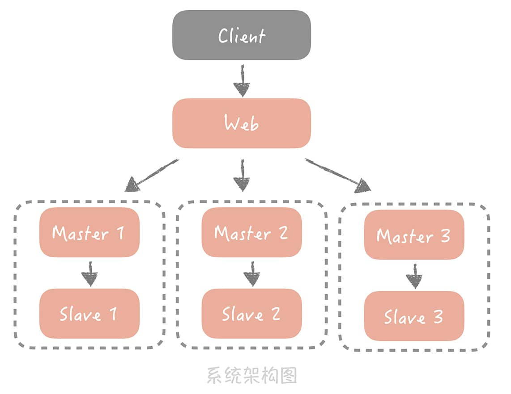

## 发号器

搭建发号器服务来生成全局唯一的 ID

twitter 提出的 Snowflake 算法完全可以弥补 UUID 存在的不足，因为它不仅算法简单易实现，也满足 ID 所需要的全局唯一性，单调递增性，还包含一定的业务上的意义。Snowflake 的核心思想是将 64bit 的二进制数字分成若干部分，每一部分都存储有特定含义的数据，比如说时间戳、机器 ID、序列号等等，最终生成全局唯一的有序 ID。它的标准算法是这样的：

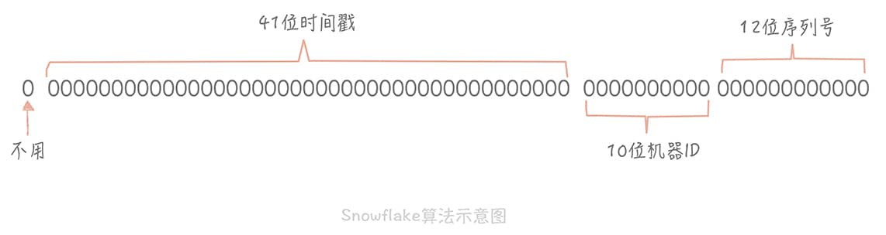

从上面这张图中我们可以看到，41 位的时间戳大概可以支撑 pow(2,41)/1000/60/60/24/365 年，约等于 69 年，对于一个系统是足够了。

## NoSQL

高并发场景下，可以通过NoSQL和数据库进行互补

- 在性能方面，NoSQL 数据库使用一些算法将对磁盘的随机写转换成顺序写，提升了写的性能；

索引在 InnoDB 引擎中是以 B+ 树（上一节课提到了 B+ 树，你可以回顾一下）方式来组织的，而 MySQL 主键是聚簇索引（一种索引类型，数据与索引数据放在一起），既然数据和索引数据放在一起，那么在数据插入或者更新的时候，我们需要找到要插入的位置，再把数据写到特定的位置上，这就产生了随机的 IO。而且一旦发生了页分裂，就不可避免会做数据的移动，也会极大地损耗写入性能。

LSM 树（Log-Structured Merge Tree）牺牲了一定的读性能来换取写入数据的高性能，Hbase、Cassandra、LevelDB 都是用这种算法作为存储的引擎。

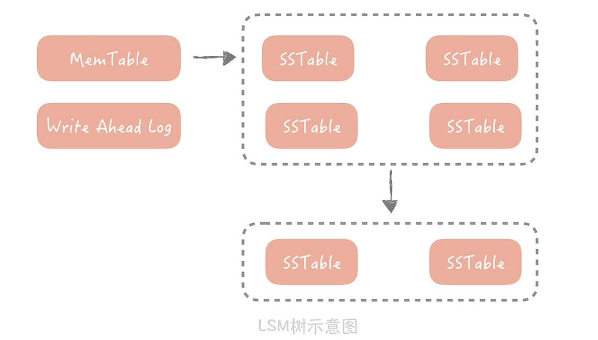

- 在某些场景下，比如全文搜索功能，关系型数据库并不能高效地支持，需要 NoSQL 数据库的支持；

Elasticsearch 作为一种常见的 NoSQL 数据库，就以倒排索引作为核心技术原理，为你提供了分布式的全文搜索服务

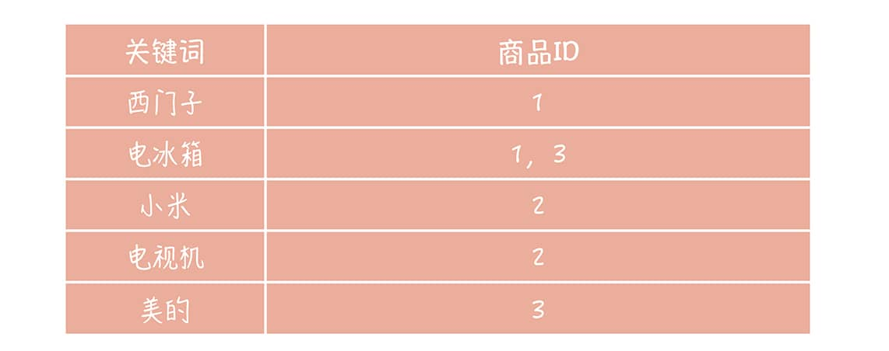

- 在扩展性方面，NoSQL 数据库天生支持分布式，支持数据冗余和数据分片的特性

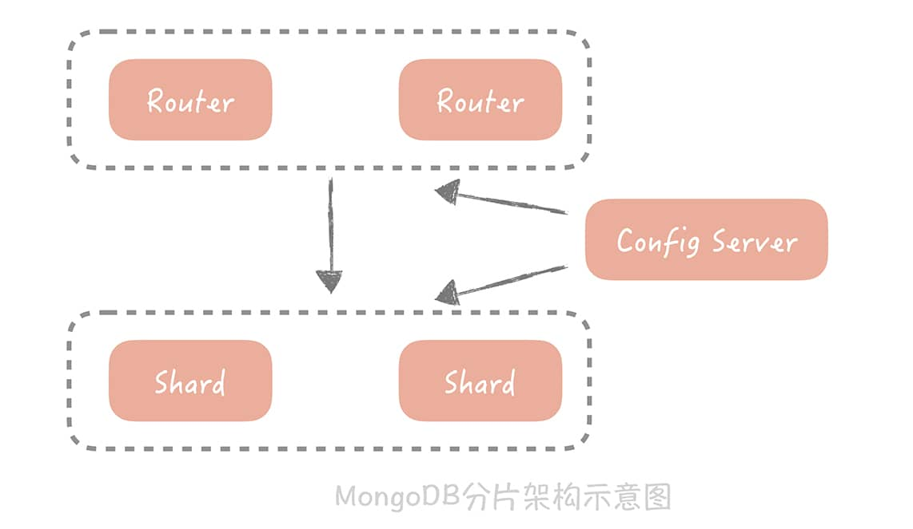

## 缓存

当前架构：

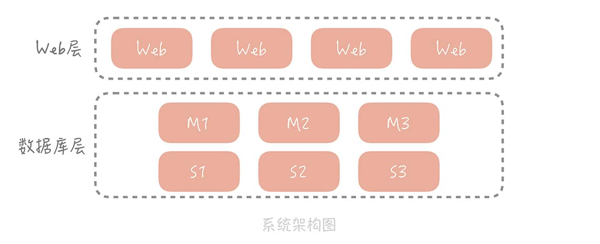

缓存，是一种存储数据的组件，它的作用是让对数据的请求更快地返回。

日常开发中，常见的缓存主要就是静态缓存、分布式缓存和热点本地缓存这三种

分布式缓存

	- mc
	- redis

### 缓存读写策略

- Cache Aside（旁路缓存）

  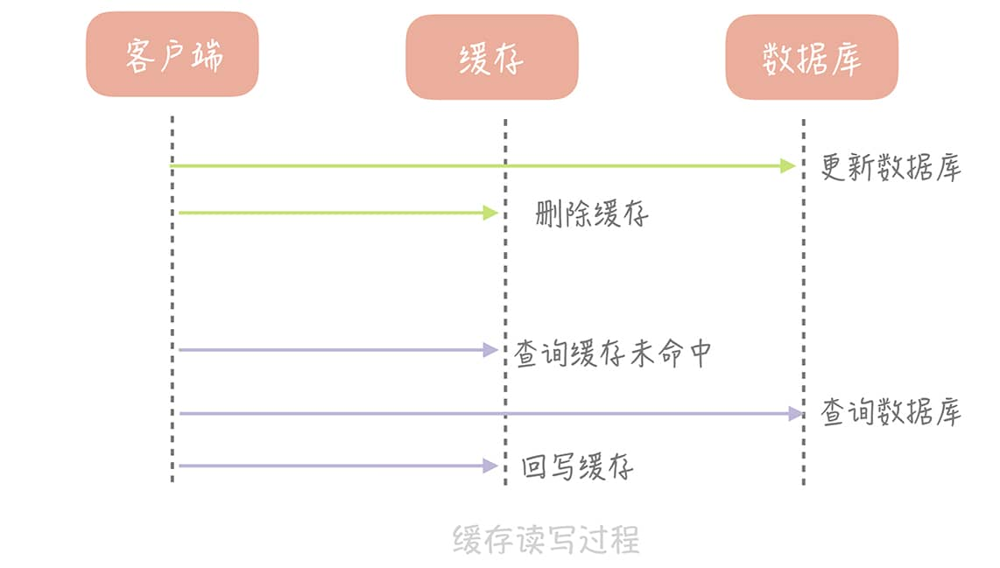

  读策略的步骤是：从缓存中读取数据；如果缓存命中，则直接返回数据；如果缓存不命中，则从数据库中查询数据；查询到数据后，将数据写入到缓存中，并且返回给用户。

  写策略的步骤是：更新数据库中的记录；删除缓存记录。

- Read/Write Through（读穿 / 写穿）策略

  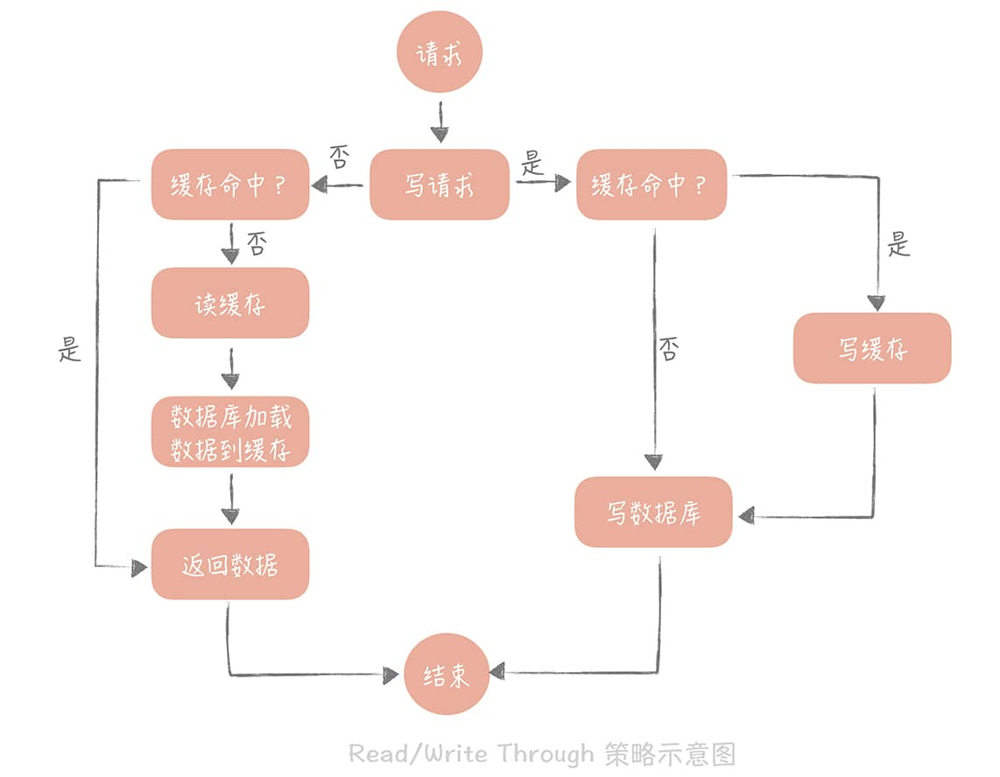

Write Through 的策略是这样的：先查询要写入的数据在缓存中是否已经存在，如果已经存在，则更新缓存中的数据，并且由缓存组件同步更新到数据库中，如果缓存中数据不存在，我们把这种情况叫做“Write Miss（写失效）”。一般来说，我们可以选择两种“Write Miss”方式：一个是“Write Allocate（按写分配）”，做法是写入缓存相应位置，再由缓存组件同步更新到数据库中；另一个是“No-write allocate（不按写分配）”，做法是不写入缓存中，而是直接更新到数据库中。在 Write Through 策略中，我们一般选择“No-write allocate”方式，原因是无论采用哪种“Write Miss”方式，我们都需要同步将数据更新到数据库中，而“No-write allocate”方式相比“Write Allocate”还减少了一次缓存的写入，能够提升写入的性能。

Read Through 策略就简单一些，它的步骤是这样的：先查询缓存中数据是否存在，如果存在则直接返回，如果不存在，则由缓存组件负责从数据库中同步加载数据。

- Write Back（写回）策略

  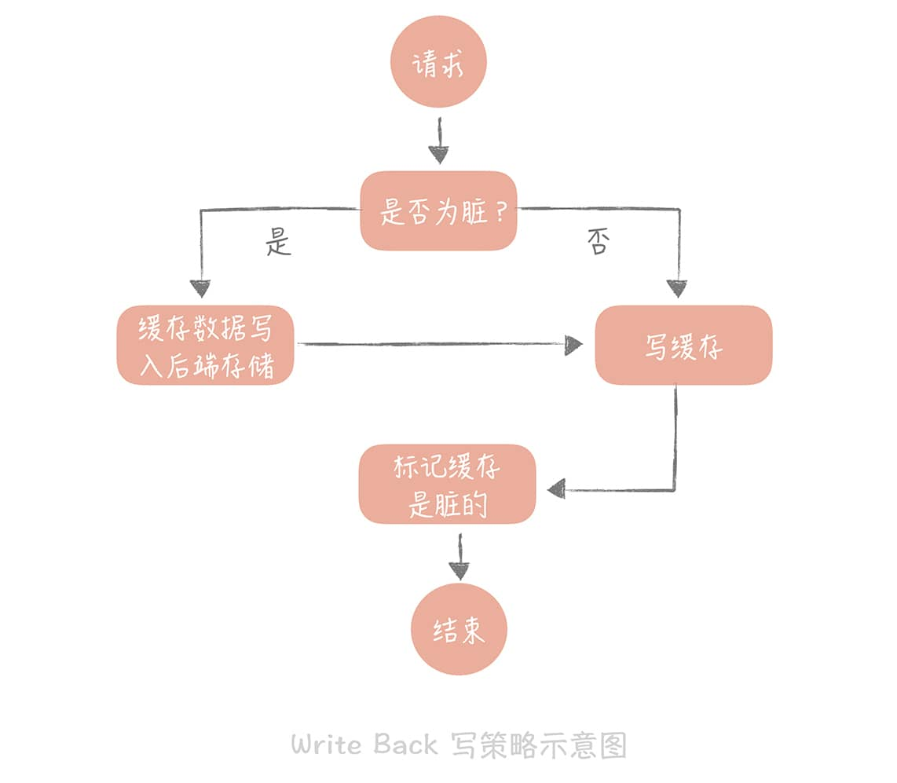

  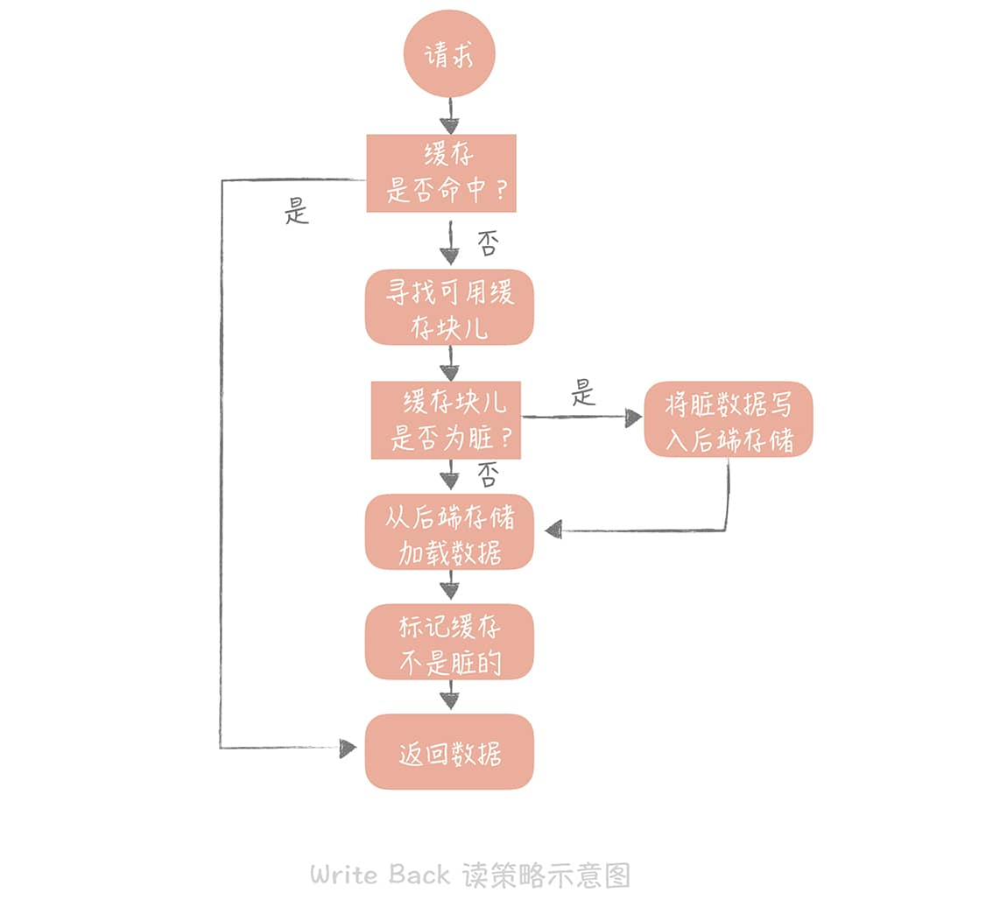

  加入缓存后，架构演进为：

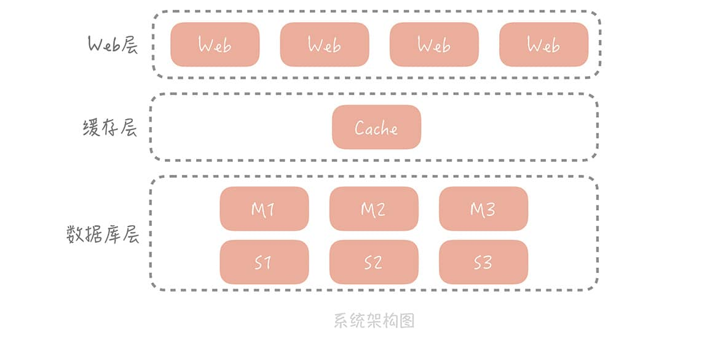

如何实现缓存的高可用？

### 分布式缓存的高可用方案

- 客户端方案

  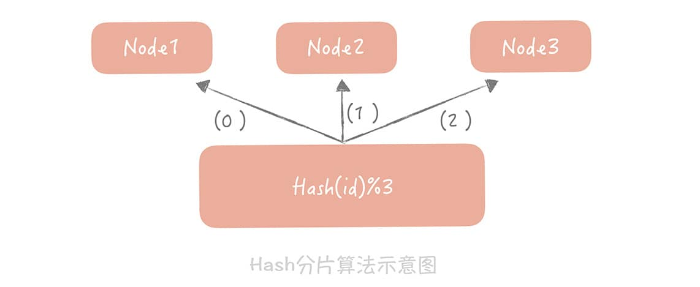

  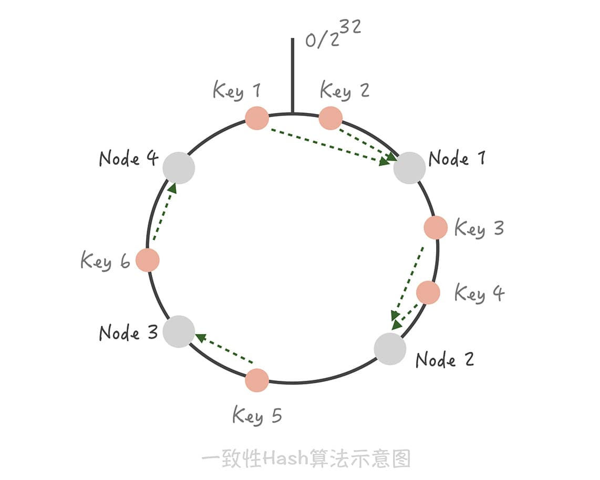

  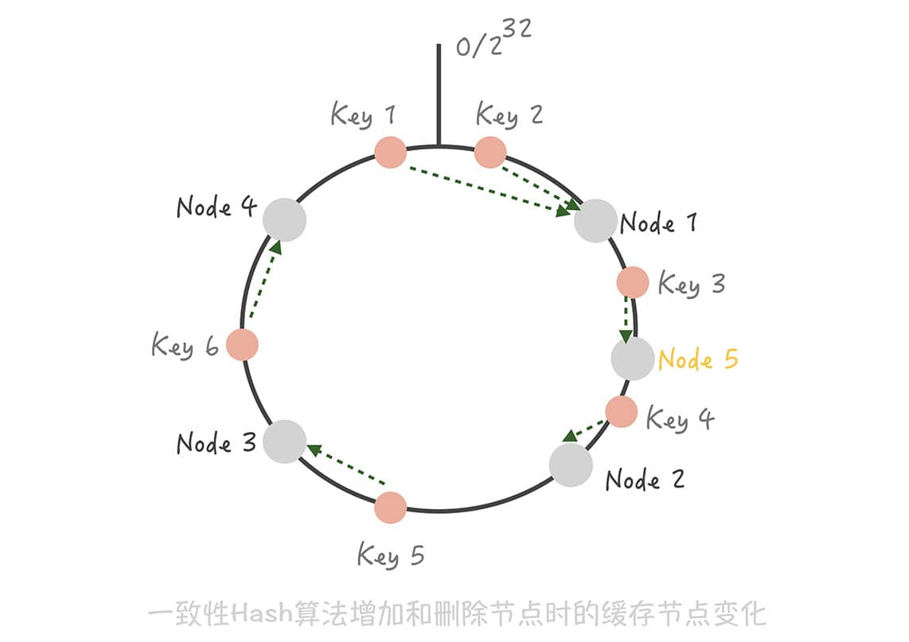

  

- 中间代理层方案

  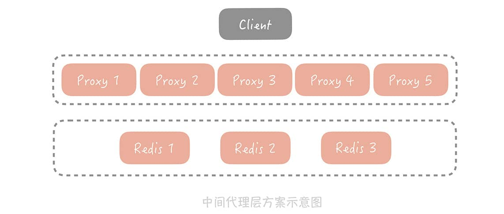

- 服务端方案

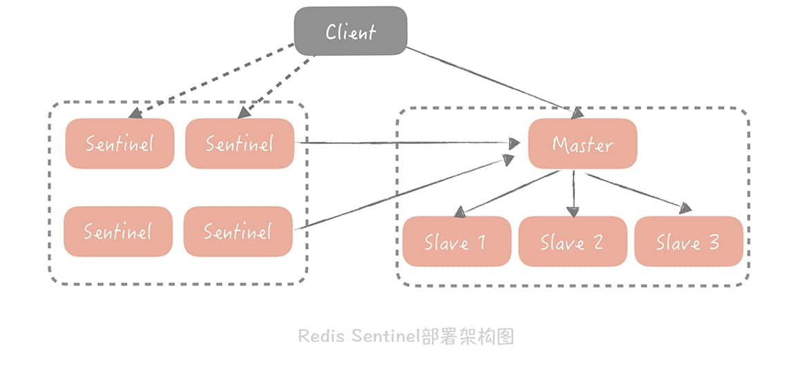

Redis Sentinel（哨兵） 也是集群部署的，这样可以避免 Sentinel 节点挂掉造成无法自动故障恢复的问题，每一个 Sentinel 节点都是无状态的。在 Sentinel 中会配置 Master 的地址，Sentinel 会时刻监控 Master 的状态，当发现 Master 在配置的时间间隔内无响应，就认为 Master 已经挂了，Sentinel 会从从节点中选取一个提升为主节点，并且把所有其他的从节点作为新主的从节点。Sentinel 集群内部在仲裁的时候，会根据配置的值来决定当有几个 Sentinel 节点认为主挂掉可以做主从切换的操作，也就是集群内部需要对缓存节点的状态达成一致才行。