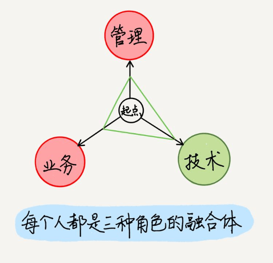
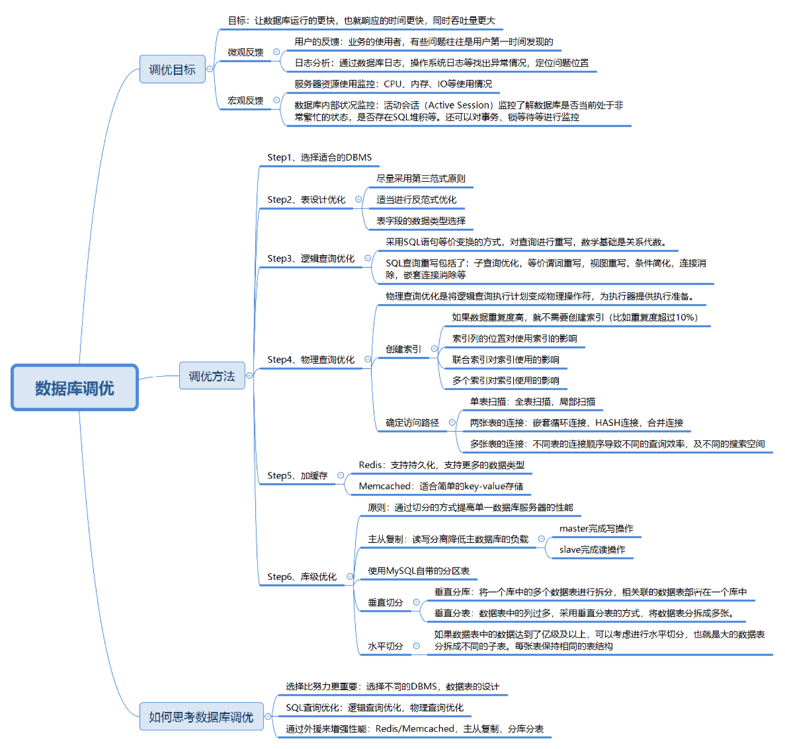

- <u>学习一定要有产出</u>

- <u>该焦虑的是 35 岁程序员吗？并不是，该焦虑的那些写着增删改查代码，应付着日常工作，不做思考，没有提升的程序员，不论什么年纪。</u>

- <u>优秀的程序员知道如何编程，而卓越的程序员知道如何合理复用</u>。在 Linux 诞生的过程中，还有一点非常值得说说，那就是林纳斯并没有尝试从零开始编写 Linux，而是从复用 Minix 的代码和理念开始的。虽然在 Linux 最终的版本中，几乎所有的 Minix 代码都被移除或重写了，但它在 Linux 成长初期确实起到了类似脚手架的作用。

- 把早期用户当做你的合作者或开发者，这是提高代码和产品质量的有效途径。

- 事实上，<u>Code Review 才是真正的白盒测试</u>，没有经过代码审查，仅凭测试很难保证代码质量。测试通过了但没有经过代码审查的代码仍然会出各种问题，l这样的案例比比皆是。只有当另外一个人读了你的代码，并且表明能看懂时，这些代码才真正有了鲜活的力量。代码审查的意义就是，在你的代码合进代码库之前，至少有一个人读过你的代码。

- <u>深入的阅读和学习要求我们能集中注意力，做到专注</u>。

- 很早之前我在阅读《软件随想录》的时候看到过一句话，给了我很大的震撼，“许许多多的人选择编程，首要的原因就是，他们宁愿将时间花在一个公平有序的地方，一个严格的能者上庸者下的地方，一个只要是你对就可以赢得任何争论的地方。”

- 丹尼尔 · 平克按照人们睡眠中间点的不同，把他们分成了猫头鹰、云雀和第三种鸟这三种不同的类型。在凌晨 0 点到 3 点的是云雀，在上午 6 点到中午 12 点的是猫头鹰，介于凌晨 3 点到 6 点的被称为第三种鸟。什么决定了我们的时间类型呢？主要是遗传因素和年龄。

- 通常来说，<u>三十分钟的演讲，能讲清楚三到四个点就很不错了</u>，所以不要舍不得自己辛苦准备的材料，堆积材料反而会喧宾夺主，模糊观众的印象。

- 优秀的产品经理需要掌握的知识体系可能是 IT 领域最庞杂的，他们需要精通产品相关的业务领域知识，懂设计，懂营销，懂市场，懂心理学，理解时尚，最好是产品的典型用户，沟通和协调能力是必备技能，对数据敏感，能够及时反馈和调整。

- 要发现自己的长处，唯一途径就是反馈分析法（feedback analysis）。
  > 什么是反馈分析法呢？每当你做出重要的决定和改变的时候，事先记录下自己对结果的预期。比如你开始写公众号了，你希望你一年后达成什么样的效果。你开始进入机器学习领域了，你想在一年内有什么样的成就。你跳槽了，你希望一年内有什么改变，等等。用文字把你真实的想法记录下来保存好，九到十二个月之后，也就是一年左右的光景，拿出你的小本本和实际结果进行对比，看预期是达成了，超标了，还是偏离了。
  
- 在职场中，我们可以把人群分为四类：<u>优秀并重要、优秀、重要、既不优秀也不重要</u>。tips：不优秀的人也可以很重要，优秀的人也可以不重要

- 对于优秀但与公司业务不匹配的人，大致就这么两种情况，一种是离开，一种是在公司内部开辟一个沙盒，让他们愿意干嘛干嘛，也许会有奇迹发生呢。

- <u>第十人理论</u>：无论多么完美的计划、周密的理论，总需要有人站出来，从另一个层面考虑问题。当所有人的意见或建议都变得无比一致的时候，潜在的危机和隐患恰恰是最大的时候。这时候如果第十人站了出来，提出了出乎意料的方案或建议，最终的结果要么是被愤怒的群众砸死，要么是成为力挽狂澜的英雄。

- TED 演讲者凯瑟琳·舒尔茨在《犯错的价值》中说，“<u>禁止犯错就等于禁止质疑，就会剥夺我们深层理解的机会</u>。错误是深度思考的一部分，犯错，是人类本性的核心内容之一。”

- 用类似 Intelli IDEA 这样的工具把代码之间的调用关系用 Diagrams 展现出来。或者go-callvis工具

- 《奈飞文化手册》中提到奈飞有8条文化准则，其中之一是"我们只招成年人"

- 显然，成年人的第一个特征是“知道自己要前往何方，并愿意为此付出任何努力”。同时，麦考德还指出，成年人会对他们需要解决的问题感到极其兴奋，他们最渴望的奖励就是成功。

- 吴军在《浪潮之巅》里分享过一个诺威格定律，大概意思是，当一家公司的市场占有率超过 50% 后，就无法再使市场占有率翻番了。所以它必须不断寻找新的增长点，才能长盛不衰。

- 互联网公司之间的竞争，也开始从争夺用户，转为争夺用户的使用时长。

- 过去 30 年的时候里，对于互联网来说有三个重要节点，一个是 1994 年网景浏览器的发布，它正式定义了互联网。一个是 2006 年 AWS 的发布，它预示着云计算的到来。一个是 2008 年苹果 AppStore 的发布，它代表着移动互联网的开始。互联网、移动、云计算，用这三个词基本可以描绘互联网的发展轮廓了，你想想是不是这样。

- 怎么衡量你适不适合走技术路线呢？我觉得，能不能做好技术，不在于你是不是计算机科班出身，不在于你是不是现在还处理琐碎的小任务，而在于你对底层细节的好奇心，以及是否愿意尝鲜钻研，扩充自己的知识体系。
  
  
  
- <u>做好事情需要不断叠加</u>。简单来说，我们要继续快速发展，那肯定是要补足短板，强化优势，这答案是废话，大家都明白。但换个角度，强化优势的过程就是叠加的过程，补足短板的过程也是叠加的过程。叠加的意思是 1+1+1+1+1 这样，而不是 1+1+1-1+1-1 这样。你不能今天补了个短板，明天丢了个优势，那这就太可怕了。

- 你只能做到<u>阶段性正确</u>。过去正确的，现在不一定正确。现在正确的，未来不一定正确。

- 其实最关键的，是从认知和思维层面转变自己的观念。不要奢求永远，恒久远是属于钻石的，留给咱们程序员的只有不断更新迭代的技术知识，从中选出现阶段最合适的技术。另外不要妄想一步到位，技术实时在更新，各种框架的选型用法也是层出不穷，很多当前的用法都只是阶段性正确，每个技术人都需要不断的修正自己，不要让自己陷入到已有知识的认知围城中。

- 似乎“软件可以随意更改”的这种特性刺激了需求的不断变更。

- 以创业的心态打工，以打工的心态创业。前者可以让创业人不那么焦虑。打工者如果想要有更大的提升和发展，尝试用创业者的心态去做事，多从公司的角度去考虑问题，多想想怎么提高产品的质量，如何转化更多的用户，并且，适当的焦虑一点，你会有更多的收获。

- 霍夫施塔特定律：即使你考虑到了霍夫施塔特定律，项目的实际完成时间总是比预期的要长。

- 布鲁克定律：为已经延期的软件项目增加人手只会让项目延期得更厉害。

- 主动阅读的核心是：你在阅读时要提出问题来，同时在阅读的过程中，你必须自己尝试去回答这些问题。这本书到底在谈什么？作者具体说了什么，怎么说的？这本书说得有道理吗？是全部有道理，还是部分有道理？这本书跟你有什么关系？（你从这本书中学到了什么？）

- 其实不光是产品经理，任何一个岗位都有“脏活累活”，真正能够把这些工作细致而有效率的做完，证明了你有把事情做成的能力，如果你竟然可以改进这些“脏活累活”，那将进一步展现你的创造力。

- 虚假希望综合征：下定决心会让我们立刻有了放松感和控制感，我们不再觉得自己普通平凡，只觉得自己能变成一个完全不同的人。

- <u>用OKR管理人生目标</u>：既然如此，为什么不把工作中实践过的有效的目标管理方法用到个人成长上呢？工作的顺利完成很重要，但个人的成长也是一件不可忽视的小事啊，它甚至跟你在工作中的成长相辅相成。

- <u>让美好的事情持续发生</u>

- 三个原则：闭环原则；谁难受谁推进原则；Think bigger原则；

- 系统正常，只是该系统无数异常情况下的一种特例，这句话出自《Google SRE》这本书，一行 bug 千行泪，道出了程序员们多少辛酸

- 亚马逊的oncall机制，值得学习。每个开发团队至少都会有一位 oncall 的工程师。在 oncall 的时候，工程师要专心处理线上故障，轮换周期为每人一周。一旦发生比较大的故障，比如，S1 全部不可用，或 S2 某功能不可用，而且找不到替代方案，那么这个故障就会被提交到一个工单系统里。几乎所有相关团队 oncall 的工程师都会被叫到线上处理问题。

- 对于故障的事后处理，我的建议是：一定要区分好两个概念，定责和处罚，定责≠处罚。 定责，事情一定要有人承担责任，并且负责后续改进措施落地。只体现责任团队，具体责任人不公开，也就是对事不对人。

- 10 个项目死亡的信号：
  - 第一版做太多功能 ;
  - 太依赖新技术平台；
  - 与公司另一个有份量的产品竞争；
  - ‘团队人手不足；
  - 复杂的问题，需要复杂的解法；
  - 成员开始隐藏进度落后的事实和原因；
  - 不断更改、增加的需求 ；
  - 2.0 症候群 - 非要更大、更强、更美 ；
  - 产品没有市场立足点；
  - 你根本无法解决的大问题
  
- 如何应对风险
  - 回避风险——更改导致风险的方案
  - 转移风险——将损失转嫁出去
  - 缓解风险——降低风险发生概率或减少可能造成的损失
  - 接受风险——明知山有虎偏向虎山行
  
- 从 MVP 到 PMF
  - MVP：最小可行性产品
  - PMF：时长认可的产品
  
- <u>神奇时刻Magic Moment</u>：实际上就是用户接触产品后的一些特定行为，并发出“哇~”的那个瞬间。这些行为决定了用户是不是会回来，是否会再次使用你的产品。

- 可扩展性
  - 规则可扩张
    - 水平扩张
    - 垂直扩张
  - 功能可扩展
  
- <u>C10K</u> 就是 Client 10000 问题，即“在同时连接到服务器的客户端数量超过 10000 个的环境中，即便硬件性能足够， 依然无法正常提供服务”，简而言之，就是单机 1 万个并发连接问题。

- 每个技术人都面临着技术更新迭代的巨大压力，需要快速学习新技术、新的编程语言、新的框架和其他能力

- <u>像程序员一样思考，解决问题</u>的四步法
  1. 理解
  2. 计划
  3. 分解
  4. 卡壳
  
- 事情卡壳了怎么解决
  1. 调试：一步步跟踪，看看是哪里出了问题
  2. 重新评估：问题是否有其它解决方案，最初的方向是不是错了

### <u>十步学习法</u>

1. **<u>了解全局</u>**
2. **<u>确定范围</u>**
3. **<u>定义目标</u>**
4. **<u>寻找资源</u>**
5. **<u>创建学习计划</u>**
6. **<u>筛选资源</u>**
7. **<u>开始学习，浅藏辄止</u>**
8. **<u>动手操作，边学边玩</u>**
9. **<u>全面掌握，学以致用</u>**
10. **<u>乐为人师，融会贯通</u>**
11. Instagram 的联合创始人凯文·斯特罗姆 (Kevin Systrom) 分享过“5 分钟法则”，这个法则是斯特罗姆为了改变自己的拖延症总结出的方法，大概意思是：“<u>**如果你实在不想开始动手做某件事，那就告诉自己只做 5 分钟就好。其实 5 分钟后，你通常会做完整件事情。**</u>”
12. 相较于那些已经完成的或者是还没开始的工作，我们会比较容易记得那些还没完成的，或者中途被打断的工作。
13. 归根到底，你的时间和精力是有限的，在你当前高优先级排序之外的事情，你都要学着分析这件事对你的成长是否有利，与你对未来的规划是否合拍，你有是否有额外的精力接下这个任务，然后根据你独立分析的结果试着说“不”。
14. 学会对好东西说‘不’，这样你才能对最好的说‘行’
- 之前在 Coinbase 女博士朱赟的知识星球里看到一个问答，很好的诠释了这个话题。

> 问题是这样的：作为一个后端开发，想请教安姐，如何去提高自己的驾驭复杂业务逻辑的能力、设计能力和抽象能力？如果接手一个稳定性不够好的系统，如何收敛复杂度，逐步提高稳定性？

朱赟老师非常干练和漂亮的给出了这个答案：

> <u>驾驭首先要做到通晓</u>。了解所有业务逻辑的来龙去脉，知道一些典型系统设计方案以及其针对的问题，还有优劣比较。接触过一些实际的系统。在此之上，才有可能把合适的设计套用到当前的业务逻辑上，把现有的业务逻辑抽象成一个已经存在（部分）解决方案，或更经典的方式。
> 
> 接手一个稳定性不好的系统，如果没有足够的时间从头设计、完全重构。那么<u>至少要知道影响稳定性的几个关键要素，然后根据重要性、紧急性和解决问题需要的资源（时间、技能集、人等）进行优先级排序，逐个击破</u>。对于所有的改善型动作，确保有适合的评测和监控，这样能够知道不同的措施效果到底是怎么样的。

- 不论是哪个技术领域，如果你想在这个领域不断深入，还是应该把最宝贵的时间花在可迁移的技能上——那些永不过时的技能。前端更是如此，不要被那些五花八门的框架和库迷了眼。
  那什么是永不过时的技能呢？之前跟极客时间作者左耳朵耗子聊天的时候，谈到过这个话题，他的答案非常具有参考性，也就是编程能力、架构能力和工程能力。
- 在贾国龙看来，集体学习要比老板一个人学习重要。很多基层、中层的管理者，在一线的实战管理中，积累了很多经验，但很多时候，他们是凭本能，比如责任心、同理心、真诚等去带人，却没能形成自己的管理理念，知道怎么做，但却不知道为什么要这么做，而学习就能帮他们点破那道窗户纸，还能带来心性上的成长。
- 在重要的事情中，灵活并非优势，而是一个陷阱。很多优秀的人身上有一个共性，凭借极端固执完成了长期目标。为什么会如此？原因有两个：首先，<u>谁如果在每一个情景中都要重新做出选择，那他便会丧失意志力。这种现象的专业名词是“选择疲劳”</u>。一旦大脑由于之前做了太多的抉择而感到疲惫，那它就会选择最容易的方案，而这个方案往往是最差劲的。“誓言”的意义在于，一旦许诺，那么你便不必每次都反复权衡利弊。你的决定已在眼前，而且没有消耗任何脑力。
- <u>留出固定的时间，专注于你的焦虑</u>。具体来说：找出一个笔记本，并将其命名为“我的忧虑之书”。每天留出十分钟，在本子上记下令你忧虑的一切，无论这种焦虑是合理、是愚蠢，还是模糊不清。一旦这样做了，一天中剩下的时光包含的忧虑就会相对减少些，因为大脑已经知道，它的忧虑没有被忽视，而是都被记录在册。请坚持每天都在新的一页上做记录。你会慢慢发现，惹你烦忧的总是那十几个问题…
- 一本书读两遍的效果，绝非读一遍的两倍，而是会远远高于这个比例。依照我的经验，书读两遍，其效果会翻十倍。某一本书，如果我看完一遍能记住 3% 的内容，那么看完第二遍后我便能记住 30%。
- 产品暗黑模式：通过网页或 App 的界面或流程的有意精心设计，诱导用户做出本不打算做出的举动，比如购买、注册、点击广告、发送垃圾邮件等等，被统一定义为“暗黑模式”（Dark Patterns）。

### 数据库调优

### 认知陷阱

- 1、如果是我感兴趣的事情，就一定能做好
- 2、重复做别人做的东西
- 3、同时去做 10 件事
- 4、过于看重自己
- 5、害怕失败
- 6、创业者不要自嗨
- 7、融资和资金问题

### 产品的核心功能

- 任何产品都有核心功能，其宗旨就是能帮助到用户，解决用户某一方面的需求，如节省时间、解决问题、提升效率等。核心能力要做到极致，要多想如何通过技术实现差异化，让人家做不到，或通过一年半载才能追上。

### 价格策略

制定价格需要牢记的一点是：涨价总比降价难。如果你一开始把价格定得很低，突然提高价格势必会流失很多用户，因为用户会觉得“你变了”。反过来，价格定高了想降价的方法就非常多了，适当的打折促销既能吸引用户眼球，又不会对品牌造成伤害。

- Done is better than perfect
