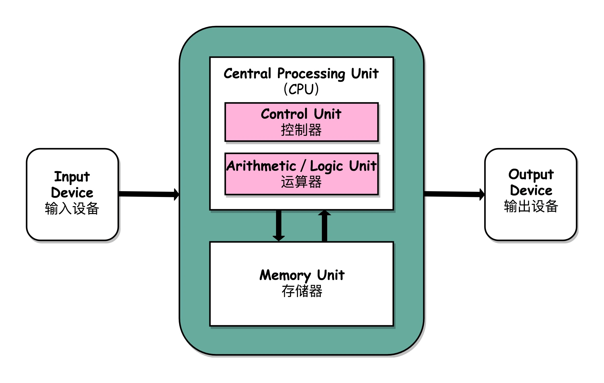
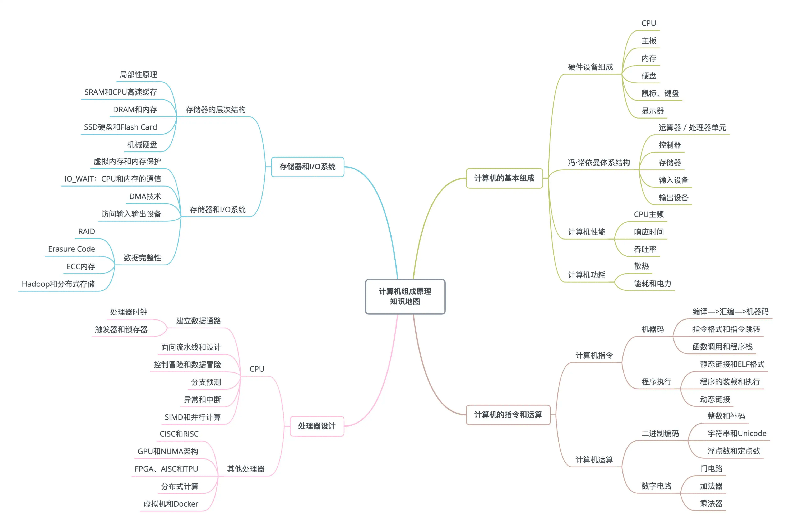

- 非科班出生，对于计算机组成原理本就是一片空白。这个领域其实是又爱又怕的地方，想了解，又怕理解不了，浪费时间。
作者回复: 其实这些领域并不困难，又很有意思。就像《冰与火之歌》里面水舞者教导艾莉亚的一样，“<u>恐惧比利剑更伤人</u>"。破除对于基础知识“难”的迷信，是迈向更高水平必经的一步。加油和大家一起学习。

- 冯诺依曼体系结构
  
  
  
- 学习地图
  
  
  
- 性能
  性能 = 1/ 响应时间
  
  

### 扩展阅读

1. 计算机是怎么样跑起来的

2. 程序是怎样跑起来的

