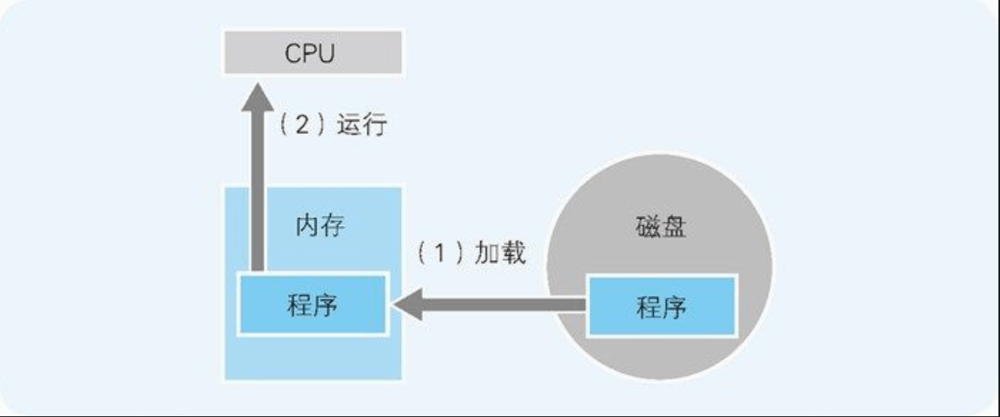
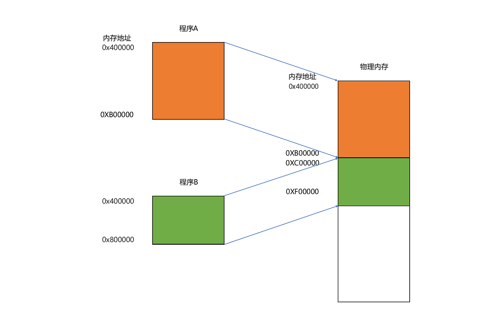
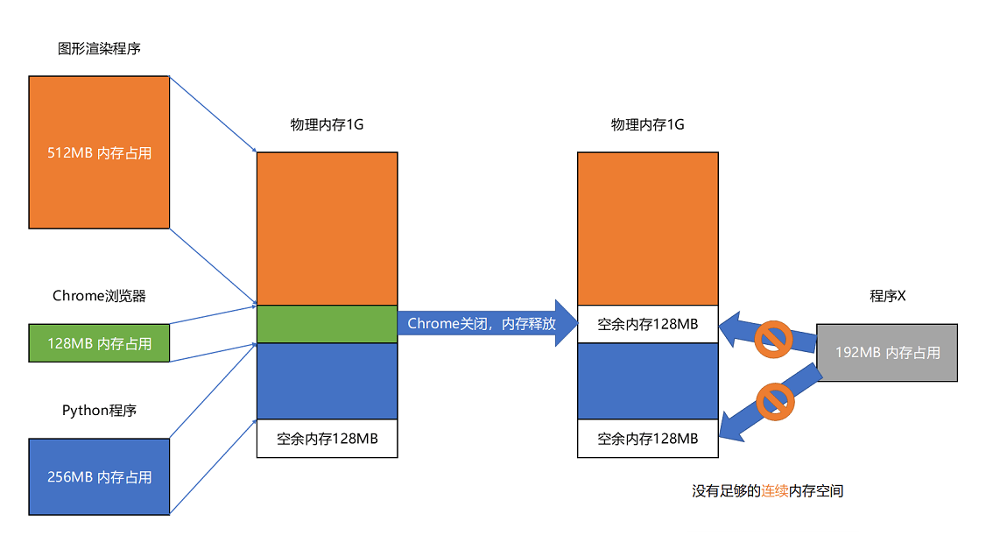
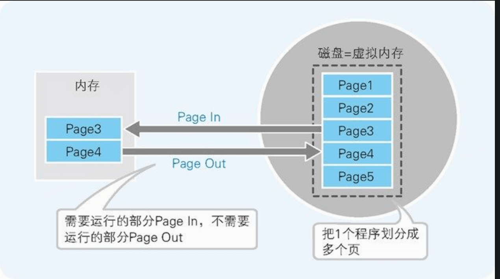

### 磁盘和内存

磁盘中存储的程序，必须要加载到内存后才能运行。在磁盘中保存的原始程序是无法直接运行的。

### 虚拟内存

虚拟内存 是指把磁盘的一部分作为假想的内存来使用。这与磁盘缓存是假想的磁盘（实际上是内存）相对，虚拟内存是假想的内存（实际上是磁盘）

虚拟内存的方法有分页式 和分段式两种。

#### 分段式

内存分段会带来内存碎片问题

通过内存交换的方式解决

虚拟内存、分段，再加上内存交换，看起来似乎已经解决了计算机同时装载运行很多个程序的问题。不过，你千万不要大意，这三者的组合仍然会遇到一个性能瓶颈。硬盘的访问速度要比内存慢很多，而每一次内存交换，我们都需要把一大段连续的内存数据写到硬盘上。所以，如果内存交换的时候，交换的是一个很占内存空间的程序，这样整个机器都会显得卡顿。

#### 分页式

Windows 采用的是分页式。该方式是指，在不考虑程序构造的情况下，把运行的程序按照一定大小的页（page）进行分割，并以页为单位在内存和磁盘间进行置换。

在分页式中，我们把磁盘的内容读出到内存称为 Page In，把内存的内容写入磁盘称为 Page Out。

通过引入虚拟内存、页映射和内存交换，我们的程序本身，就不再需要考虑对应的真实的内存地址、程序加载、内存管理等问题了。任何一个程序，都只需要把内存当成是一块完整而连续的空间来直接使用。

### 动态链接

- Windows 下，这些共享库文件就是.dll 文件， Dynamic-Link Libary（DLL，动态链接库）。

-  Linux 下，这些共享库文件就是.so 文件， Shared Object

  