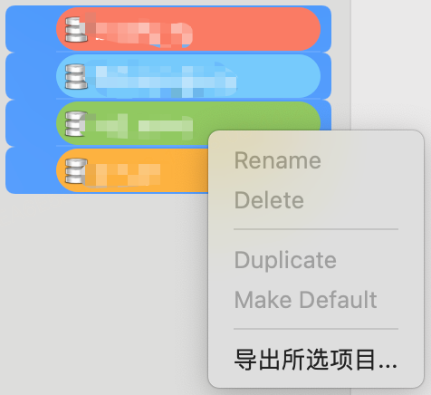
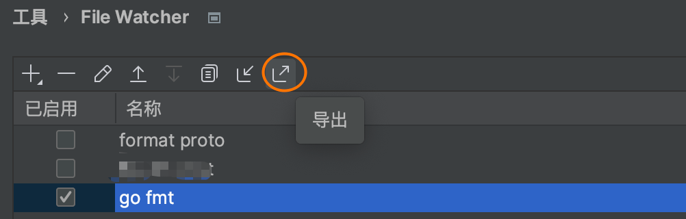
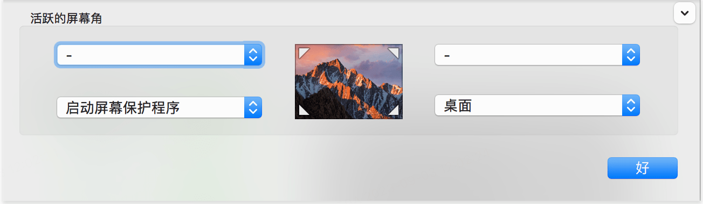
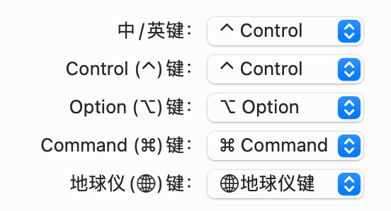
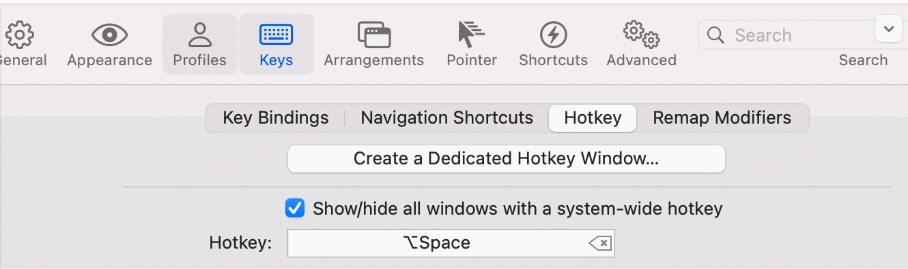
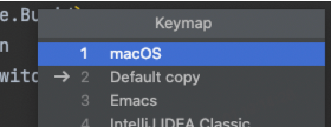
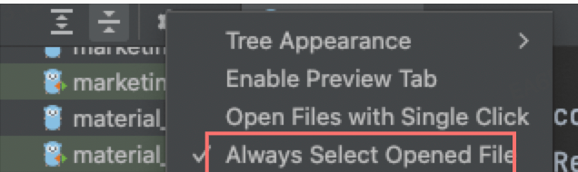
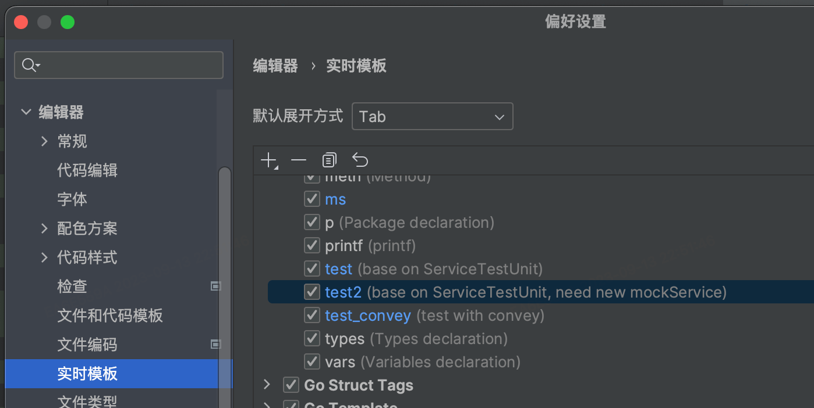
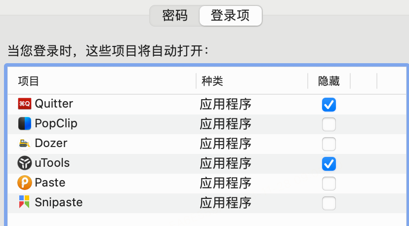

* TOC
{:toc}

# 准备工作

- 老mac 退出登录 apple id（重装系统不会清除 apple id）

- postman 无需备份，登录账号后会自动同步

## 坚果云备份老电脑

  ### chrome 标签

  #### Sequel Ace  数据库配置

  选中多个配置后，`导出所选项目`，导出配置中不含密码，密码可以在钥匙串中查看

  

  ### Goland配置和 File Watcher 配置

  - 导出IDE设置

  

  - 导出File Watcher设置

    

<br/>

### 通过brew bundle备份安装过的应用到坚果云

```sh
brew bundle dump --describe --force --file="~/Nutstore Files/我的坚果云/backup/Brewfile"
```


完成以上备份工作后，开始设置新mac

---


# 基础设置

1. 登录apple账号
2. 设置触摸板（三指拖拽功能在辅助功能中设置）

```
1. 选取苹果菜单  >“系统设置”（或“系统偏好设置”）。
2. 点按“辅助功能”。
3. 点按“指针控制”（或“鼠标与触控板”）。
4. 点按“触控板选项”按钮。
5. 打开“使用触控板进行拖移”（或“启用拖移”）。
6. 从弹出式菜单中，选取“三指拖移”拖移样式。
7. 点按“好”。
```

3. 设置触发角



4. 设置 dock

   

   <br/>

5. <u>将  中/英键（Caps Lock键）修改为 ctrl 键</u>，程序员必备

   路径：在系统偏好设置中搜索` 修饰键`



# 环境搭建

## brew

[**https://brew.sh/index_zh-cn**](https://brew.sh/index_zh-cn)

```sh
/bin/bash -c "$(curl -fsSL https://raw.githubusercontent.com/Homebrew/install/HEAD/install.sh)"
```

 如果报网络问题，可以用国内的下载链接

```sh
/bin/zsh -c "$(curl -fsSL https://gitee.com/cunkai/HomebrewCN/raw/master/Homebrew.sh)"
```

==从brew bundle中恢复之前通过brew和cask安装的软件==

```sh
brew install mas

brew bundle --file="~/Nutstore Files/我的坚果云/backup/Brewfile"
```

##  git

- 安装xcode
- 安装git安装了xcode后，在终端输入git命令即可安装git

<br/>

安装好 git 后，生成公钥，配置 到 github/gitlab

```
 cd ~/.ssh
 ssh-keygen -t rsa -C "xxxxx@xxxxx.com"
```

将生成的`id_rsa.pub`  拷贝到 github/gitlab

- 添加 ignore

  ```
  git config --list
  git config --global core.excludesfile ~/.gitignore_global
  cat ~/.gitignore_global
  cover.out
  coverage.xml
  report.html
  ```

- 同时使用 github 和 gitlab

  [怎样在一台电脑上同时使用公司 GitLab 和 Github 的服务](https://bl-ott.github.io/git-study/#%E6%80%8E%E6%A0%B7%E5%9C%A8%E7%94%B5%E8%84%91%E4%B8%8A%E5%90%8C%E6%97%B6%E4%BD%BF%E7%94%A8github%E5%92%8Cgitlab)

##  iterm2 && oh my zsh

- iterm2 (执行brew bundle可跳过)

```sh
brew install iterm2 --cask
```

- oh my zsh

```sh
sh -c "$(curl -fsSL https://raw.github.com/robbyrussell/oh-my-zsh/master/tools/install.sh)"
```

- 下载插件

```sh
cd ~/.oh-my-zsh/custom/plugins
git clone https://github.com/zsh-users/zsh-autosuggestions.git $ZSH_CUSTOM/plugins/zsh-autosuggestions
git clone https://github.com/zsh-users/zsh-syntax-highlighting.git
```

- 配置插件

修改 ~/.zshrc文件

```sh
plugins=(git wd tmux zsh-autosuggestions zsh-syntax-highlighting)
```

每次修改`.zshrc`后都要执行 `source ~/.zshrc`命令加载配置

- 设置快捷键

  

  配置 `Create a Dedicated Hotkey Window` 可以通过快捷键双击ctrl出发一个半屏半透明的终端

- 设置背景图

  在 iterm2 配置中搜索`background image`

- zshrc 配置

  ```powershell
  alias man=tldr
  alias krc="kratos tool rc"
  alias klp="kratos tool lp -s"
  alias kdb="kratos tool gdmb"
  alias kt="kratos tool testgen"
  alias klt="kratos tool lint run"
  alias kg='kratos t http2grpc -deploy.env=uat -log.stdout=true -log.noagent=true'
  alias tv-proxy="adb shell settings put global http_proxy"
  alias tv-unproxy="tvunproxy(){adb shell settings delete global http_proxy;adb shell settings delete global global_http_proxy_host;adb shell settings delete global global_http_proxy_port;adb reboot;};tvunproxy"
  alias tv-cap="adb shell screencap -p /sdcard/01.png && adb pull /sdcard/01.png ~/Downloads"
  #alias colaboratory="docker run -it -p "127.0.0.1:8081:8080" -v "${HOME}:/content" gcr.io/cloud-datalab/datalab:local-20170224"
  alias gch="git checkout"
  alias gpl="git pull"
  alias ll="ls -l -a"
  alias draft="wd blob && cd _drafts && cp tmpl.md $(date +"%Y%m%d")-"
  
  
  export DOCKER_BUILDKIT=0
  export COMPOSE_DOCKER_CLI_BUILD=0
  export PATH=$PATH:/Applications/Sublime\ Text.app/Contents/SharedSupport/bin
  export PATH=/Users/xujun01/Library/Python/3.9/bin:$PATH
  ```

<u>强烈建议将.zshrc加入git版本控制，防止误修改或误删除</u>

```sh
cd ~
git init
git add .zshrc
git commit -m "Backup .zshrc"
```

## go

安装(执行brew bundle可跳过)

```sh
brew install go
```

配置

～/.zshrc

```sh
export GOROOT=/opt/homebrew/Cellar/go/1.21.0/libexec
export GOPATH=$HOME/go
export GOBIN=$HOME/go/bin
export PATH=$PATH:$GOROOT/bin:$GOPATH/bin
export GOSUMDB=off
export GOPROXY=http://goproxy.bilibili.co
export GO111MODULE=on
export DEPLOY_ENV=uat
export GRPC_GO_REQUIRE_HANDSHAKE=off
```

## wd 工具

>终端快捷跳转到指定目录

安装(执行brew bundle可跳过)

```sh
brew install wd
```

wd list

```sh
All warp points:
      blog  ->  ~/project/bl-ott.github.io
        go  ->  ~/go
   jupyter  ->  ~/jupyter
        md  ->  ~/Nutstore Files/我的坚果云/backup/===文稿/=markdown
   project  ->  ~/project
        sh  ->  ~/Nutstore Files/scripts
       ssh  ->  ~/.ssh
```

然后执行`wd ssh`即可跳转到`~/.ssh`目录，可以搭配其它命令使用

## node

npm 启动本地 fe 项目

```
brew install node //执行brew bundle可跳过
wd fe
npm install
npm run dev
```

## UT

安装gocov和gocov-xml

```sh
go install github.com/axw/gocov/gocov@latest
go install github.com/AlekSi/gocov-xml@latest
```

 安装 diff-cover

（自带了 python3）

```sh
pip3 install diff_cover --user
```
# Mac软件

## 工具

> 已执行brew bundle，可以跳过这一步

| 工具         | 描述              |
| ------------ | ----------------- |
| wd           | 快捷目录          |
| tldr         | 代替man命令       |
| clang-format | 格式化 proto 文件 |
| go           | 开发              |
| node         | 开发              |
| wget         | 下载工具          |

## 软件

> 所有软件都可以通过brew cask安装
>
> 已执行brew bundle，可以跳过这一步

| 软件                   | 功能                | 安装                                                         | 备注                                                         |
| ---------------------- | ------------------- | ------------------------------------------------------------ | ------------------------------------------------------------ |
| uTools                 | all in one          | brew install utools --cask                                   | 唯一指定真神，无所不能                                       |
| 坚果云                 | 云备份              | brew install nutstore --cask                                 |                                                              |
| Clash For Window       | vpn                 | brew install clash-for-windows --cask                        | brewsudo xattr -rd com.apple.quarantine /Applications/xxxxxx.app 安装，打开报错已损坏，执行下面 sudo xattr -rd com.apple.quarantine /Applications/xxxxxx.app |
| chrome                 | 浏览器              | brew install google-chrome --cask                            | 导入坚果云书签                                               |
| Goland                 | IDE                 | 官网                                                         | 导入坚果云配置文件                                           |
| Paste                  | 剪切板管理          |                                                              |                                                              |
| AppCleaner             | 软件卸载            | brew install appcleaner --cask                               |                                                              |
| dozer                  | 菜单栏管理          | brew install dozer --cask                                    |                                                              |
| caffeine               | 休眠                | brew install caffeine --cask                                 |                                                              |
| Docker                 |                     | https://docs.docker.com/desktop/release-notes/#docker-desktop-4120 |                                                              |
| ~~Alfred~~             | ~~快捷工具~~        | ~~brew install alfred --cask~~                               | ~~uTools代替~~                                               |
| vscode                 | 文本编辑            | brew install visual-studio-code --cask                       |                                                              |
| Postman                | API管理             | brew install postman --cask                                  | 登录账号自动同步                                             |
| ~~Te~~ampaper Snap~~~~ | ~~截图~~            | ~~Appstore 已购~~                                            | ~~Snipaste代替                                               |
| Snipaste               | 截图                | brew install snipaste --cask                                 | 支持截图后图片置顶                                           |
| ~~Com~~pareMerge~~~~   | ~~文本比对~~        | ~~Appstore 已购~~                                            | ~~utools替代~~                                               |
| Typora                 | markdown 编辑       | brew install typora --cask                                   |                                                              |
| WPS                    | 文档编辑            | brew install wpsoffice-cn --cask                             |                                                              |
| Charles                | 抓包                | brew install charles --cask                                  |                                                              |
| The Unarchiver         | 解压                | brew install the-unarchiver --cask                           |                                                              |
| Magnet                 | 窗口管理            | Appstore 已购                                                |                                                              |
| TinyCal                | 日历                | Appstore 已购                                                |                                                              |
| ~~~~PixelScheduler~~~~ | ~~侧边展示日程~~    | ~~Appstore 已购~~                                            |                                                              |
| ~~~~licecap~~~~        | ~~屏幕录制~~        | ~~brew install licecap --cask~~                              | ~~utools替代~~                                               |
| ~~~~go2shell~~~~       | ~~finder 跳转终端~~ | ~~brew install go2shell~~                                    | ~~utools替代~~                                               |
| Sequel Ace             | 数据库客户端        | brew install sequel-ace --cask                               | Sequel Pro升级版，从坚果云中同步配置，密码在钥匙串中         |
| CheatSheet             | 快捷键              | brew install cheatsheet --cask                               |                                                              |
| 搜狗输入法             | 输入法              | brew install sogouinput --cask                               |                                                              |
| Quitter                |                     | brew install quitter --cask                                  | 自动退出和最小化不用的app                                    |
| Calibre                | 电子书管理          | brew install calibre --cask                                  |                                                              |

### chrome

插件：

- <u>标签分组扩展</u>

- <u>Ghelper</u>

- FeHelper前端助手

- Save to Pocket

- Dark Reader

  

### Goland

####  备份

- 导入坚果云里的配置
- 导入坚果云里的 watcher.xml
- 选择快捷键



- 设置自动选择已打开文件

  


#### 插件

| 插件                                            | 功能                 |
| ----------------------------------------------- | -------------------- |
| Smart Input                                     | 自动切换中英文输入法 |
| Chinese (Simplified) Language Pack / 中文语言包 | 中文扩展             |

#### 代码模板

`偏好设置/编辑器/实时模板`添加模板



### utools

会员可自动同步，无需备份


 推荐安装以下插件

- 网页快开

- 词云生成器

- 剪切板

- 备忘

- 文本代码比对

- JSON编辑器

- Markdown笔记

  

### 登录启动项

偏好设置-用户与群组-登录项


