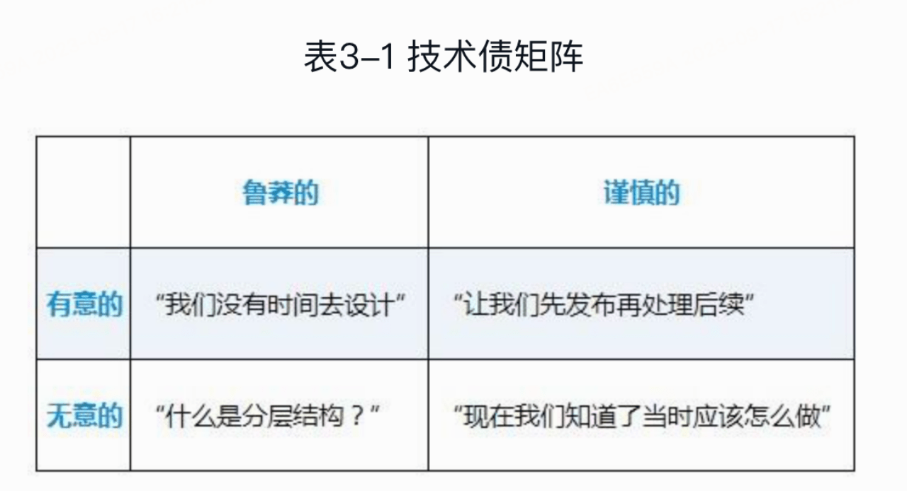
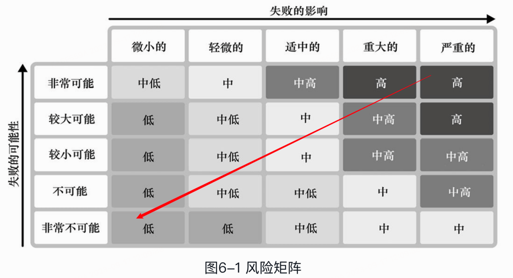
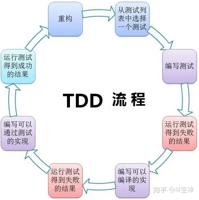
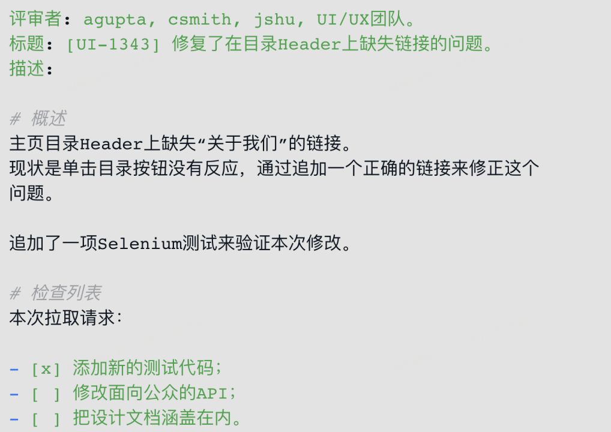
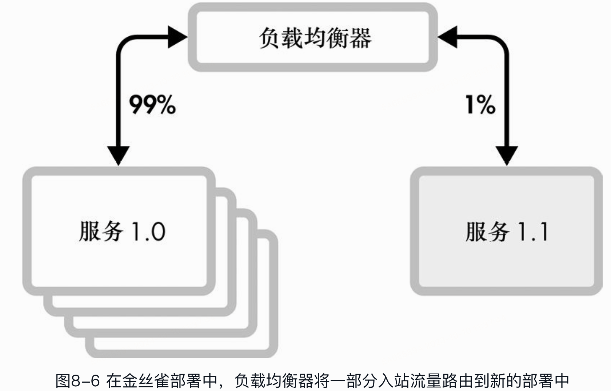
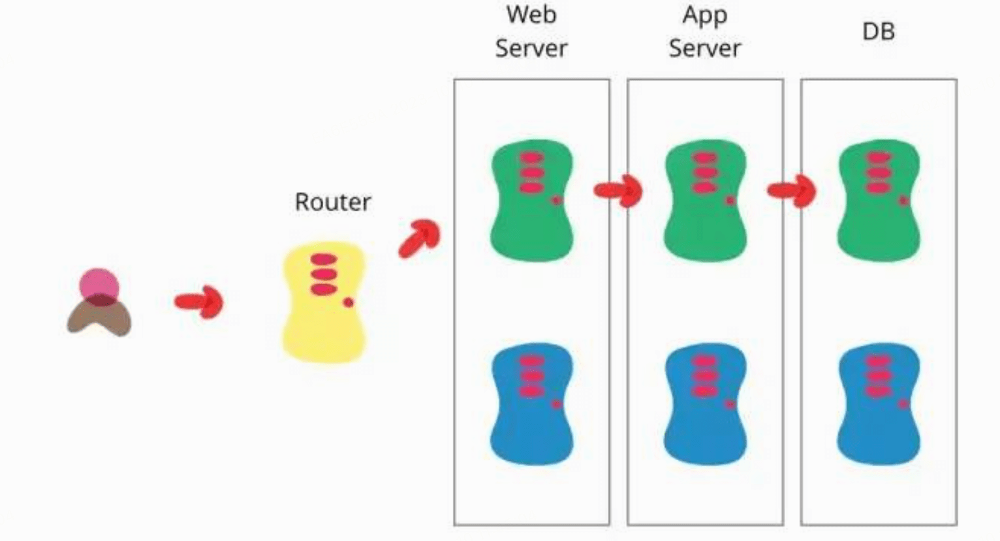
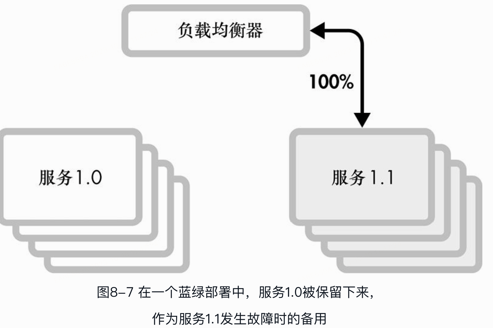
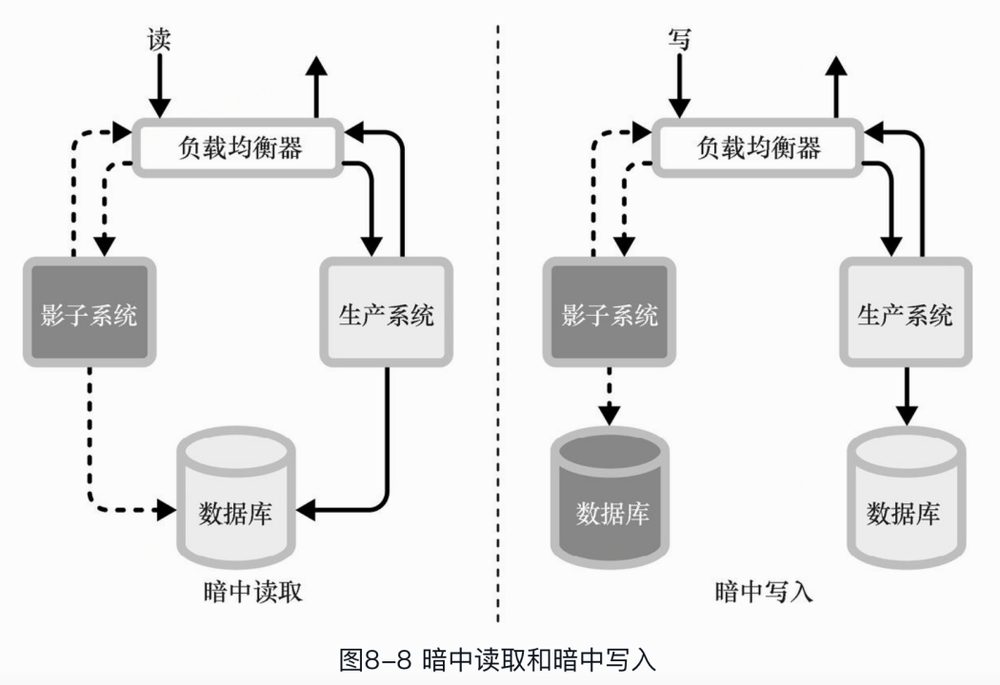

> 《程序员的README》读书笔记

* TOC
{:toc}
## 云图

这本书几乎涵盖了程序员开发生涯的所有点，用专业的名称概括了众所周知的一些概念

## 成长

### 如何成为资深

1. 技术知识
2. 执行力
3. 沟通能力
4. 领导力

### 新手村两条定律

> 坎宁安定律：在互联网上获得正确答案的最好方法并不是提出问题，而是发布错误的答案。
>
> 自行车车棚效应：过度集中在细枝末节上的讨论总是会很冗长

### 能力的四个阶段

1. 无意识的无能力：你无法胜任某项任务，并且没有意识到这种差距
2. 有意识的无能力：你虽然无法胜任某项任务，但其实已经意识到了其中的差距
3. 有意识的有能力：你有能力通过努力完成某项任务
4. 无意识的有能力：你可以很轻松地胜任某项任务

> 在不同的领域或一个领域的不同分支，一个人的能力可能处于不同的阶段

### 学习如何学习

1. 在实践中学习

2. 运行实例代码

3. 阅读

4. 讲座

5. 分享会议

6. 结对编程

7. <u>code review</u>

   

### 克服成长障碍

> 冒充者综合征：个体按照客观标准评价为已经获得了成功或取得成就，但是其本人却认为这是不可能的，他们没有能力取得成功，感觉是在欺骗他人，并且害怕被他人发现此欺骗行为的一种现象
>
> 邓宁-克鲁格效应：是一种认知偏差，能力欠缺的人有一种虚幻的自我优越感，错误地认为自己比真实情况更加优秀

## 代码

### 软件的熵

混乱的代码是变化的自然副作用，不要把代码的不整洁归咎于开发者。这种走向无序的趋势被称为软件的熵(software entropy)。

### 技术债

> 技术债是造成软件的熵的一个主要原因

`谨慎的、有意的技术债`（右上）是技术债的典型形式：在代码的已知不足和交付速度之间进行务实的取舍。只要团队有规划地解决这个问题，这就是好的债务。

`鲁莽的、有意的技术债`（左上）是在团队面临交付压力的情况下产生的。出现“……就……”或“只是”这种词就是在暗示讨论中的内容是鲁莽的债务：“我们稍后就会添加结构化日志”，或者“只是增加了超时等待的时长”。

`鲁莽的、无意的技术债`（左下）来自“不知道自己不知道”。你可以通过事前写下实施计划并获得反馈的方式，以及进行代码评审的方式来减轻这种债务的危险。**持续学习**也可以最大限度地减少这种无意的鲁莽行为。

`谨慎的、无意的技术债`（右下）是成长经验积累的自然结果。

<u>如何解决技术债</u>

- 边做边解决，小幅重构
- 增量重构不够时，进行大型重构

### 重构

> 重构可以解决技术债

1. 在不影响项目持续运转下，持续地重构，重构的成本平摊在多次的版本更迭中
2. 做渐变的修改
3. 重构要务实：旧代码、废弃代码、低风险或方很少用到的代码不需要重构
4. **从新特性的提交剥离重构的部分**
5. 善用IDE进行重构

### 如何安全地在现有代码库中改变代码

1. 自定义变更点
2. 寻找测试点：是修改代码的入口，也是测试用例需要调用和注入的区域
3. 打破依赖关系：依赖关系是测试代码锁需要的对象和方法，打破依赖关系意味着改变代码结构
4. 编写测试：为了让测试成为可能，可以对代码进行重构，老代码也需要添加测试用例
5. 进行修改和重构

### 防御性编程    

1. 避免空值
2. 保持变量不可变
3. 使用类型提示和静态类型检查器
4. 验证输入
5. 善用异常
6. 异常要有精确含义
7. 早抛晚捕
8. 幂等
9. 及时释放资源
10. <u>智能重试：退避策略</u>

### backoff退避策略

捕捉到一个异常马上就进行重试
但如果重试的操作再次失败了怎么办？如果一个磁盘空间耗尽，它很可能在10毫秒后仍然没有剩余可用的空间，再来10毫秒也是如此。一遍又一遍单纯地重试会使事情处理变慢，也会使系统更难以恢复

退避会非线性地增加休眠时间，通常使用**指数退避**（重试的间隔=重试次数的2次方）

如果一个网络服务器发生故障，所有的客户端在同一时间内重新发起请求，这被称为**惊群效应**，解决的方法是在退避策略中加入抖动，有了抖动客户端给退避加一个随机的有限制的时间，引入随机可以分散请求，降低发生踩踏的可能性

不要盲目的重试所有失败的调用，尤其是那些写入数据或可能触发业务流程的调用，最好让应用程序在遇到在设计时没有预想到的错误时崩溃，这被称为**快速失败**，如果引入了快速失败，就不会造成进一步的损失

## 日志

1. 给日志分级

2. 日志的原子性：关联的日志打到同一个日志

3. 关注日志性能：拼接字符串

4. **不要记录敏感数据**

   

## 监控

1. 资源池

2. 缓存

3. 数据结构

4. CPU密集型操作

5. I/O密集型操作

6. 数据大小

7. 异常和错误

8. 远程请求和响应

   

## 测试

### 为什么要写单测

编写单元测试也**迫使开发人员思考他们程序的接口和实现过程**

开发人员通常首先会在测试代码中与他们的业务代码联动。新的代码会有粗糙的边缘，测试可以尽早地暴露出笨拙的接口设计，以便于它们被纠正。测试也可以暴露出混乱的实现过程，“意面式”的代码，或有太多依赖项的代码，都很难进行测试。编写测试也可以**迫使开发人员分别通过改进关注点分离和降低紧耦合的方式来确保他们的代码拥有良好的构造**

### 关于单测

1. 代码复杂度越高，测试用例越难写，迫使开发人员降低复杂度
2. 仅依靠覆盖率不能衡量代码优劣，100%覆盖不代表没有bug
3. 避免过度测试，专注于对代码风险有最大影响的测试（即测试失败的时候有意义的测试）    
4. 间歇性失败的用例应该禁用或修复
5. 不要在单元测试中调用远程服务

### 风险矩阵

测试越多，失败发生的可能性越低，即使发生了影响也越小

基于风险矩阵编写单元测试，优先测试矩阵右上角的代码：失败影响严重高的、失败可能性高的

### TDD测试驱动开发

TDD是指在写代码之前先编写测试的实践，如果测试写好之后运行测试失败了，那么就去编写代码使其通过。TDD迫使开发人员在写出一堆代码之前思考软件的行为、接口设计和集成

> 测试驱动开发不是一种测试技术。它是一种分析技术、设计技术，更是一种组织所有开发活动的技术

传统的开发模式是开发人员编写完业务代码后再开始编写单元测试脚本来验证上一步的业务功能代码，而测试驱动开发的中心思想却是先根据需求文档来编写测试代码（即先编写单元测试脚本），并思考怎样对这些要实现的业务功能作验证，等编写了足够的单元测试脚本后，再继续编写业务功能代码，通过测试后，再继续迭代以上的过程一直到编写完成所有的业务需求功能模块。

测试驱动开发的口号是不可运行/可运行/重构

`TDD`没有普及的原因：

- 这是一种技术或管理方式上的变革需要慢慢被大众所熟知 
- 需要足够专业技能、专业素质的人才来保证整个过程的通畅与专业
- 前期需要一定的投入

### 系统测试

系统测试是验证整个系统的整体运行情况。端到端(end-to-end，e2e)的工作流程是为了模拟在预生产环境中系统与真实用户的互动。系统测试自动化的方法各不相同。一些组织要求软件在发布前通过系统测试，这意味着所有的组件都应被测试并同步发布。有些组织提供的系统过于庞大，以至于同步发布是不现实的。这些组织通常会进行广泛的集成测试，并以连续的合成监控进行生产环境测试作为补充。合成监控脚本在生产环境中运行，可以模拟用户注册、浏览和购买商品等。合成监控可进行计费、财会以及其他系统行为的一整套动作来区分这些生产环境测试和真实的活动。

## code review

### 为什么需要code review

1. 对代码库的共同理解有助于团队更有凝聚力地扩展代码
2. 可以从别人评审你的代码给予的反馈中学习
3. 了解你的团队的编码风格

### 如何code review

1. 不需要评审每一项代码修改，要专注于那些你可以从中学习的修改和你熟悉的代码
2. 不要一有评审就终止你的工作，预留固定的评审时间
3. 在反馈前加上“可选”(optional)、“接受或不接受”(take it or leave it)或“非必须”(nonblocking)的字样，将提出的建议与你真正希望看到的block修改区分开来
4. 不要只做橡皮图章
5. 不要只局限使用网页版评审工具

### 一个好的mr示例

## 上线

### 发布如何保证稳定性

- 系统监控

- **特性开关**

控制灰度开关、白名单和比例

不建议用特性开关做A/B实验

- **熔断器**

熔断器是一种特殊的特性开关，由运维事件（如延迟的峰值或异常）控制。熔断器有几个特点：它是二进制的（开/关）、永久性的，而且是自动化的。如果超过了延迟的阈值，某些特性可以被自动禁用或限制速率

- 金丝雀部署 （灰度）

- 蓝绿部署

| 名称       | 特点                                                         | 优势                                                         | 劣势                                                         |
| ---------- | ------------------------------------------------------------ | ------------------------------------------------------------ | ------------------------------------------------------------ |
| 蓝绿部署   | 同时存在两个集群，两个集群中只有一个集群真正提供服务，另外一个集群测试、验证或待命 | 服务文档，版本回退简单，适用于各种场景的升级，大版本不兼容升级的或迭代兼容升级 | 浪费硬件资源，需要同时有两个集群，如果集群比较大，比如有1000个节点，这种方式几乎不可用 |
| 金丝雀部署 | 逐点部署，逐步替换线上服务                                   | 小步快跑，快速迭代                                           | 只能适用于兼容迭代的方式，如果是大版本不兼容的场景，就没办法使用这种方式了 |

- 摸黑启动（影子流量）

摸黑启动（有时被称为影子流量）将新的代码暴露在真实的流量中，而不使其对终端用户可见，即使代码是坏的，也没有用户受到影响

在摸黑启动模式下，应用程序的代理位于实时流量和应用程序之间。该代理重复向影子系统发出请求，对不同系统根据相同请求做出的响应进行比较，并记录差异。只有生产环境下的系统响应被发送到用户手中。这种做法允许运维人员在不影响用户的情况下观察他们在真实流量下的服务。

当只有读取流量被发送到系统，而没有数据被修改时，系统被称为处于“暗中读取”模式。

某个系统在暗中读取模式下运行时，可能使用与生产系统相同的数据存储。当写入请求也被发送到系统中，并且使用一个完全独立的数据存储时，它被认为处于“暗中写入”模式。

**抹黑启动与流量比对**

你可以用摸黑启动做各种很酷的事情。例如，开源工具Diffy向后端服务的3个实例发送影子流量：两个运行生产版本的代码，一个运行新的候选版本的代码。Diffy比较新版本和旧版本的响应，以确定所有的差异，并比较两个旧版本的响应，以确定随机波动的噪声。这使得Diffy能够自动识别出预期的差异，并消除误报

## 技术评审

### 是否需要 技术评审

- 该项目将需要至少一个月的工程时间。
- 这一变更将对软件的扩展和维护产生长期的影响。
- 该变更将显著影响其他团队

### 技术评审步骤

1. 定义问题
2. 着手调查：公司外方案、公司内方案、征求其他人意见
3. 进行实验
4. 需要时间

### 如何设计技术文档

1. 文档持续变更
2. 设计文档使用模板
3. 阅读博客论文来获取灵感（调研）
4. 对于看到的一切保持批判性思考
5. 在设计阶段就编写实验性的代码
6. 学会清晰的写作，并经常性的联系
7. 对设计文档进行版本控制
8. 对队友的设计提出问题

## On call

1. 随时响应
2. 保持专注
3. 确定工作优先级
4. 清晰的沟通
5. 追踪你的工作

## 事故处理

1. 分流
2. 协同
3. 应急方案
4. 解决方案
5. 后续行动

## 敏捷迭代

许多团队使用基于时间的任务分配策略，一个故事点相当于一个工作日。基于工作日的估计通常需要考虑到非任务工作——会议、中断、代码评审等，<u>请将一个工作日定义为4个小时</u>

*如何给需求估时**

还有的团队以任务的复杂性来给需求估时，采用T恤衫尺码大小的方法：**1点是特小，2点是小，3点是中等，5点是大，8点是特大**。认识这个数字排列的模式吗？这就是斐波那契数列！根据斐波那契数列给需求估时的方法有助于消除一些关于3点或3.5点的争论。点值之间应该有一些差距，也迫使团队对某个项目是大还是小做出偏向于更难一方的决定，而不是一个居中的决定。在更复杂的任务中，差距的增加说明了评估大型工作时的不准确性。

## 站会

站会通常是在每天早上安排15分钟的会议（快到可以站着完成，不过实际上可以选择是否一定要站着）。在会议上，队友们围成一圈，介绍自上一次站会以来

- 他们所做的工作（Process）

- 他们计划在未来做什么（Plan）

- **他们是否发现了任何可能存在风险的问题（Problem）**

  

如果你的团队举行同步站会，应该尽你所能准时参加。

- 如果你的站会涉及更新需求的状态，请尽量提前更新那些分配给你的需求。
- 在阅读或聆听他人的更新时，你要寻找机会来帮助降低完成的风险
- **当有人说某个需求实际需要的时间比预期的要长，如果你有空闲时间，就自愿去帮忙。**

## 路线图

管理者使用产品路线图进行长期规划。路线图通常被分成几个季度：1月到3月，4月到6月，7月到9月，10月到12月。

路线图应该鼓励每个人对团队正在构建的东西进行长期思考，它并不是要成为关于团队9个月后将构建的东西的静态和不可变的文档。更远的地方应该更模糊，而更近的地方应该更准确。不要自欺欺人地认为任何一个季度都是百分之百准确的。

## 沟通、目标和成长

- one one
- ppp
- okr

### One One 做什么

你应该制定议程，并在一对一面谈中承担大部分的谈话。在面谈之前，与你的管理者分享一份议程摘要。保存一份包含过去议程和笔记的面谈文档，与你的管理者分享你的文档，并在每次一对一面谈之前和之后更新它。如果你的管理者有某些话题要讨论，他们也可以添加自己的条目，但管理者的议程应该排在你的议程之后

### One One 聊什么

大局观：你对公司的方向有什么疑问？你对组织变革有什么疑问？

反馈：我们可以在哪些方面做得更好？你对团队的计划流程有什么看法？你最大的技术难题是什么？你希望你能做什么而你却做不到？你最大的问题是什么？公司的最大问题是什么？你或团队中的其他人遇到了什么阻碍？

职业生涯：你的管理者对你都有哪些职业建议？你有哪些可以改进的地方？你希望自己有哪些技能？你的长期目标是什么，你觉得你在这些目标上的进展如何？

个人事务：你的生活中有什么新鲜事？你的管理者应该注意你的哪些个人问题？

### PPP 计划与问题报告

- 进展progress

- 计划plans

- 问题problems

  

范例：

2022-07-02

- 迸展

  - 调试通知服务的性能问题。

  - 对通知服务中的电子邮件模板进行了代码评审。

  - 垃圾邮件检测服务的设计已经分发，并编写了里程碑编号为0的服务

- 计划

  - 为垃圾邮件检测服务添加系统指标和监控。

  - 与工具团队合作，支持安全构建环境中的PyP!构件。

  - 帮助新入职的员工——为垃圾邮件检测服务安排一次代码预排会议。

  - 与数据库管理员合作，添加素引，在假期负载增加前预先修复通知服务的性能

- 问题

  - 团队对我的PR进行代码评审时发现了一些问题一有若干待定事项。

  - Redis的稳定性是个问题。

  - 面试工作量很大，平均每周4次

### OKR

- 不要把关键结果变成待办事项清单。它们不应该说明如何做某件事，而应该说明你知道如何衡量某件事已经完成
- OKR通常被设定得比合理值略高，以创造“达成”或“延伸”目标的条件。这种理念意味着你不应该百分之百地达成目标的OKR，这是一个表明你设定的目标还不够高的迹象

### 绩效

## 职业生涯规划

### T型人才

……这些人既是通才（在一系列广泛的有价值的事情上有很高的技能——T的顶端横线）

也是专家（在某个垂直领域中成为佼佼者——T的竖线）

