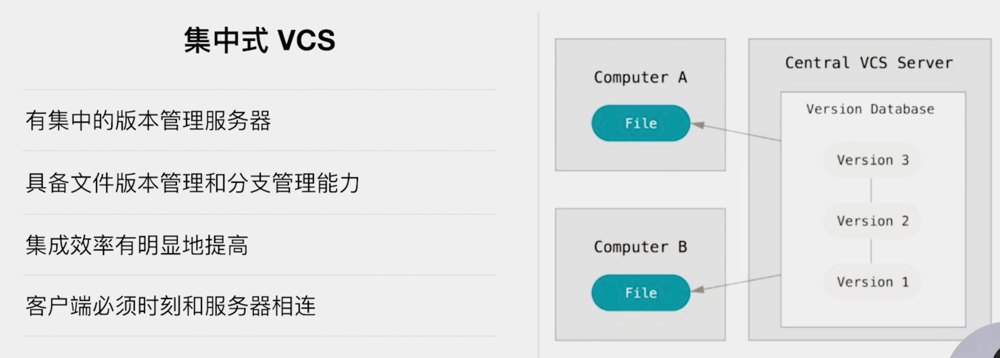
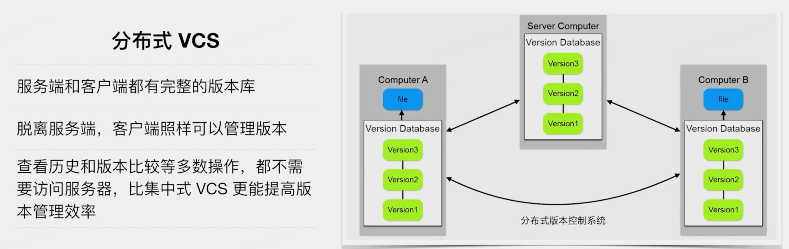
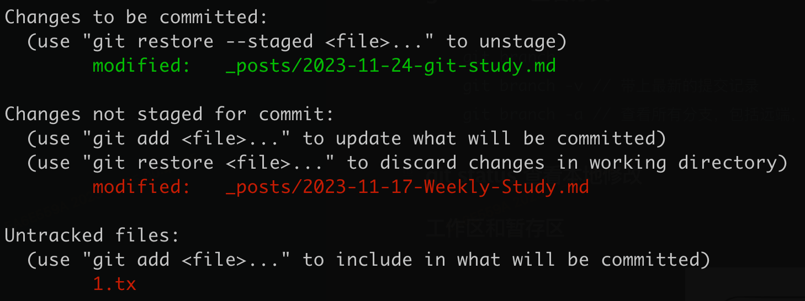
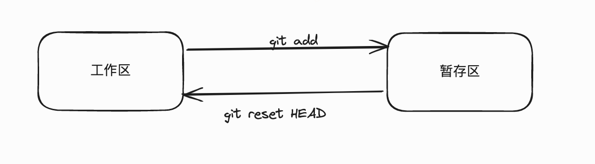
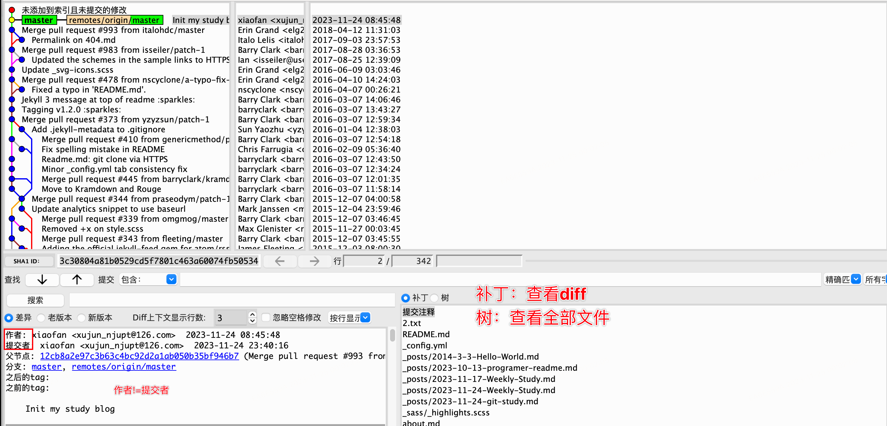
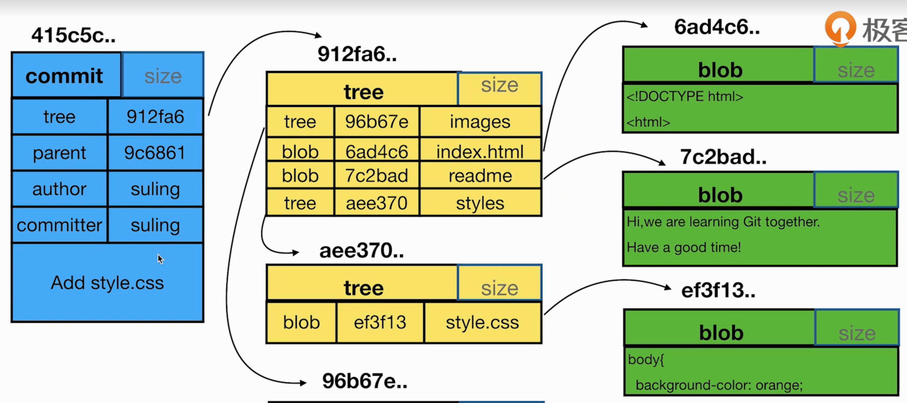
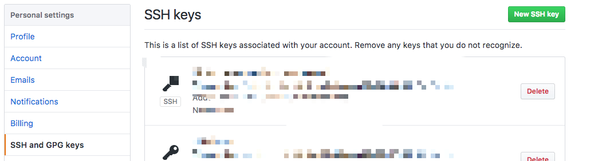

* TOC
{:toc}


### 集中式VCS和分布式VCS





### git config 配置

#### 查看配置

```sh
git config --list --local // 项目
git config --list --global // 全局
git config --list --system // 对系统所有登录用户都生效
```

#### 修改配置

```sh
git config --local user.name "xiaofan"
git config --local user.email "xiaofan@126.com"
```

#### 修改本地仓库init时的默认分支名

新版本默认分支名是`main`，可以在`git config`中配置默认分支名

```sh
git config --global init.defaultBranch master
```

### git branch 查看分支

```sh
git branch
git branch -v // 带上最新的提交记录
git branch -a // 查看所有分支，包括远端，可以跟上面一起用-av
```

### git status 查看本地修改



- Changes to be committed // 暂存区

- Changes not staged for commit // 工作区

- Untracked files // 未跟踪的文件，git没有纳入版本控制

### 工作区和暂存区



#### git add 加入暂存区

```sh
git add <file>
git add -u // 将所有已修改（modified）和已删除（deleted）的文件添加到暂存区
git add . // 将所有未跟踪（untracked）的文件和已修改（modified）的文件添加到暂存区
```

#### git commit 暂存区提交到本地分支

```sh
git commit -m"commit message"
```

#### git reset --hard清空暂存区

```sh
git reset --hard
```

#### 恢复暂存区和HEAD一样

```sh
git reset HEAD // 从暂存区回滚到工作区
```

#### 恢复工作区和暂存区一样

当工作区和暂存区对相同的文件都有修改时

```sh
git restore <file>
```

#### git clean 删除工作区Untracked files

```sh
git clean -f 
git clean -f <file>
```

### git rm 删除文件

```sh
git rm <file>
```

### git stash 保存工作目录和暂存区的状态

```sh
git stash // 加入stash堆栈
git stash list // 查询stash堆栈
git stash apply // 应用stash堆栈，堆栈数据仍保留
git stash pop // pop stash堆栈，堆栈数据不保留
```

### git mv重命名

```sh
mv readme <file>
git add <file>
git rm <file> 
```

等价于下面的写法

```sh
 git mv readme <file>
```

### git checkout 创建新分支

签出分支时可以指定到哪一次提交

```sh
git checkout -b <branch> <commit> // 基于commit签出一个分支
git checkout -b <branch> origin/<commit> // 从远端分支签出一个分支
```

### git log查看日志 

```sh
git log
git log --oneline // 更简洁
git log -n10 // 看最近的10条
git log --all // 所有分支提交记录
git log --all --graph // 所有分支提交记录(带图谱信息)
```

### **<u>gitk 图形化界面查看log</u>**

在git仓库下执行

```sh
gitk
```

报命令不存在，执行命令安装:

```sh
brew install git-gui
```

该命令可打开git自带的终端



通过菜单栏的`View`可以自定义视图，查看指定的作者和分支

### git cherry-pick

`git cherry-pick` 是一个用于将一个或多个提交从一个分支应用到另一个分支的 Git 命令。这个命令的主要用途是从一个分支选择一个或多个提交，然后将它们应用到另一个分支上

```sh
# 切换到目标分支
git checkout <target-branch>

# 应用单个提交
git cherry-pick <commit-hash>

# 应用多个提交范围
git cherry-pick <start-commit-hash>^..<end-commit-hash>

# 应用多个不相邻的提交
git cherry-pick <commit-hash-1> <commit-hash-2> <commit-hash-3> ...

```

###    HEAD 头指针

- 当前分支最新一次提交
- 某个提交（分离头指针时）

### <u>detached HEAD 分离头指针</u>

```sh
(base) ➜  local git:(test) git checkout af89f5a
Note: switching to 'af89f5a'.

You are in 'detached HEAD' state. You can look around, make experimental
changes and commit them, and you can discard any commits you make in this
state without impacting any branches by switching back to a branch.

If you want to create a new branch to retain commits you create, you may
do so (now or later) by using -c with the switch command. Example:

  git switch -c <new-branch-name>

Or undo this operation with:

  git switch -

Turn off this advice by setting config variable advice.detachedHead to false

HEAD is now at af89f5a update readme
```

分离头指针后，处于没有分支的状态

`You can look around, make experimental changes and commit them, and you can discard any commits`

git建议我们想要做一些实验性质的修改的时候，可以采用分离头指针的方式，无需单独创建一个分支。

当我们本次测试结束后，如果需要保留这些测试代码，，可以用`git switch -c <new-branch-name>`将改动保存到一个新分支，也可以`git switch -`撤销这些改动

### git diff 代码比对

```sh
git diff <commit> HEAD 

git diff HEAD HEAD^ // 比较当前提交和上一次提交的差异
git diff HEAD HEAD~1 // 同上

git diff // 比较工作区和HEAD
git diff -- <file> // 只查看指定文件
git diff --cached // 比较暂存区与HEAD
```

比较两个分支的差异：

```sh
(base) ➜  local git:(main) git branch -av
  dev   9b66265 owner
  exp   c6773e8 Update README
* main  7cd5193 Add hello.txt
  pre   075e7e7 init
  test  a51864f merge master
  test2 e335c29 fmt
  
  
git diff 9b66265 7cd5193
git diff dev main // 同上
git diff dev main --<file> // 只看指定文件
```

### git checkout -b 签出新分支

```sh
git checkout -b <branch> main // 基于分支签出新分支
git checkout -b <branch> <commit> // 基于提交签出新分支
```

### 解决merge冲突

```sh
git merge master // aha~冲突了
git status // 查看冲突文件
vim <file> // 编辑冲突文件并修复冲突，终端或GUI工具解决冲突都可，复杂冲突建议用GUI
git merge --continue
git add .
git commit -m"Fix conflict"
```

### git branch -d/-D删除分支

```sh
git branch -d <branch> // 删除，若分支未合入当前分支，会报错
git branch -D <branch> // 强制删除
```

### git commit --amend  修改最新message

只能修改最近的一次commit的message

```sh
git commit --amend 
```

### git branch/log/diff 结果输出在当前终端不分页

修改git config

```sh
[pager]
        branch = false
        log = false
        diff = false
```

### .gitignore配置

参考[github/gitignore](https://github.com/github/gitignore)仓库，比如`go`语言的.gitignore推荐配置如下：

```sh
# If you prefer the allow list template instead of the deny list, see community template:
# https://github.com/github/gitignore/blob/main/community/Golang/Go.AllowList.gitignore
#
# Binaries for programs and plugins
*.exe
*.exe~
*.dll
*.so
*.dylib

# Test binary, built with `go test -c`
*.test

# Output of the go coverage tool, specifically when used with LiteIDE
*.out

# Dependency directories (remove the comment below to include it)
# vendor/

# Go workspace file
go.work
```

### git push推送到远端

常用的传输协议

- 哑协议
- 智能协议
- http/https协议：用账号密码
- ssh协议：用公钥

### git clone --bare 本地新建一个裸仓库

如果你想本地测试推送到远端分支，又不想在github或其它代码托管网站上创建仓库，可以在本地建一个远端仓库

用`git clone --bare`命令可以建立一个裸仓库，作为一个集中式的代码仓库，用于协作和同步。裸仓库没有工作目录

```sh
git clone --bare /Users/xujun01/go/src/local/.git ya.git // 哑协议
Cloning into bare repository 'ya.git'...
done.

git clone --bare file:///Users/xujun01/go/src/local/.git zhineng.git // 智能协议 
Cloning into bare repository 'zhineng.git'...
remote: Enumerating objects: 90, done.
remote: Counting objects: 100% (90/90), done.
remote: Compressing objects: 100% (78/78), done.
remote: Total 90 (delta 20), reused 0 (delta 0), pack-reused 0
Receiving objects: 100% (90/90), 14.10 MiB | 12.08 MiB/s, done.
Resolving deltas: 100% (20/20), done.
```

 然后用`git remote add`命令向当前git仓库中添加一个远程仓库的应用

### git push -f 强制更新

慎用！会导致远端commit丢失

使用场景：测试环境一个公共的开发分支和master冲突太多，从master签出一个新分支，覆盖这个开发分支

```sh
git reset hash
git push -f origin dev
```

### <u>git rebase 变基</u>	

执行`git rebase`命令后，会打开一个git的todo列表，

在todo列表中可以使用以下命令列表

```sh
# p, pick <commit> = use commit
# r, reword <commit> = use commit, but edit the commit message
# e, edit <commit> = use commit, but stop for amending
# s, squash <commit> = use commit, but meld into previous commit
# f, fixup [-C | -c] <commit> = like "squash" but keep only the previous
#                    commit's log message, unless -C is used, in which case
#                    keep only this commit's message; -c is same as -C but
#                    opens the editor
# x, exec <command> = run command (the rest of the line) using shell
# b, break = stop here (continue rebase later with 'git rebase --continue')
# d, drop <commit> = remove commit
# l, label <label> = label current HEAD with a name
# t, reset <label> = reset HEAD to a label
# m, merge [-C <commit> | -c <commit>] <label> [# <oneline>]
# .       create a merge commit using the original merge commit's
# .       message (or the oneline, if no original merge commit was
# .       specified); use -c <commit> to reword the commit message
```

常用的有`pick`、`reword`、`squash`，下面展开说明用法

### reword修改旧的commit的message

reword <commit> = use commit, but edit the commit message 

保留commit，但是修改它的message

```sh
git rebase -i <commit> // 选择要修改的commit的父提交
挑选要修改的commit，改成reword，保存
修改commit
```

### squash把多个commit合并成1个

squash <commit> = use commit, but meld into previous commit

- 多个连续的commit

```sh
git rebase -i <commit> // 选择要修改的commit的父提交
保留一个commit还是pick，挑选要修改的commit，改成squash，保存
修改commit
```

- 多个不连续的commit

原理同上，只是需要在执行`git rebase -i`之后的todo列表中手动将不连续的commit调整为连续

再使用上面的方法将连续的commit sqush为一个commit

### **<u>merge、squash merge和rebase merge</u>**

假设我们目前有两个分支master和dev，提交记录如下，C后面跟的数字是提交的顺序

C0 - C1 - C2 - C3                                    dev

​		↘

​		        C4 - C5                 		master

分别用三种merge方法将dev分支合入master分支

#### merge

C0 - C1 - C2 - C3                                             dev

​		↘            ↘

​		      C4 - C5 - C6‘                 		master


优点：
- 简单易用

- 保留了完整的提交记录

缺点：
- 主干分支历史记录不清晰


#### Squash merge

<u>squash merge 会将C2、C3两次提交压缩成1个提交记录C6'合到master中</u>

C0 - C1 - C2 - C3                                    dev

​		↘

​		       C4 - C5 - C6‘                 		master

优点：

- 保持了干净的提交历史，主干历史记录清晰
- 开发过程中无需纠结`commit message`是否规范等问题

缺点：

- 多人共同开发一个分支时，squash merge后只保留最终merge人作为代码提交作者


#### rebase merge

```sh
git chekout dev
git rebase master 
```

首先找到这两个分支 的最近共同祖先 `12`，然后对比当前分支相对于该祖先的历次提交，提取相应的修改并存为临时文件， 然后

<u>将当前分支指向目标基底</u>（被称为变基的原因） `C5`, 最后以此将之前另存为临时文件的修改依序应用，C2'  C3'


C0 - C1 - ~~C2 - C3~~                                     

​		↘

​		      C4 - C5 - C2' - C3'                 dev

​			     master

最后再切回master分支，将dev合入即可

```sh
git checkout master
git merge dev
```


优点：

-  保持了线性的提交历史，主干历史记录清晰

缺点：

-  变基修改了提交历史，可能会导致冲突


#### 选择merge还是rebase？

有一种观点认为，仓库的提交历史即是 **记录实际发生过什么**。 它是针对历史的文档，本身就有价值，不能乱改。 从这个角度看来，改变提交历史是一种亵渎，你使用 *谎言* 掩盖了实际发生过的事情。 如果由合并产生的提交历史是一团糟怎么办？ 既然事实就是如此，那么这些痕迹就应该被保留下来，让后人能够查阅。

另一种观点则正好相反，他们认为提交历史是 **项目过程中发生的事**。 没人会出版一本书的第一版草稿，软件维护手册也是需要反复修订才能方便使用。 持这一观点的人会使用 `rebase` 及 `filter-branch` 等工具来编写故事，怎么方便后来的读者就怎么写。

### git rerere 自动解决冲突

`git rerere` 功能是一个隐藏的功能。 正如它的名字“重用记录的解决方案（reuse recorded resolution）”所示，它允许你让 Git 记住解决一个块冲突的方法， 这样在下一次看到相同冲突时，Git 可以为你自动地解决它。

开启rerere功能

```sh
 git config --global rerere.enabled true
```

[点击查看rerere命令的详细介绍](https://git-scm.com/book/zh/v2/Git-%E5%B7%A5%E5%85%B7-Rerere)

### <u>git objects 对象数据库</u>

Git 是一个内容寻址文件系统， 这意味着，Git 的核心部分是一个简单的键值对数据库（key-value data store）。 你可以向 Git 仓库中插入任意类型的内容，它会返回一个唯一的键，通过该键可以在任意时刻再次取回该内容。

这个唯一键是一个长度为 40 个字符，是将待存储的数据外加一个头部信息（header）一起做 SHA-1 校验运算而得的校验和

用 `git hash-object` 创建一个新的数据对象并将它手动存入 Git 数据库中，存储路径为`.git/objects`，前两位作为文件夹名称，剩余38位作为文件名

```sh
(base) ➜  bl-ott.github.io git:(master) ✗ echo 'test content' | git hash-object -w --stdin
d670460b4b4aece5915caf5c68d12f560a9fe3e4

(base) ➜  bl-ott.github.io git:(master) ✗ find .git/objects -type f
.git/objects/d6/70460b4b4aece5915caf5c68d12f560a9fe3e4

(base) ➜  bl-ott.github.io git:(master) ✗ git hash-object -w index.html // 查看文件的object
5e0cb3ee5773d8207228cfdc53310d8940f644df 
```

用`git cat-file -t`命令查看object的类型，用`git cat-file -p`从object中取出数据

```sh
(base) ➜  bl-ott.github.io git:(master) ✗ git cat-file -t d670460b4b4aece5915caf5c68d12f560a9fe3e4
blob
(base) ➜  bl-ott.github.io git:(master) ✗ git cat-file -p d670460b4b4aece5915caf5c68d12f560a9fe3e4
test content
```


object分为以下类型

- commit

- tag

- tree - 文件夹

- blob - 文件

  
  
  其中，commit、tree和blob之间的关系参考下图



blob-文件

- <u>内容相同的文件对应的blob是同一个</u>

- Untracked file不会生成blob，加入暂存区才会生成
- 修改文件内容后，会生成新的blob，老的仍保留
- blob中不包含文件名信息，文件名信息存在tree中

tree-树

用`git cat-file -p master^{tree}`查看当前最新的树对象

`master^{tree}` 语法表示 `master` 分支上最新的提交所指向的树对象

```sh
(base) ➜  git_learn git:(master) git cat-file -p master^{tree}
040000 tree b194cba364e8e801227e608c15bd2d01bb38e3d0	app
100644 blob d00491fd7e5bb6fa28c517a0bb32b8b506539d4d	readme
```

tree中包含tree和blob对象


### <u>如何把A分支的部分改动文件checkout到B分支</u>

有命令行和IDE两种范式

- 命令行方式

```sh
git checkout master
git checkout -b <branch_B>
git checkout <file1> <file2> <file3>
```

- IDE方式

1. A分支和B分支都merge最新的master代码

2. 切换到B分支

3. 在Goland的Git窗口中选中A分支，右键选择`显示与工作树的差异`
4. 在文件diff列表窗口中，选择多个文件或目录，右键选择`从分支获取`

### git统计项目中代码行数

```sh
git log --format='%aN' | sort -u | while read name; do echo -en "$name\t"; git log --author="$name" --pretty=tformat: --numstat | awk '{ add += $1; subs += $2; loc += $1 - $2 } END { printf "added lines: %s, removed lines: %s, total lines: %s\n", add, subs, loc }' -; done
```

### 怎样在电脑上同时使用github和gitlab

#### 生成秘钥，指定秘钥的名称

```sh
//生成gitlab的秘钥
ssh-keygen -t rsa -f ~/.ssh/id_rsa.gitlab -C "test_aaa@126.com"


//生成github的秘钥
ssh-keygen -t rsa -f ~/.ssh/id_rsa.github -C "test_bbb@126.com"
```

执行完上述的操作的时候，在`~/.ssh`目录就可以看到如下的4个文件

```sh
id_rsa.gitlab        gitlab的私钥
id_rsa.gitlab.pub    gitlab的公钥
id_rsa.github        github的私钥
id_rsa.github.pub    github的公钥
```


#### 将私钥添加到 ssh-agent 中

```sh
ssh-add id_rsa.gitlab
ssh-add id_rsa.github
```


#### 将公钥添加到git平台中

以github为例，在`Personal settings/SSH and GPG keys`中就可以添加`ssh key`了，如下图所示




#### 测试ssh

执行下面的命令测试ssh

```sh
ssh -T git@github.com
```

若出现类似下面的提示，说明ssh可用


然后就可以使用ssh的方式使用git平台了


### 参考资料

1. [极客时间《玩转Git三剑客》课程](https://time.geekbang.org/course/detail/100021601-76379)
2. [Git 内部原理 - Git 对象](https://git-scm.com/book/zh/v2/Git-%E5%86%85%E9%83%A8%E5%8E%9F%E7%90%86-Git-%E5%AF%B9%E8%B1%A1)
3. [Git 分支 - 变基](https://git-scm.com/book/zh/v2/Git-%E5%88%86%E6%94%AF-%E5%8F%98%E5%9F%BA)
