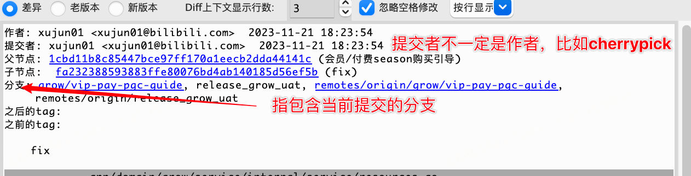

### 集中式VCS和分布式VCS


### 查看git配置

```sh
git config --list --local // 项目
git config --list --global // 全局
git config --list --system // 对系统所有登录用户都生效
```

<br/>

### git add 加入暂存区

```sh
git add {filename}
git add -u // 将所有已修改（modified）和已删除（deleted）的文件添加到暂存区
git add . // 将所有未跟踪（untracked）的文件和已修改（modified）的文件添加到暂存区
```

### g it commit

```
git commit -m"commit message"
```

### git reset 清空暂存区

```
git reset --hard HEAD
```

### git 重命名

```
mv readme readme.md
git add readme.md
git rm readme 
```

等价于下面的写法

```
 git mv readme readme.md 
```

### git log查看日志 

```
gitlog
git log --oneline // 更简洁
git log -n10 // 看最近的10条
git log --all // 所有分支提交记录
git log --all --graph // 所有分支提交记录(带图形化信息)
```

### git branch 查看分支

```
git branch
git branch -v // 带上最新的提交记录
git branch -a // 查看所有分支，包括远端，可以跟上面一起用-av
```

### git checkout 创建新分支

签出分支时可以指定到哪一次提交

```
git checkout -b {branch_name} {commit_hash} // 基于commit签出一个分支
git checkout -b {branch_name} origin/{branch_name} // 从远端分支签出一个分支
```

### gitk log图形化界面

安装

```sh
brew install git-gui
```

运行

```
gitk
```



通过菜单栏的`View`还可以自定义视图，查看指定的作者和分支

<br/>

### git cherry-pick

`git cherry-pick` 是一个用于将一个或多个提交从一个分支应用到另一个分支的 Git 命令。这个命令的主要用途是从一个分支选择一个或多个提交，然后将它们应用到另一个分支上

```sh
# 切换到目标分支
git checkout <target-branch>

# 应用单个提交
git cherry-pick <commit-hash>

# 应用多个提交范围
git cherry-pick <start-commit-hash>^..<end-commit-hash>

# 应用多个不相邻的提交
git cherry-pick <commit-hash-1> <commit-hash-2> <commit-hash-3> ...

```

​    

### git objects

在`.git/objects`中存储了git仓库的对象
包含这些类型：

- commit
- tag
- tree
- blog

我们可以通过`cat-file -t`命令查看object的类型,`cat-file -p`打印输出object

```
git cat-file -t // show object type 
git cat-file -p // pretty-print <object> content
```

## 


tree- 文件夹是一个tree

blob-文件，内容相同的文件对应的blob是同一个

<br/>


2个tree，1个blob

<br/>

### 分离头指针  detached HEAD

```sh
(base) ➜  local git:(test) git checkout af89f5a
Note: switching to 'af89f5a'.

You are in 'detached HEAD' state. You can look around, make experimental
changes and commit them, and you can discard any commits you make in this
state without impacting any branches by switching back to a branch.

If you want to create a new branch to retain commits you create, you may
do so (now or later) by using -c with the switch command. Example:

  git switch -c <new-branch-name>

Or undo this operation with:

  git switch -

Turn off this advice by setting config variable advice.detachedHead to false

HEAD is now at af89f5a update readme
```

分离头指针后，处于没有分支的状态

### HEAD

- 当前分支最新一次提交
- 某个提交（分离头指针时）

### git diff 

比较两个提交的差异：

```
git diff af89f5abcaf63934ea3fb7d04211de68d7aff08b HEAD 

git diff HEAD HEAD^ // 比较当前提交和上一次提交的差异
git diff HEAD HEAD~1 // 同上
```

比较两个分支的差异：

```
(base) ➜  local git:(main) git branch -av
  dev   9b66265 owner
  exp   c6773e8 Update README
* main  7cd5193 Add hello.txt
  pre   075e7e7 init
  test  a51864f merge master
  test2 e335c29 fmt
  
  
git diff 9b66265 7cd5193
git diff dev main // 同上
git diff dev main --file_name // 只看指定文件
```

### 切换新分支

```
git checkout -b dev main // 基于一个分支
git checkout -b pre 075e7e79689a0d4ebfcefad82764e68be760e561 // 基于一个提交
```

### 解决冲突

```
git merge master // 冲突了
git status // 查看冲突文件
// 编辑冲突文件并修复冲突
git merge --continue
git add .
git commit -m"Fix conflict"
```

### 删除分支

```
git branch -d xxx // 删除，若分支未合入当前分支，会报错
git branch -D xxx // 强制删除
```

### 修改最新一次commint的message

```
git commit --amend 
```

### 修改旧的commit的message

```
git rebase -i xxx // 选择要修改的commit的父提交
挑选要修改的commit，改成reword，保存
修改commit
```

git rebase 命令列表

```
# p, pick <commit> = use commit
# r, reword <commit> = use commit, but edit the commit message
# e, edit <commit> = use commit, but stop for amending
# s, squash <commit> = use commit, but meld into previous commit
# f, fixup [-C | -c] <commit> = like "squash" but keep only the previous
#                    commit's log message, unless -C is used, in which case
#                    keep only this commit's message; -c is same as -C but
#                    opens the editor
# x, exec <command> = run command (the rest of the line) using shell
# b, break = stop here (continue rebase later with 'git rebase --continue')
# d, drop <commit> = remove commit
# l, label <label> = label current HEAD with a name
# t, reset <label> = reset HEAD to a label
# m, merge [-C <commit> | -c <commit>] <label> [# <oneline>]
# .       create a merge commit using the original merge commit's
# .       message (or the oneline, if no original merge commit was
# .       specified); use -c <commit> to reword the commit message
```

<br/>

### 把连续多个commit合并成1个

```
git rebase -i xxx // 选择要修改的commit的父提交
保留一个commit还是pick，挑选要修改的commit，改成squash，保存
修改commit
```

### 把多个不连续的commit合并成1个

同上，在rebase阶段手动将不连续的commit调整为连续的

### git branch和git log结果输出在当前终端不分页

修改git config

```
[pager]
        branch = false
        log = false
        diff = false
```

### 恢复暂存区和HEAD一样


```
git reset HEAD
```

### 恢复工作区和暂存区一样

> 修改工作区用 git checkout 修改暂存区用 git reset

```
git restore xxx 
```

### git diff

```
git diff // 比较工作区和HEAD
git diff -- CHANGELOG.md // 只查看指定文件
git diff --cached // 比较暂存区与HEAD
```

### 删除工作区Untracked files

```
git clean -f 
git clean -f xxx
```

### 删除文件

```
git rm file_name
```

### git stash 保存工作目录和暂存区的状态

```
git stash // 加入stash堆栈
git stash list // 查询stash堆栈
git stash apply // 应用stash堆栈，堆栈数据仍保留
git stash pop // pop stash堆栈，堆栈数据不保留
```

### gitignore

官方推荐的go语言的gitignore配置

```
# If you prefer the allow list template instead of the deny list, see community template:
# https://github.com/github/gitignore/blob/main/community/Golang/Go.AllowList.gitignore
#
# Binaries for programs and plugins
*.exe
*.exe~
*.dll
*.so
*.dylib

# Test binary, built with `go test -c`
*.test

# Output of the go coverage tool, specifically when used with LiteIDE
*.out

# Dependency directories (remove the comment below to include it)
# vendor/

# Go workspace file
go.work
```

### git push推送到远端

常用的传输协议

- 哑协议
- 智能协议
- http/https协议：用账号密码
- ssh协议：用公钥

<br/>

### 本地新建一个裸仓库

用`git clone --bare`命令可以建立一个裸仓库，作为一个集中式的代码仓库，用于协作和同步。裸仓库没有工作目录

```
git clone --bare /Users/xujun01/go/src/local/.git ya.git // 哑协议
Cloning into bare repository 'ya.git'...
done.

git clone --bare file:///Users/xujun01/go/src/local/.git zhineng.git // 智能协议 
Cloning into bare repository 'zhineng.git'...
remote: Enumerating objects: 90, done.
remote: Counting objects: 100% (90/90), done.
remote: Compressing objects: 100% (78/78), done.
remote: Total 90 (delta 20), reused 0 (delta 0), pack-reused 0
Receiving objects: 100% (90/90), 14.10 MiB | 12.08 MiB/s, done.
Resolving deltas: 100% (20/20), done.
```

 然后用`git remote add`命令向当前git仓库中添加一个远程仓库的应用

### git push -f 强制更新

慎用！会导致远端commit丢失

使用场景：测试环境一个公共的开发分支和master冲突太多，从master签出一个新分支，覆盖这个开发分支

```
git reset hash
git push -f origin dev
```

### git merge

三种merge方式：普通merge、squash merge和rebase merge

下面我们通过三种方式将beijing分支merge到master分支，说明三种merge方式对git log图谱的影响


1. merge


2. squash merge


3. rebase merge


### 怎样在电脑上同时使用github和gitlab

#### 生成秘钥，指定秘钥的名称

```
//生成gitlab的秘钥
ssh-keygen -t rsa -f ~/.ssh/id_rsa.gitlab -C "test_aaa@126.com"


//生成github的秘钥
ssh-keygen -t rsa -f ~/.ssh/id_rsa.github -C "test_bbb@126.com"
```

执行完上述的操作的时候，在`~/.ssh`目录就可以看到如下的4个文件

```
id_rsa.gitlab        gitlab的私钥
id_rsa.gitlab.pub    gitlab的公钥
id_rsa.github        github的私钥
id_rsa.github.pub    github的公钥
```


#### 将私钥添加到 ssh-agent 中
```
ssh-add id_rsa.gitlab
ssh-add id_rsa.github
```


#### 将公钥添加到git平台中

以github为例，在`Personal settings/SSH and GPG keys`中就可以添加`ssh key`了，如下图所示


#### 测试ssh

执行下面的命令测试ssh

```
ssh -T git@github.com
```

若出现类似下面的提示，说明ssh可用


然后就可以使用ssh的方式使用git平台了
