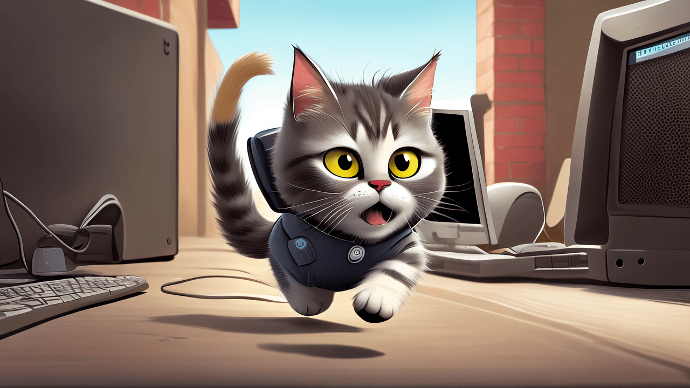
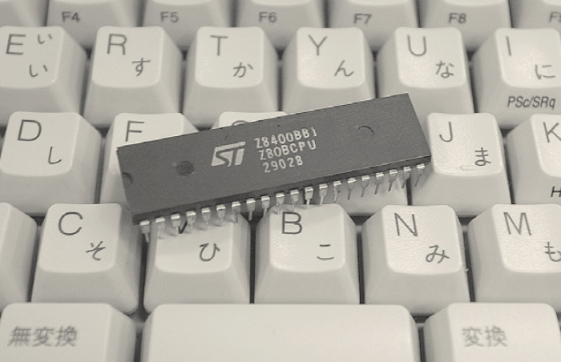
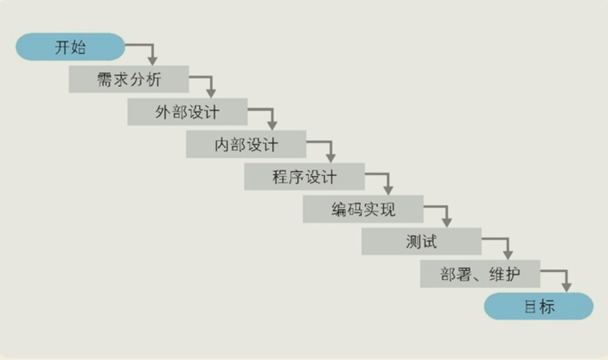
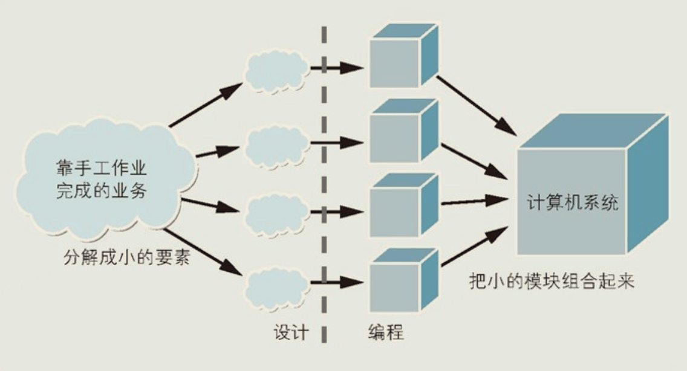

### 计算机三大原则

- 原则1：计算机是个执行输入、计算、输出的机器

  计算机是由IC组成的，IC的引脚中部分用于输入部分用于输出

- 原则2：程序是指令和数据的集合

无论程序多么高深、多么复杂，其内容也都是指令和数据

指令，就是控制计算机进行输入、运算、输出的命令

程序，就是把向计算机发出的指令一条条列出来

- 原则3：计算机的处理方式有时和人们的思维习惯不同

计算机中什么都是数字

e.g.，用“0,0,255”表示蓝色，用“255,0,0”表示红色，用“255,0,255”表示由蓝色和红色混合而成的紫色

### 计算机不断进步接近人类

​	编程方法也在进化，进化的成果是诞生了两种编程方法，面向组件编程（Component Based Programming）和面向对象编程（Object Oriented Programming）。这两者的进化目标一致，都是使程序员可以在编程中继续沿用人类创造事物时的方法。面向组件编程的方法是通过将组件（程序的零件）组装到一起完成程序；面向对象编程的方法是先如实地对现实世界的业务建模，之后再把模型搬到程序中。使用符合人类思维习惯的编程方法，可以实现高效率的开发。

​	也许计算机进化的最终形态就是机器人了，有着与人类一样的外表，可以使用人类的语言。

​	基于这个原因，有人称SQL是第四代编程语言（二进制语言是第一代，汇编语言是第二代，高级语言是第三代），因为SQL中的语言(select * from table where id=1;)已经很接近人类语言了

### 制造一台微机

### 瀑布模型

这种开发过程之所以被称为“瀑布模型”，是因为**开发流程宛如瀑布，一级一级地自上而下流动，永不后退**

- 外部设计：用户看的到的部分的设计
- 内部设计：开发者看得到，用户看不到的部分的设计
- 程序设计：技术方案设计
- 编码实现：**经过充分的程序设计，编码是一项十分简单的工作**
- 测试：需要定量地标示出测试的结果，不能只记录含糊的结果如"已测试"、"已通过"
  - 涂色检查
  - 覆盖率测试
- 部署维护：产出部署手册和维护手册

### 设计即拆解

从需求分析到程序设计，所进行的工作都是拆解业务，把将要为计算机系统所替代的手工业务拆解为细小的要素。

从编码实现到部署、维护阶段，所进行的工作则是集成，把拆解后的细小要素转换成程序的模块，再把这些模块拼装在一起构成计算机系统。

