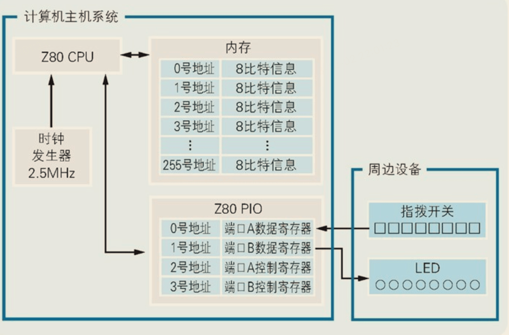

>《计算机是怎样跑起来的》读书笔记

* TOC
{:toc}

### 计算机三大原则

- **原则1：计算机是个执行输入、计算、输出的机器**

​	计算机是由集成电路（以下简称IC）组成的，IC的引脚中部分用于输入部分用于输出


- **原则2：程序是指令和数据的集合**

​	无论程序多么高深、多么复杂，其内容也都是指令和数据

​	指令，就是控制计算机进行输入、运算、输出的命令

​	程序，就是把向计算机发出的指令一条条列出来

- **原则3：计算机的处理方式有时和人们的思维习惯不同**

​	计算机中什么都是数字

​	比如，用“0,0,255”表示蓝色，用“255,0,0”表示红色，用“255,0,255”表示由蓝色和红色混合而成的紫色

### 计算机不断进步接近人类

​	编程方法也在进化，进化的成果是诞生了两种编程方法，面向组件编程（Component Based Programming）和面向对象编程（Object Oriented Programming）。这两者的进化目标一致，都是使程序员可以在编程中继续沿用人类创造事物时的方法。面向组件编程的方法是通过将组件（程序的零件）组装到一起完成程序；面向对象编程的方法是先如实地对现实世界的业务建模，之后再把模型搬到程序中。使用符合人类思维习惯的编程方法，可以实现高效率的开发。

​	也许计算机进化的最终形态就是机器人了，有着与人类一样的外表，可以使用人类的语言。

​	基于上述原因，有人把SQL成为第四代编程语言（第一代二进制语言，第二代汇编语言，第三代高级语言），因为SQL中的语言(e.g.select * from table where id=1;)已经很接近人类语言了

### 用IC制造一台微机

程序的作用是驱动硬件工作，在编写程序之前需要了解微型计算机的硬件信息。通过打印下面的微机集成电路图，可以通过在白纸上画电路图的方式体验制造微机的过程。


#### 主要元件列表

1. Z80 CPU

2. TC5517：内存

3. Z80PIO：I/O

4. 时钟发生器：产生时钟信号

5. 指拨开关：设定内存地址

6. 按动开关：写入内存

7. 快动开关：输入I/O设备

8. LED：输出I/O设备

   

#### **时间发生器**

时间发生器的震荡频率，可以衡量CPU的运转速度，我们称之为CPU的主频

> 程序的 CPU 执行时间 =CPU 时钟周期数×时钟周期时间

如2.8GHz 的 CPU 上，时钟周期时间就是 1/2.8G

提升CPU的主频（超频），可以使CPU运转的更快，同时散热压力也更大。


#### Z80CPU 引脚

1. **A0-A15**（A表示Address）：地址总线引脚，用于传输 16 位的地址信息。
2. **D0-D7**（D表示Data）：数据总线引脚，用于传输 8 位的数据。
3. **!MREQ[^1]：** 存储器请求，指示对存储器的读写操作。
4. **!IORQ：** 输入/输出请求，指示对 I/O 端口的读写操作。
5. **!RD：** 读取操作的时钟信号。
6. **!WR：** 写入操作的时钟信号。
7. **!BUSRQ：** 总线请求，用于外部设备请求对总线的控制权。
8. **!BUSACK：** 总线确认，用于向外部设备发送总线控制权。
9. **!M1：**用于同步
10. **!INT（中断请求）：** 外设请求中断时，会发出 INT 信号。
11. **CLK（时钟）：** 时钟信号，用于同步操作。
12. **!RESET（复位）：** 外部设备可以通过发送 RESET 信号来重置 Z80。
13. **Vcc：**这是 Z80 CPU 的电源引脚，通常连接到系统提供的正电源。
14. **GND：**这是 Z80 CPU 的地引脚，连接到系统的地线或地点。


#### TC5517引脚

1. **A0-A8：** 地址总线引脚，用于传输 9 位地址信息。

2. **DO-D7：**输入输出数据

3. **!CE：** 在电路中激活IC。

4. **!RD：** 输出使能引脚，用于启用输出。

5. **!WE：** 写入使能引脚，用于启用写入操作。

6. **Vcc：**这是 Z80 CPU 的电源引脚，通常连接到系统提供的正电源。

7. **GND：**这是 Z80 CPU 的地引脚，连接到系统的地线或地点。

   

#### Z80PIO引脚

1. **B/!A：**选择端口B或端口A。

2. **C/!D**：选择控制模式或数据模式。

3. **D0-D7：** 数据总线引脚，用于传输 8 位的数据。 

4. **!CE：**在电路中激活IC

5. **!IORQ：** 输入/输出请求引脚，指示对 I/O 端口的读写操作。

6. **!M1：**用于同步

7. **!INT（中断请求）：** 外设请求中断时，会发出 INT 信号。

8. **!RD：** 读取操作的时钟信号。

9. **CLK（时钟）：** 时钟信号，用于同步操作。

10. **PA0-PA7：** 从外部设备读取数据或向外部设备写入数据。

11. **PB0-PB7：** 从外部设备读取数据或向外部设备写入数据。

12. **Vcc：**这是 Z80 CPU 的电源引脚，通常连接到系统提供的正电源。

13. **GND：**这是 Z80 CPU 的地引脚，连接到系统的地线或地点。

    

#### 连线组装微机

1. 连接电源：将CPU、内存、I/O、时钟发生器的Vcc引脚连接到+5V电源，GND引脚连接到0V电源。（只要想成0V表示数字0，+5V表示数字1，那么数字IC就是在用二进制数的形式收发消息）

2. 连接数据总线：连接CPU的D0-D7、内存的D0-D7、I/O的D0-D7、指拨开关1(经74367三态缓冲器)

3. 连接地址总线：连接CPU的A0-A7、内存的A0-A7、指拨开关2，将CPU的A0和A1连接到I/O的B/!A引脚和C/!D引脚

   - 只用到了8个地址总线，是因为用于输入程序的指拨开关是8比特的
   - 通过CPU的A0和A1两个总线的信号按照不同的顺序排列时(00、01、10、11)，可以控制PIO的4个寄存器：端口A数据寄存器、读端口B数据寄存器、端口A控制寄存器、端口B控制寄存器

4. 连接时钟信号：连接时钟发生器的8号引脚、CPU的CLK、I/O的CLK。CPU和PIO就可以跟随时钟信号同步转动。

5. 连接区分读写对象是内存还是I/O的引脚：因为A0和A1引脚同时连接到了内存和CPU，为了能够区分对象是内存还是CPU，将CPU的!MREQ引脚连接到内存的!CE，将CPU的!IORQ连接到I/O的!CE和!IORQ。同时，为了区分是读操作还是写操作，将CPU的!RD连接到内存的!RD和I/O的!RD，将CPU的!WR连接到内存的!WE（不需要连接到I/O，是因为I/O可以通过!RD引脚是0还是1来区分读写）。

   CPU不同读写操作时，各引脚值见下表

   | CPU操作    | !MREQ | !IORQ | !RD  | !WR  |
   | ---------- | ----- | ----- | ---- | ---- |
   | 从内存输入 | 0     | 1     | 0    | 1    |
   | 向内存输出 | 0     | 1     | 1    | 0    |
   | 从I/O输入  | 1     | 0     | 0    | 1    |
   | 向I/O输出  | 1     | 0     | 1    | 0    |

6. 连接其它引脚：CPU的!M1和!INT引脚连接到I/O的!M1和!INT引脚，!BUSRQ引脚连接到拨动开关，!RESET引脚连接到按动开关。将!BUSAK引脚连接到4个74367的!G1和!G2引脚上。将I/O的PA0-PA7连接到指拨开关用于输入，PB0-PB7连接到LED灯用于输出。

   - 按动开关，!RESET引脚的信号就会先设定为0再还原成1，CPU就会被重置，重新从内存0号地址上的指令开始顺序往下执行。
   - 若用指拨开关将!BUSRQ引脚值设为0，则  CPU 从电路中隔离。当处于这种隔离状态时，就可以不通过 CPU，手动地向内存写入程序了。像这样不经过 CPU 而直接从外部设备读写内存的行为叫作 DMA（Direct Memory Access，直接存储器访问）。当CPU从电路中隔离之后，!BUSAK引脚的值就会变成0，也就是说，把!BUSRQ的值设为0后，还要确认!BUSAK的值已经变为0，才能进行DMA。
   - 只有在74367的!G1和!G2引脚都为0的时候，信号才能通过。

7. 连接外部设备，通过DMA输入程序：将控制内存写入的按键开关连接到内存的!WE引脚,将内存的!CE连接到0V，!RD拉起连接到5V，这时内存为写入状态。

   

#### 调试微机

测试的二进制程序代码如下

```
地址           程序
00000000       00111110
00000001       11001111
00000010       11010011
```

我们一行行开始输入，通过指拨开关1设置地址总线的数据（如00000000），再通过指拨开关2设置数据总线的数据（如00111110）。设置好后，按动按键开关，内存的!WE引脚值变为0，地址和数据被写入到内存中。重复操作直至所有的地址和程序都被写入到内存中。

程序输入完成后，按动用于重置CPU的按键开关，CPU开始顺序执行内存中的程序。

### 手工汇编



编写汇编语言时你需要了解的计算机硬件信息只有以下7种：

1. CPU的种类
2. 时钟信号的频率
3. 内存的地址空间
4. 内存每个地址中可以存储多少比特的信息
5. I/O的种类
6. I/O的地址空间
7. I/O连接着哪些设备


### 瀑布模型


这种开发过程之所以被称为“瀑布模型”，是因为**开发流程宛如瀑布，一级一级地自上而下流动，永不后退**


- 外部设计：用户看的到的部分的设计
- 内部设计：开发者看得到，用户看不到的部分的设计
- 程序设计：技术方案设计
- 编码实现：**经过充分的程序设计，编码是一项十分简单的工作**
- 测试：需要定量地标示出测试的结果，不能只记录含糊的结果如"已测试"、"已通过"
  - 涂色检查
  - 覆盖率测试
- 部署维护：产出部署手册和维护手册

### 设计即拆解

从需求分析到程序设计，所进行的工作都是拆解业务，把将要为计算机系统所替代的手工业务拆解为细小的要素。

从编码实现到部署、维护阶段，所进行的工作则是集成，把拆解后的细小要素转换成程序的模块，再把这些模块拼装在一起构成计算机系统。


[^1]: 带!的引脚当电信号是0的时候激活，不带的信号为1的时候激活 ↩
