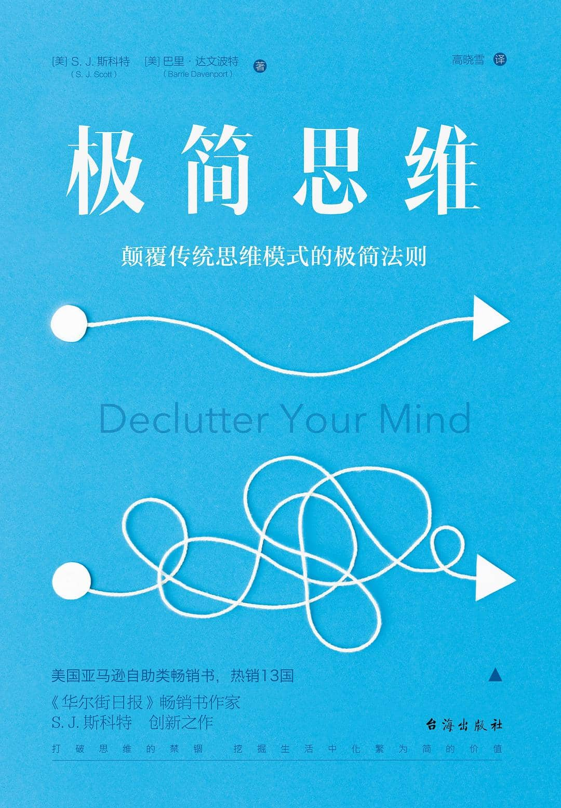

## 整理你的思维杂念

### 排除杂念练习一：专注的腹式呼吸

你可以遵循下面7个步骤，来养成每天进行有意识呼吸的好习惯：

>1.确定一天中练习深呼吸的时间，这个时间最好是在你能每天坚持的某种行为之后，比如刷牙。早晨是练习的好时机，因为这会帮你定下这一天舒适而轻松的基调。你可能也会想在中午休息一下，因为你的工作可能会使你感到忙乱，深呼吸有助于你克服困难。睡前是另一个好时机，因为它可以将你带入一种舒适而放松的状态，从而更好地进入梦乡。
>
>2.选择一个安静的空间来进行呼吸练习，保证你不会被任何事物所打扰。关掉你的手机、电脑，关掉任何可能会干扰到你的设备来确保一段专注的练习。
>
>3.将计时器设置为10分钟。
>
>4.你可以在垫子上做莲花坐，也可以在椅子上坐直，伸直你的脊椎，双脚踩地，把你的手轻轻地放在大腿上。
>
>5.慢慢吸气，直到你的肺被充满，让你的肚子在吸气时向外推。
>
>6.吸气结束时，停下来倒数两秒。
>
>7.慢慢地、平稳地、完全地把气呼出去，让你的肚子回到它的自然位置。呼气结束时也要暂停倒数两秒。

刚开始的时候不要一次性吸入太多空气，吸气的时候数四下，然后暂停数两下，呼气的时候再数四下。如果你感到呼吸困难，不要太过在意呼吸的深度，通过不断的练习，你的肺活量会逐渐提升，就能吸入更多的空气了。

### 排除杂念练习二：冥想

- 冥想不是为了让你的杂念平静下来，而是为了带领你去往那份本来就存在的宁静，那份被脑海中飘过的无数想法所深埋的宁静
- 遵循下面的十一个步骤，来养成你冥想的习惯吧！

> 1.找一个安静的空间来进行冥想练习，你可以关上门来确保自己能够一个人安静地待在这个空间里。
>
> 2.为练习定一个具体的时间。如果你已经开始练习之前介绍过的深呼吸，那么你可以在练习完深呼吸后直接开始冥想练习。你也可以选择在另一个不同的时间做冥想练习，这两种方法都可以，但一定要选好时间。
>
> 3.你可以选择找个垫子坐在地上，也可以坐在靠背椅或沙发上。冥想的过程中尽量不要倚靠在椅子上面，因为你可能会犯困然后睡过去。
>
> 4.确保远离一切干扰，关掉所有的数码设备和任何会发出噪音的电器。别忘了把宠物赶出去。
>
> 5.设定10分钟的计时器。
>
> 6.放松地坐在椅子上，或盘腿找个垫子坐在地上。保持脊柱直立，双手轻轻放在大腿上。
>
> 7.闭上眼睛，或者目光向下凝视。然后用你的鼻子进行几次深呼吸，我们建议一次练习中做三到四次深呼吸。
>
> 8.将意识集中于你的呼吸，感受空气从你的鼻孔进进出出，胸腔与腹部随着呼吸起起伏伏。让你的呼吸逐渐变得自然，不需要刻意进行。
>
> 9.然后把注意力集中在呼吸的感觉上，你可以随着呼吸的节奏，吸气的时候在脑海里想“吸”，呼气的时候在脑海里想“呼”。
>
> 10.刚开始的时候，你的思维肯定会不受控制地乱跑。每当思维抛锚的时候，慢慢地让这些杂乱的想法离开你的大脑，然后把你的注意力重新集中到呼吸的感觉上
>
> 11.刚开始的时候，你的思维肯定会不受控制地乱跑。每当思维抛锚的时候，慢慢地让这些杂乱的想法离开你的大脑，然后把你的注意力重新集中到呼吸的感觉上

- 每当思维抛锚的时候，慢慢地让这些杂乱的想法离开你的大脑，然后把你的注意力重新集中到呼吸的感觉上
- 冥想大师将这个静止的广阔空间称为“**间隙**”（gap）——无数念头中的沉默空间。起初，这个间隙很狭窄，在间隙中停留几秒都很困难。但当你成为一个更熟练的冥想者，你会发现间隙变得更加开阔，也更容易进入。你可以在间隙中休息更长的时间
- 你可以通过下面这个练习来短暂地感受一下间隙的存在：闭上眼睛，开始关注你大脑中的想法，单纯地观察它们的产生和消逝，持续几秒钟。然后问自己一个问题：“我的下一个想法会从哪儿来？”停下等待答案出现。当你等待答案的时候，你就会发现自己已经进入了一个狭窄的间隙空间
- 练习冥想不是为了到达极乐世界，也不是为了灵魂的觉醒。我们只是单纯地想要提高对思想的控制，让杂念不再掌控你的大脑。你努力的结果将给予你一个你可以做主的精神家园。

### 排除杂念练习三：驯服消极思想

你需要观察你的思维模式，并在这种思维模式失控前打断它

- 策略一：做一个旁观者

- 策略二：给思想命名

### 排除杂念练习四：新思想替换旧思想

## 整理你的生活

与其让这种“全或无”的思想占据你的大脑，不如在消极思想发生的时候挑战它。只需要简单地用一个具体地例子来反驳你的想法，用那些积极的事件或过去的“胜利”来提醒你的大脑，这种以偏概全的想法是不正确的。

### 方法一：确定自己的核心价值观

因为你的核心价值观可以作为衡量你生活中所有选择和决定的标尺，让你能够将精力有针对性地花在成为想成为的人和过希望过的生活上。行为与价值观一致，你将收获快乐、平静、镇定，这种生活环境对你来说是最棒的

### 方法二：确定生活任务的优先级

当我们还没有确定生活事项优先级的时候，我们常常让生活压力来决定要做什么

这里我们将生活划分为下面几个重要组成部分：1.事业2.家庭3.婚姻（或情侣）4.精神/个人成长/个人发展5.休闲/社交6.生活管理（例如：家务、理财）7.健康与健身

然而，向往着未来，却对现状保持满意，这种情况真的可能吗？人类真的能够在满足现状的同时寻求进化吗？我们认为，聚焦未来，但仍能享受当下，这种状况是可能的。

如果对未来的憧憬让你远离当下，又何必对未来那么在意呢？

### 方法三：设定季度S.M.A.R.T.目标

只关注你生活中的三到四个方面

不管你有多么忙碌，都该留出回顾总结的时间。如果每天不进行总结，那么你就不太可能获得成功了

通过回答下面几个问题，你可以完成你的季度评估：

- 我是否收获了预期的结果？
- 什么策略导致了成功或不成功？
- 为了完成目标，我付出了百分之百的努力吗？如果没有，为什么？
- 我是否取得了与我的努力相一致的结果？
- 下个季度我是否还需要制定一个类似的目标？
- 我应该消除或改变什么目标？
- 有没有什么我愿意尝试的新事物出现？

### 方法四：做你热爱的事

记得让那些与你亲近的人参与到你的行动中来

朝着梦想努力本身有时和好的结果一样令人满意

## 整理你的人际关系

我们在脑内不断重复那些不愉快的对话，或因为一个轻蔑的眼神闷闷不乐几个小时，又或者因远离朋友和爱人而感到孤单、寂寞、不被关爱。这些都让我们感到不开心。

太过于关注成就或不太关心人际关系的人都不怎么快乐

### 改善人际关系策略一：活在当下

作为一个有同理心的倾听者，我们必须要愿意做到以下几点：

- 允许他人来主导对话，并且决定讨论的话题。
- 对他人说的话，要保持百分之百的专注。
- 避免打断对方，即使你有重要的事情想要追加说明

- 问一些能让对方更多开口的问题。
- 避免过早得出结论或提供解决方案。
- 可以如实地重复他曾说的话，以确认他是否表达的是这个意思

冲突和消极总是会让朋友远离自己，所以要学会用积极替换消

不用因那些我们不曾拥有的天赋而痛苦，因为我们仍可以选择在能力范围的领域里做到最好

以下这三个简单的小练习，可以帮助你改变常与他人比较的习惯

- 练习一：彻底的自我接

- 练习二：改变你所能改变的
- 练习三：表达你的感激之情

### 改善人际关系策略二：放下过去的痛苦回忆

与其因为过去的问题感到焦虑，不如开始一段彻底的沟通

主动原谅还需要你原谅自己，原谅那些你曾在和他人相处时说过的话与做过的事情。诚实地面对你过去做过的可能伤害或冒犯过他人的行为吧。这时的你可能会不由自主地找出许多借口来解释自己当时为何会那样做，使自己的行为合理化，但如果你当时的行为真的出了差错，你必须学会接受它，并且原谅曾做出这种行为的自己。

### 改善人际关系策略三：同伴侣一起练习正念

正念只是帮助我们，让我们和我们的情感、经验培养一种与众不同的关系。在这种关系中，我们将能坐在驾驶席上。我们能像观察站台上通过的火车一般观察我们的情感与思想，也能决定是否要上情感这辆

不带防御的倾听

贬低和伤害对方之前，回到正念的练习上去。关注你的情绪，等到你冷静下来，不那么带刺儿的时候，再开始你们的对话

### 改善人际关系策略四：离开让你痛苦的人

讽刺的是，常常是那些陪伴了我们多年的深刻的亲密关系，会给我们带来最大痛苦和混乱

如果给你这种感受的人恰好是你的配偶、父母及家庭成员、又或是你的成年子女，那么你将不可能做到全身而退去放弃这段感情。但你可以更好地管理这些关系，通过建立强大的界限、与相关的人沟通你的底线，来保护自己的精神健康

再见也可能意味着放弃与这个人相处的旧方式，用一种新的、更自我保护的方式来替代之前相处的模式。

## 整理你的生活

### 简化你的家

这也是为什么我们建议你只把那些确信要保留的东西放回你整理好的空间里。扔掉那些你确定不需要的东西。至于那些有些犹豫要不要扔掉的很少用到的东西，放在收纳盒里之后处理

我们居住的空间，应该是为未来的我们而准备，而不是为了已经过去的自己

### 简化你的电子产品

每天抽出神圣而自由的一小时，让自己不受数字时代的侵扰

### 简化你的行为

这是你第多少次用“我太忙了，生活实在太疯狂了”来回答“最近怎样”这个问题？你最后一次听到“生活很棒，我真的很放松，什么都没做”这样的回答，又是什么时候

减少不必要活动的第一步，是要去认可减少不必要活动的价值，你要认识到忙碌会导致精神错乱，而做的更少也可能获得更多

把接下来一周属于你个人的和工作上的任务都写下来，如果你知道整月的任务，就把整月的写下来。查看你刚刚写下的清单，看看有没有哪个不会导致严重后果的任务可以删除掉，然后再查看一遍列表，看看还有什么任务可以委派给他人、推迟完成或者缩短执行时间的。

策略四：创造“神圣”时刻给你自己留一段可以什么事都不做的时间。可以坐在扶手椅里，看看窗外的景色，或到外面走走，听听鸟儿鸣啼。你不需要冥想、深呼吸、做计划、思考或是“做”任何事情。一切顺

### 简化你的基本生活

就像释一行禅师建议的一样，与其一边喝着茶一边思考你今天要做的事情，不如改变你的观点，在喝茶的时候把喝茶看作是世界上唯一重要的事情。这个转变适用于你所能做的一切，不论是洗盘子还是清理猫砂盒。

下面让我们学习以下五种方法，帮助你将正念带入日常生活中，让你即使是在最平凡的活动里，也能享受当下。

1. 认真吃饭细嚼慢咽，在脑海里对准备这顿饭菜的人表达感谢。

2. 认真收拾屋子

3. 认真散步

4. 认真体验大自然（享受大自然有助于疾病或手术的恢复）

5. 认真锻炼

运动的时候，想象把能量运送到你正在锻炼的部位

你的任务就是觉醒，即使每天只有短暂的片刻，去真正地体验你的人生吧，意识清楚地活在当下，而不是和担忧与胡思乱想纠缠不清。随着不断的练习和时间的推移，你会发现回到当下变得越来越不需要你付出意志层面的努力，会更加自主地发生。当你越频繁地回到当下，你便越能够真正地享受生活。

### 请下定决心驯服你的思维

通过将正念运用到日常生活的所有活动中，从洗碗到运动，你清空了你的头脑，留下了生活中唯一的真实，那就是此时此刻

你发现自己总是不断地贬低自己的能力和外表，而这些消极的想法使你不能享受生活。那么开始自我接纳、停止比较、学会宽恕将会是你需要去着手的方向。
