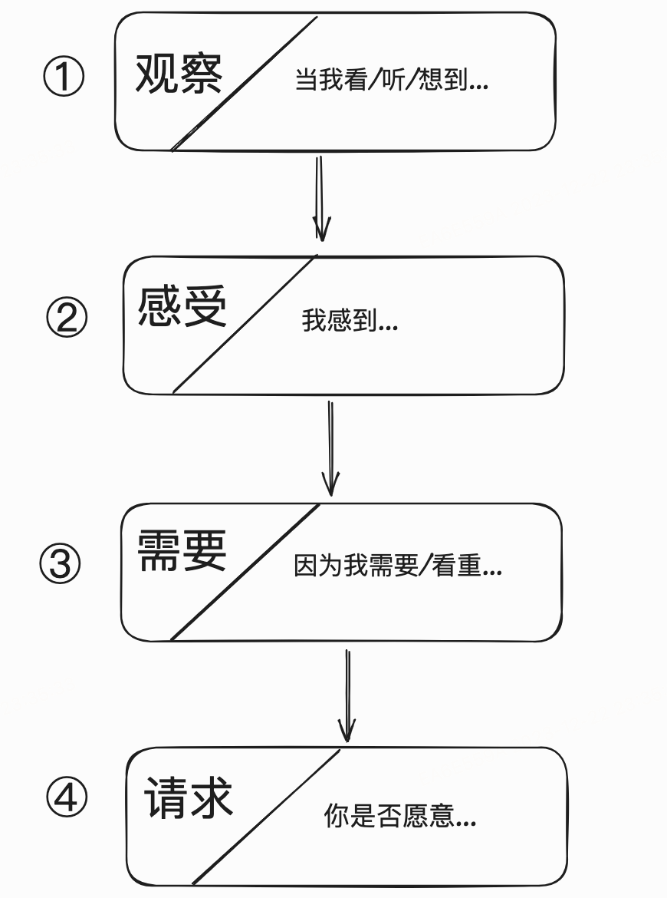
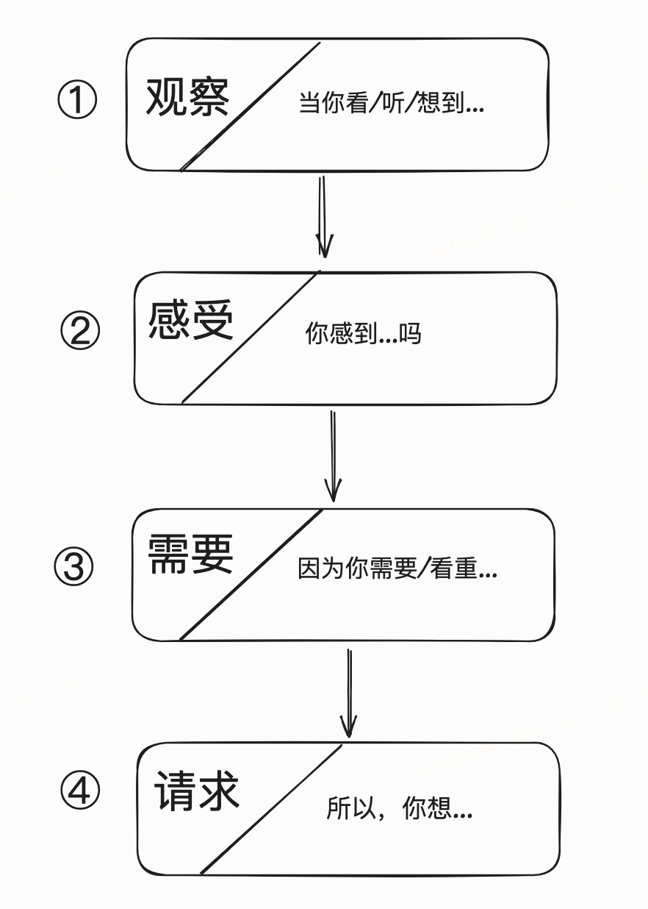

* TOC
{:toc}

# 非暴力沟通

非暴力沟通（Nonviolent Communication，简称NVC）

> **1.诚实地表达自己，而不批评、指责**
>
> （1）观察
>
> 我所观察（看、听、回忆、想）到的有助于（或无助于）我的福祉的具体行为：
>
> “当我（看、听、想到我看到的/听到的） ……”
>
> （2）感受
>
> 对于这些行为，我有什么样的感受（情感而非思想）：
>
> “我感到……”
>
> （3）需要
>
> 什么样的需要或价值（而非偏好或某种具体的行为）导致我那样的感受：
>
> “因为我需要／看重……”
>
> （4）请求
>
> 清楚地请求（而非命令）那些能丰富我生命的具体行为，
>
> “你是否愿意……？”

> **2.关切地倾听他人，而不解读为批评或指责**
>
> （1）观察
>
> 你所观察（看、听、回忆、想）到的有助于（或无助于）你的福祉的具体行为：
>
> “当你（看、听、想到你看到的/听到的） ……”
>
> （2）感受
>
> 对于这些行为，你有什么样的感受（是情感而非思想）：
>
> “你感到……吗？”
>
> （3）需要
>
> 什么样的需要或价值（而非偏好或某种具体的行为）导致你那样的感受：
>
> “因为你需要／看重……”
>
> （4）请求
>
> 关切地倾听那些能丰富你生命的具体请求，而不解读为命令：
>
> “所以，你想……”

## 前言

为了加深我对暴力的认识，祖父让我画一棵树，类似家族树，用以描述暴力的根源。他认为，认识暴力，有助于理解非暴力。每天晚上，他和我一起分析我一天中的经历——我的所读、所看、所做。如果某个行为涉及使用武力，就把它归到暴力之树“身体的暴力”那一边；如果主要造成精神伤害，那就归到暴力之树“隐蔽的暴力”那一边。

几个月后，我房间的一面墙上就写满了各种“隐蔽的暴力”。与“身体的暴力”相比，它们的危害性不那么明显，但祖父认为它们更为有害。他解释说，归根结底，是“隐蔽的暴力”激怒了受害者，使他作出暴力的反抗——不管是以个人的名义，还是以团体成员的名义。如果看不到这一点，我们为促进和平所做的努力，要么徒劳无功，要么昙花一现。不切断地狱之火的燃料供应，怎么可能成功灭火呢？

非暴力意味着让爱融入生活。让尊重、理解、欣赏、感激、慈悲和友情，而非自私自利、贪婪、憎恨、偏见、怀疑和敌意，来主导生活。

## 第一章 让爱融入生活

听到批评时，我们一般会申辩、退缩或反击。然而，<u>**一旦专注于彼此的观察、感受及需要，而不反驳他人，我们便能发现内心的柔情，对自己和他人产生全新的体会。**</u>这将最大限度地避免暴力。通过强调倾听——倾听自己及他人，非暴力沟通培育彼此的尊重、关注与爱，使人乐于互助

为了彼此能乐于互助，我们专注于四个方面——非暴力沟通模式的四个要素。

- 首先，留意发生的事情。我们此刻观察到什么？不管是否喜欢，只是说出人们所做的事情。要点是，清楚地表达观察结果，而不判断或评估。
- 接着，表达感受，例如受伤、害怕、喜悦、开心、气愤等等。
- 然后，说出哪些需要导致那样的感受。一旦用非暴力沟通诚实地表达自己，前三个要素就会得到体现。举例来说，一位母亲可能对她处于青春期的儿子说：“费利克斯，看到咖啡桌下的两只脏袜子和电视机旁的三只，我不太高兴，因为我看重整洁。”
- 接着，她立即提出非暴力沟通的第四个要素——具体的请求：“你是否愿意将袜子拿到房间或放进洗衣机？”这一要素明确告知他人，我们期待他采取何种行动，来满足我们。

比如，有位学生在教室中吐痰、咒骂、尖叫，并用铅笔戳走近他课桌的同学。我提醒他：‘<u>请换一种方式表达。使用长颈鹿语言</u>。’（在一些研讨班中，长颈鹿形状的木偶，被用作解释非暴力沟通的教具）他立即站起来，看着本想指责的同学，平静地说：‘你靠我这么近，我都要生气了！离我的桌子远点好吗？’

## 第二章 是什么蒙蔽了爱？

暴力的根源在于人们忽视彼此的感受与需要，而将冲突归咎于对方——至少大部分暴力的根源都是如此，不论是语言、精神或身体的暴力，还是家庭、部落以及国家的暴力

异化的沟通方式源自等级社会或专制社会，同时也支撑着它们。对于国王、沙皇、贵族来说，将臣民训练得具有奴隶般的精神状态符合他们的利益。“不应该”、“应该”和“不得不”这些表达方式特别适合这个目的：人们越是习惯于评定是非，他们也就越倾向于追随权威，来获得正确和错误的标准。

## 第三章 区分观察和评论

不要求我们保持完全的客观而不作任何评论。它只是强调区分观察和评论的重要性。将观察和评论混为一谈，人们将倾向于听到批评，甚至会产生逆反心理

**<u>非暴力沟通不鼓励绝对化的评论，而主张评论要基于特定时间和环境中的观察</u>**

不带评论的观察是人类智力的最高形式。

对于大多数的人来说，观察他人及其行为，而不评判、指责或以其他方式进行分析，是难以做到的。

注意：“每次”“曾”等词语在以下句子中表达的是观察结果。

“总是”、“从不”等词语在以下句子中表达的是评论。

**<u>如果我们的表达言过其实，别人就可能产生逆反心理，而不愿作出友善的回应。</u>**

非暴力沟通的第一个要素是观察。将观察和评论混为一谈，别人就会倾向于听到批评，并反驳我们。非暴力沟通是动态的语言，不主张绝对化的结论。它提倡在特定的时间和情境中进行观察，并清楚地描述观察结果

## 第四章 体会和表达感受

虽然他用“觉得”这个词，但他表达的是看法而非感受

区分感受和想法

清楚地表达感受需要丰富的词汇

非暴力沟通的第二个要素是感受。通过建立表达感受的词汇表，我们可以更清楚地表达感受，从而使沟通更为顺畅。在表达感受时，示弱有助于解决冲突。此外，非暴力沟通还对表达具体感受的词语与陈述想法、评论以及观点的词语作了区分

## 第五章 感受的根源

如果我们想利用他人的内疚，我们通常采取的办法是，把自己不愉快的感受归咎于对方

我们可以通过“我（感到）……因为我……”这种表达方式来认识感受与自身的关系

如果我们通过批评来提出主张，人们的反应常常是申辩或反击。反之，如果我们直接说出需要，其他人就较有可能作出积极的回应。不幸的是，大多数人并不习惯从需要的角度来考虑问题。在不顺心时，我们倾向于考虑别人有什么错

对于大多数的人来说，个人成长一般会经历三个阶段。

- 第一阶段：“情感的奴隶

- 第二阶段：“面目可憎”

- 第三阶段：“生活的主人”

  

对他人的指责、批评、评论以及分析反映了我们的需要和价值观。如果我们通过批评来提出主张，人们的反应常常是申辩或反击。反之，如果直接说出我们的需要，其他人就较有可能作出积极的回应。

## 第六章 请求帮助

首先，清楚地告诉对方，我们希望他们做什么。如果我们请求他人不做什么，对方也许会感到困惑，不知道我们到底想要什么。而且，这样的请求还容易引起别人的反感。

我们提出的请求越具体越好。如果我们的意思含糊不清，别人就难以了解我们到底想要什么。

此外，使用抽象的语言还会使我们无法深入了解自己。请求他人采取具体的行动将揭示我们的动机。

抽象的语言无助于深化自我认识

<u>**参加集体讨论时，说清楚我们希望得到怎样的反馈，是至关重要的。如果不清楚发言的目的，我们的讨论也许只是在浪费时间，而无法满足任何人的需要**</u>

如何区分命令和请求：

- 请求没有得到满足时，提出请求的人如果批评和指责，那就是命令；
- 如果想利用方的内疚来达到目的，也是命令。

- 我们越是将他人的不顺从看作是对我们的排斥，我们所表达的愿望就越有可能被看作是命令。这将导致恶性循环，因为一旦人们认为我们是在强迫他们，他们就会不太想满足我们的愿望。

- 反之，如果尊重他人的感受和需要，那么所表达的愿望就是请求而非命令。

  

如果我们只是想改变别人，以使他们的行动符合我们的利益，那么非暴力沟通并不是适当的工具。非暴力沟通是用来帮助我们在诚实和倾听的基础上与人联系。使用非暴力沟通时，我们希望人们的改变和行动是出于对生命的爱。一旦人们相信我们看重彼此的感情，并能兼顾双方的需要，那么，他们也就会相信我们所表达的愿望是请求而非命令

## 第七章 用全身心倾听

不论别人说什么，我们只听到他们此时此刻的（a）观察，（b）感受，（c）需要，和（d）请求

非暴力沟通建议我们使用疑问句来给予他人反馈。这将便于他人对我们的理解作出必要的补充。我们的问题可以集中于以下几个方面：1.他人的观察：“上周我有三个晚上不在家，你说的是这回事？”

2.他人的感受及需要：“你很灰心？你希望得到肯定是吗？”

3.他人的请求：“你是不是想请我帮你预订酒店？

我们可以问自己，我们关心的是加深与人的联系，还是以“标准的”非暴力沟通方式来说话。或者，虽然我们是以非暴力沟通的方式来表达自己，我们在乎的也许只是改变他人来迎合我们的需要。

**<u>如果双方同意在作出答复前先准确地重述对方的观点，那么，达成协议的时间将可以比平时缩短一半。</u>**

## 第九章 爱自己

他们的自责意味着：他们认为自己所做的事情是错的或不好的，他们应当为此感到痛苦。然而，可悲的是，许多人陷于自我憎恨之中，而无法从失误中获益——失误揭示我们的局限性，并引导我们的成长

在我们的语言中，有一个词极易引起羞愧和内疚。我们经常使用它来打击自己。它在我们的意识中是如此根深蒂固，以致许多人无法想象，没有它生活将如何继续。这个词就是“应该”，也就是“我应该早点知道”或“我不应该做那件事情”中的“应该”

他们不断地说他们“必须”做什么，与此同时，又不停地找借口不那么做，因为没有人想成为奴隶。

非暴力沟通认为，对他人的指责反映了我们遇到了挫折——他人的行为不符合我们的需要。如果我们指责的那个人恰好是我们自己，那么，言下之意是：“我的行为不符合我的需

一旦发现自己正在做无益的事情，我们的挑战是如何对需要和价值观保持清醒的认识，以使我们的转变：（1）符合我们的心愿；

（2）出于对自己的尊重和爱护，而不是出于自我憎恨、内疚或羞愧

自我宽恕

“不要做任何没有乐趣的事情

出于

对生命纯洁的爱，而不是出于恐惧、内疚、羞愧、职责或义务来选择生活，是爱惜自己的重要体现

**<u>用“选择做”代替“不得不”</u>**

- 第一步：在日常生活中，你觉得哪些事情没意思，却又认为自己不得不做？请将它们列在一张纸上

- 第二步：列好清单后，向自己坦白：你做这些事情是因为你选择了做它们，而不是因为你不得不做。在你所列的每个项目前，加上“我选择做”

- 第三步：一旦承认某一行为是你的选择，就填写以下的声明来了解你为什么要那么做：“我选择做____是因为我想要____。”

  

同样一件事情，不同的目的会给我们带来截然不同的感受。如果为了避免内疚，我们将活得可怜兮兮；如果为了活出对他人的爱，我们的生活将充满乐趣。

非暴力沟通最重要的应用也许在于培育对自己的爱。当我们的表现不完美时，我们可以通过体会忧伤和自我宽恕，来看清个人成长的方向，以及避免自我惩罚。

在日常生活中，我们主动根据需要和价值观来选择生活。我们的行为不再是为了履行职责、获得回报、逃避惩罚或避免感到内疚和羞愧

## 第十章 充分表达愤怒

同一件事情，不同的需要导致不同的感受。一旦意识到自己的需要——不论是友谊、诚信还是休息，我们就可以更加体贴自己。我们可能会有强烈的情绪，但不再生气。可是，如果意识不到自己尚未满足的需要，一心考虑别人的过错，我们难免就会生气

专注于我们的需要，比评判他人是什么人，更有益于生活。

但通过不断的实践，我们将会有意识地用“我生气是因为我需要……”来取代“我生气是因为他们……

我生气的原因不在于别人做了什么，而在于我怎么看待对方及其行为

现在让我们看看非暴力沟通表达愤怒的具体步骤。

- 首先，停下来，除了呼吸，什么都别做。我们避免采取行动去指责或惩罚对方。我们只是静静地体会自己。接着，想一想是什么想法使我们生气

- 接下来，就去了解自己想要满足的需要

- 为了充分表达自己，我们现在需要张开嘴，说出我们的愤怒——怒火此时已被转化为需要以及与需要相联系的情感

- 一旦我们注意到他们认为自己受到了指责，或发现他们在责备自己，我们也许就需要暂时停下来，并去理解他们所经历的痛苦

- 如果你希望自己在生气的时候也能运用非暴力沟通，我建议你做以下的练习。在前面，我们已经提到，我们生气是因为我们的想法——我们认为人们“应该”或“不应该”做什么，我们还给人贴上各种标签，并说长论短。请留意我们头脑中“我不喜欢抽烟的人……”之类的想法。然后，问自己：“我不喜欢他们……，是因为我什么样的需要没有得到满足？”通过这样的方式，我们就把注意力放在了尚未得到满足的需要，而不是考虑他人有什么过错。

## 第十一章 运用强制力避免伤害

非暴力沟通认为，如果一个人做的事情会伤害到自己或他人，那是因为他不够成熟。为此，他需要得到帮助

在实际生活中，惩罚往往加强了对方的敌意和抵触心理，使双方的关系更加疏远。

有的时候孩子拒绝做一件对他们有益的事情，只是因为他们不想在父母的压力面前屈服

如果孩子刷牙是因为担心受到批评或被嘲笑，他们的口腔健康可能会得以改善，但自尊却会受损

有两个问题可以帮助我们认识惩罚的局限性。

- 第一个问题是，如果我不喜欢他现在的行为，那我希望他怎么做？如果我们只问这个问题，惩罚可能是有效果的，因为威胁或惩罚可以对他人的行为产生影响。
- 然而，通过第二个问题，我们就可以清楚地看到惩罚的局限性：我希望他基于怎样的原因去做我想要他做的事情？

## 第十二章 重获生活的热情

如果以苛刻的态度对人对己，我们的心情也好不到哪里去。通过运用非暴力沟通，我们不再试图分析自己或他人有什么毛病，而是用心去了解我们的需要，这样，我们的内心就会逐渐变得平和

## 第十三章 表达感激

在回顾个人经历时，我往往想到的是我做得不太好的2%，而不是做得不错的98%

在表达感激时，我们说出：

1. 对我们有益的行为；
2. 我们的哪些需要得到了满足；
3. 我们的需要得到满足后，我们是什么样的心情；
