* TOC
{:toc}


> [极客时间《Go 语言第一课》](https://time.geekbang.org/column/article/426282)学习笔记

<br/>

<br/>

## go入门

### go语言的诞生

> 那天下午，在谷歌山景城总部的那间办公室里，罗伯·派克启动了一个 C++ 工程的编译构建。按照以往的经验判断，这次构建大约需要一个小时。利用这段时间，罗伯·派克和罗伯特·格瑞史莫、肯·汤普森坐在一处，交换了关于设计一门新编程语言的想法。
>
> 之所以有这种想法，是因为当时的谷歌内部主要使用 C++ 语言构建各种系统，但 <u>C++ 的巨大复杂性、编译构建速度慢以及在编写服务端程序时对并发支持的不足</u>，让三位大佬觉得十分不便，他们就想着设计一门新的语言。在他们的初步构想中，这门新语言应该是能够给程序员带来快乐、匹配未来硬件发展趋势并适合用来开发谷歌内部大规模网络服务程序的。
>
> 主要思路是，**<u>在 C 语言的基础上，修正一些明显的缺陷，删除一些被诟病较多的特性，增加一些缺失的功能，比如，使用 import 替代 include、去掉宏、增加垃圾回收、支持接口等</u>**。

<br/>

罗斯·考克斯（Russ Cox）是 Go 核心开发团队的第五位成员，也是在 2008 年加入的。进入团队后，罗斯·考克斯利用函数类型是“一等公民”，而且它也可以拥有自己的方法这个特性巧妙设计出了 http 包的 HandlerFunc 类型。这样，我们通过显式转型就可以让一个普通函数成为满足 http.Handler接口 的类型了。

<br/>

### 新版本的一些特性

- go 1.5 自举
- go 1.11 Go module
- go1.18 泛型

<br/>

### Go语言的设计哲学

1. 简单
   - 仅有 25 个关键字，主流编程语言最少；
   - 内置垃圾收集，降低开发人员内存管理的心智负担；
   - 首字母大小写决定可见性，无需通过额外关键字修饰；
   - 变量初始为类型零值，避免以随机值作为初值的问题；
   - 内置数组边界检查，极大减少越界访问带来的安全隐患；
   - 内置并发支持，简化并发程序设计；
   - 内置接口类型，为组合的设计哲学奠定基础；
   - 原生提供完善的工具链，开箱即用；
2. 显示
   
   在 Go 语言中，不同类型变量是不能在一起进行混合计算的，这是因为 Go 希望开发人员明确知道自己在做什么，这与 C 语言的“信任程序员”原则完全不同，因此你需要以显式的方式通过转型统一参与计算各个变量的类型。
3. 组合
   
   垂直组合本质上是一种“能力继承”，采用嵌入方式定义的新类型继承了嵌入类型的能力。Go 还有一种常见的组合方式，叫水平组合。和垂直组合的能力继承不同，水平组合是一种能力委托（Delegate），我们通常使用接口类型来实现水平组合。
4. 并发
5. 面向工程

### go与包依赖管理问题

三个阶段

1. GOPATH：未关注依赖包的版本，无法实现可重现的构建
2. vendor：实现了可重现构建，但是需要手工管理依赖包，且需要将vendor中的包上传到项目中
3. go module：实现了可重现构建，自动管理

### go mod

- 语义导入版本机制：v.2.x.x导入 xxx/v2
- 最小版本选择机制

初始化

```
go mod init
```

更新

```
go mod tidy
```

升级或降级某依赖的版本

```
go get
```

支持vendor机制

```
go mod vendor
```

### go module vendor

作为go module的补充

适用于不方便访问外部网络，并且对Go应用构建性能敏感的环境，比如在一些内部的持续集成或持续交付环境(CI/CD)中

<br/>

### 入口函数与包初始化

- 依赖包按照“深度优先”的次序进行初始化
- 每个包按以“常量->变量->init函数”的顺序进行初始化
- 包内的多个init函数按出现次数进行自动调用

<br/>

init函数的作用

- 重置包级变量名
- 包级变量的复杂初始化
- 实现“注册模式”

<br/>

可以通过空导入包的方式执行包的init方法

如空导入了automaxprocs包之后：

```golang
_ "go.uber.org/automaxprocs"
```

自动执行包内的init方法：

```golang
func init() {
	maxprocs.Set(maxprocs.Logger(log.Printf))
}
```

<br/>

### 服务初始化

以下代码通过监视系统信号实现了http服务实例的优雅退出

```golang
  c := make(chan os.Signal, 1)
  // 通过signal包的Notify捕获了SIGHUP、SIGQUIT、SIGTERM、SIGINT这4个系统信号。
  // 当任何一个信号触发时，服务实例都有机会再退出前做一些清理工作
	signal.Notify(c, syscall.SIGHUP, syscall.SIGQUIT, syscall.SIGTERM, syscall.SIGINT)
	for {
		s := <-c
		log.Info("get a signal %s", s.String())
		switch s {
		case syscall.SIGQUIT, syscall.SIGTERM, syscall.SIGINT:
		// 调用内部的closeFunc()，来实现服务实例内部的退出清理工作
			closeFunc()
			log.Info("service exit")
			time.Sleep(time.Second)
			return
		case syscall.SIGHUP:
		default:
			return
		}
	}
```

<br/>

### Go语言惯用的一种设计方法

接受一个接口类型的参数，返回一个具体的类型。返回的具体类型组合了传入的接口类型的能力

```golang
// server/server.go

 func NewBookStoreServer(addr string, s store.Store) *BookStoreServer {
     srv := &BookStoreServer{
         s: s,
         srv: &http.Server{
             Addr: addr,
         },
     }
 
     router := mux.NewRouter()
     router.HandleFunc("/book", srv.createBookHandler).Methods("POST")
     router.HandleFunc("/book/{id}", srv.updateBookHandler).Methods("POST")
     router.HandleFunc("/book/{id}", srv.getBookHandler).Methods("GET")
     router.HandleFunc("/book", srv.getAllBooksHandler).Methods("GET")
     router.HandleFunc("/book/{id}", srv.delBookHandler).Methods("DELETE")
 
     srv.srv.Handler = middleware.Logging(middleware.Validating(router))
     return srv
 }
```

<br/>

### 静态语言和动态语言的变量内存边界

	动态语言和静态语言有不同的处理方式。动态语言（比如 Python、Ruby 等）的解释器可以在运行时通过对变量赋值的分析，自动确定变量的边界。并且在动态语言中，一个变量可以在运行时被赋予大小不同的边界。
	
	静态编程语言在这方面的“体验略差”。静态类型语言编译器必须明确知道一个变量的边界才允许使用这个变量，但静态语言编译器又没能力自动提供这个信息，这个边界信息必须由这门语言的使用者提供，于是就有了“变量声明”。

<br/>

### 声明聚类

我们可以将延迟初始化的变量声明放在一个 var 声明块 (比如上面的第一个 var 声明块)，然后将声明且显式初始化的变量放在另一个 var 块中（比如上面的第二个 var 声明块），这里我称这种方式为“声明聚类”，声明聚类可以提升代码可读性。

```golang
// $GOROOT/src/net/net.go

var (
    netGo  bool 
    netCgo bool 
)

var (
    aLongTimeAgo = time.Unix(1, 0)
    noDeadline = time.Time{}
    noCancel   = (chan struct{})(nil)
)
```

<br/>

### 包级变量申明的就近原则

“随用随定义”

```golang
// $GOROOT/src/net/http/request.go

var ErrNoCookie = errors.New("http: named cookie not present")
func (r *Request) Cookie(name string) (*Cookie, error) {
    for _, c := range readCookies(r.Header, name) {
        return c, nil
    }
    return nil, ErrNoCookie
}
```

### 变量遮蔽

```golang
func bar() {
    if a := 1; false {
    } else if b := 2; false {
    } else if c := 3; false {
    } else {
        println(a, b, c)
    }
}
```

隐式代码块展开成显式代码块

```golang
func bar() {
    { // 等价于第一个if的隐式代码块
        a := 1 // 变量a作用域始于此
        if false {

        } else {
            { // 等价于第一个else if的隐式代码块
                b := 2 // 变量b的作用域始于此
                if false {

                } else {
                    { // 等价于第二个else if的隐式代码块
                        c := 3 // 变量c作用域始于此
                        if false {

                        } else {
                            println(a, b, c)
                        }
                        // 变量c的作用域终止于此
                    }
                }
                // 变量b的作用域终止于此
            }
        }
        // 变量a作用域终止于此
    }
}
```

## 数据类型

### 整型

#### 二进制

整型的二进制表示采用 2 的补码形式：原码取反加 1

#### 整型溢出

```golang
var s int8 = 127
s += 1 // 预期128，实际结果-128

var u uint8 = 1
u -= 2 // 预期-1，实际结果255
```

#### 数字分隔符

Go 1.13支持，用_分隔，提升数字的可读性

```golang
a := 5_3_7   // 十进制: 537
b := 0b_1000_0111  // 二进制位表示为10000111 
c1 := 0_700  // 八进制: 0700
c2 := 0o_700 // 八进制: 0700
d1 := 0x_5c_6d // 十六进制：0x5c6d
```

### 浮点型

#### 十进制小数转二进制

十进制的小数转换为二进制小数，主要是利用小数部分乘2，取整数部分，直至小数点后为0。 
0.8125x2 = 1.625 1 
0.625x2 = 1.25 1 
0.25x2 = 0.5 0 
0.5x2 = 1 1
0.8125d = 0.1101b （后缀 d 表示十进制数，后缀 b 表示二进制数）

<br/>

#### 二进制

一个浮点数被分为符号位、阶码与尾数三个部分

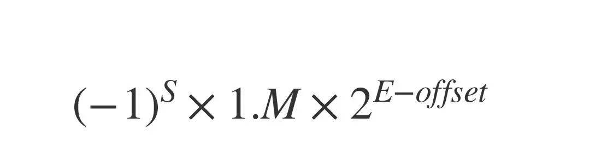

S - 符号位

E - 阶码

offset - 解码偏移量 （float32偏移量是127，float64偏移量是1023）

M - 尾数

<br/>

### 字符串

Go 语言在运行时层面通过一个二元组结构（Data, Len）来表示一个 string 类型变量，其中 Data 是一个指向存储字符串数据内容区域的指针值，Len 是字符串的长度。

```golang
// $GOROOT/src/reflect/value.go

// StringHeader是一个string的运行时表示
type StringHeader struct {
    Data uintptr
    Len  int
}
```

因此，获取字符串的长度无需遍历，时间复杂度很低

<br/>

通过常规 for 迭代与 for range 迭代所得到的结果不同，常规 for 迭代采用的是字节视角；而 for range 迭代采用的是字符视角

### 自定义类型

为什么需要自定义类型？

采用自定义类型时，我们考虑的角度不是优劣，而是需求。以type Myint int32为例，我们这么做，显然是因为int32不能满足我们的需求。哪些需求不能满足呢？第一个就是抽象，我们要建立更高级的抽象；第二个是我们不能为go原生类型int32增加我们想要的方法，只有通过自定义类型来实现。

### 常量

go在常量上的创新

**支持无类型常量，支持隐式自动转型**

无类型常量可以隐式转换（变量不支持隐式转换）

```golang
type myInt int
const n = 13

func main() {
    var a myInt = 5
    fmt.Println(a + n)  // 输出：18
}
```

**可用于实现枚举**

iota

<br/>

可以跳过不想要的枚举

```golang
// $GOROOT/src/syscall/net_js.go
const (
    _ = iota
    IPV6_V6ONLY  // 1
    SOMAXCONN    // 2
    SO_ERROR     // 3
)
```

### 数组和切片

数组类型不仅是逻辑上的连续序列，而且在实际内存分配时也占据着一整块内存。

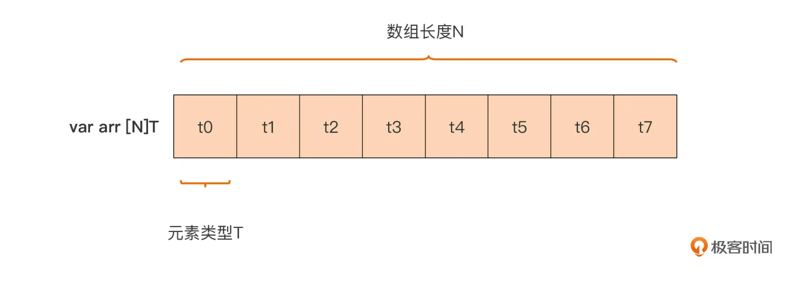

给长度较大的稀疏的数组赋值

```golang
var arr4 = [...]int{
    99: 39, // 将第100个元素(下标值为99)的值赋值为39，其余元素值均为0
}
fmt.Printf("%T\n", arr4) // [100]int
```

<br/>

直接传数组内存开销大

数组类型变量是一个整体，这就意味着一个数组变量表示的是整个数组。这点与 C 语言完全不同，在 C 语言中，数组变量可视为指向数组第一个元素的指针。这样一来，无论是参与迭代，还是作为实际参数传给一个函数 / 方法，Go 传递数组的方式都是纯粹的值拷贝，这会带来较大的内存拷贝开销

<br/>

切片

切片的结构：

```golang
type slice struct {
    array unsafe.Pointer // 指向底层数组的指针
    len   int // 切片的长度
    cap   int // 底层数组的长度，也是切片的最大容量
}
```

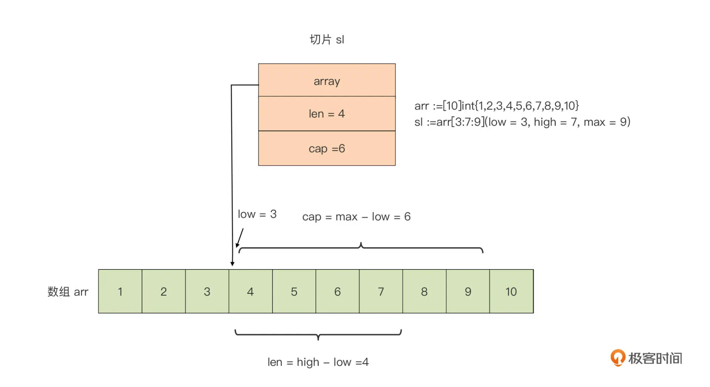

切片好比打开了一个访问与修改数组的“窗口”，通过这个窗口，我们可以直接操作底层数组中的部分元素。这有些类似于我们操作文件之前打开的“文件描述符”（Windows 上称为句柄），通过文件描述符我们可以对底层的真实文件进行相关操作。可以说，切片之于数组就像是文件描述符之于文件

#### 切片的动态扩容

```golang
var s []int
s = append(s, 11) 
fmt.Println(len(s), cap(s)) //1 1
s = append(s, 12) 
fmt.Println(len(s), cap(s)) //2 2
s = append(s, 13) 
fmt.Println(len(s), cap(s)) //3 4 -> 容量不足，创建新底层数组，容量是之前的2倍
s = append(s, 14) 
fmt.Println(len(s), cap(s)) //4 4
s = append(s, 15) 
fmt.Println(len(s), cap(s)) //5 8 -> 容量不足，创建新底层数组，容量是之前的2倍
```

动态分配新的数组，新数组长度会按一定规律扩展。在上面这段代码中，针对元素是 int 型的数组，新数组的容量是<u>当前数组的 2 倍</u>(不是2的指数)。新数组建立后，append 会把旧数组中的数据拷贝到新数组中，之后新数组便成为了切片的底层数组，旧数组会被垃圾回收掉

不过 append 操作的这种自动扩容行为，有些时候会给我们开发者带来一些困惑，比如基于一个已有数组建立的切片，一旦追加的数据操作触碰到切片的容量上限（实质上也是数组容量的上界)，切片就会和原数组解除“绑定”，后续对切片的任何修改都不会反映到原数组中了

<br/>

### map

- <u>不要依赖 map 的元素遍历顺序</u>
- <u>map 不是线程安全的，不支持并发读写</u>
- <u>不要尝试获取 map 中元素（value）的地址</u>

#### 零值不可用

初值为零值 nil 的切片类型变量，可以借助内置的 append 的函数进行操作，这种在 Go 语言中被称为“零值可用”。定义“零值可用”的类型，可以提升我们开发者的使用体验，我们不用再担心变量的初始状态是否有效。
但 map 类型，因为它内部实现的复杂性，无法“零值可用”。

#### key支持复杂结构

```golang
m1 := map[int][]string{
    1: []string{"val1_1", "val1_2"},
    3: []string{"val3_1", "val3_2", "val3_3"},
    7: []string{"val7_1"},
}

type Position struct { 
    x float64 
    y float64
}

m2 := map[Position]string{
    Position{29.935523, 52.568915}: "school",
    Position{25.352594, 113.304361}: "shopping-mall",
    Position{73.224455, 111.804306}: "hospital",
}
```

#### 删除key

```golang
m := map[string]int {
  "key1" : 1,
  "key2" : 2,
}

fmt.Println(m) // map[key1:1 key2:2]
delete(m, "key2") // 删除"key2"
fmt.Println(m) // map[key1:1]
```

#### map的内部实现

Go 运行时使用一张哈希表来实现抽象的 map 类型。运行时实现了 map 类型操作的所有功能，包括查找、插入、删除等。在编译阶段，Go 编译器会将 Go 语法层面的 map 操作，重写成运行时对应的函数调用。大致的对应关系是这样的：

```golang
// 创建map类型变量实例
m := make(map[keyType]valType, capacityhint) → m := runtime.makemap(maptype, capacityhint, m)

// 插入新键值对或给键重新赋值
m["key"] = "value" → v := runtime.mapassign(maptype, m, "key") v是用于后续存储value的空间的地址

// 获取某键的值 
v := m["key"]      → v := runtime.mapaccess1(maptype, m, "key")
v, ok := m["key"]  → v, ok := runtime.mapaccess2(maptype, m, "key")

// 删除某键
delete(m, "key")   → runtime.mapdelete(maptype, m, “key”)
```

这是 map 类型在 Go 运行层实现的示意图：

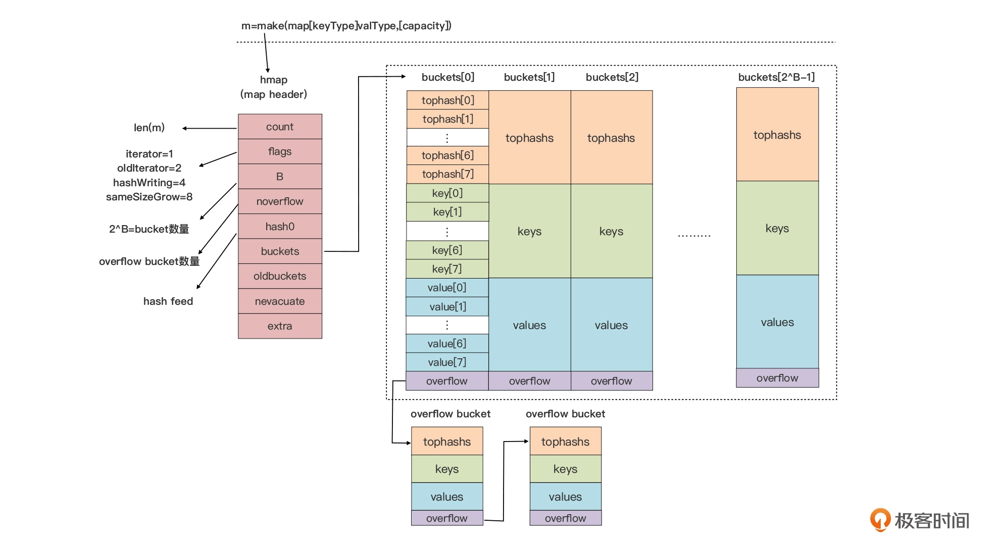

##### hmap

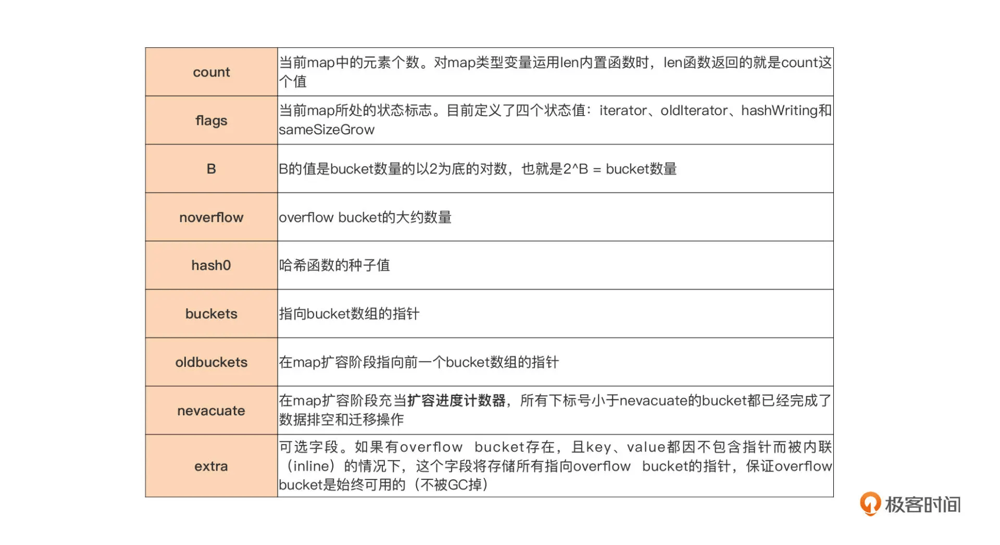

##### tophash

当我们向 map 插入一条数据，或者是从 map 按 key 查询数据的时候，运行时都会使用哈希函数对 key 做哈希运算，并获得一个哈希值（hashcode）。这个 hashcode 非常关键，运行时会把 hashcode“一分为二”来看待，其中<u>低位区的值用于选定 bucket，高位区的值用于在某个 bucket 中确定 key 的位置</u>。

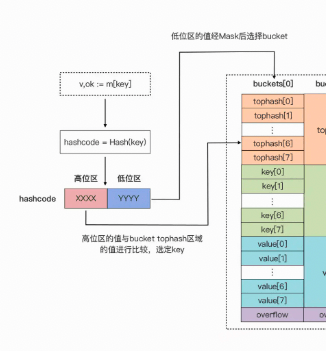

##### map扩容

Go 运行时的 map 实现中引入了一个 LoadFactor（负载因子），当 count > LoadFactor * 2^B 或 overflow bucket 过多时，运行时会自动对 map 进行扩容。目前 Go 最新 1.17 版本 LoadFactor 设置为 6.5（loadFactorNum/loadFactorDen）。

- 如果是因为 overflow bucket 过多导致的“扩容”，实际上运行时会新建一个和现有规模一样的 bucket 数组，然后在 assign 和 delete 时做排空和迁移。
- 如果是因为当前数据数量超出 LoadFactor 指定水位而进行的扩容，那么运行时会建立一个两倍于现有规模的 bucket 数组，但真正的排空和迁移工作也是在 assign 和 delete 时逐步进行的。原 bucket 数组会挂在 hmap 的 oldbuckets 指针下面，直到原 buckets 数组中所有数据都迁移到新数组后，原 buckets 数组才会被释放。

### Struct结构体

<u>用结构体建立对真实世界的抽象</u>

<br/>

#### 类型别名

```golang
type T = S // type alias
```

这种类型定义方式通常用在项目的渐进式重构，还有对已有包的二次封装方面

> 比如A-Z包都依赖foo.F1，但foo.F1迁移到了bar.F1，这时如果没有alias，所有依赖foo.F1的包编译都会失败。
> 
> 但在大型代码仓库中，要想很好的完成这样的重构，更多是协调工作，需要A-Z包同时将依赖foo.F1替换为bar.F1，这很困难，除非是统一行动。于是为了支持一种过渡，原foo包的开发者就希望这个foo.F1 -> bar.F1的迁移对于依赖foo.F1的包来说是透明的，即便迁移完依旧可用。那么有了type alias后，只需在foo包中添加一行 type F1 = bar.F1即可。
> 
> 这样一来，就满足了过渡期的要求。大型代码仓库重构都是这样循序渐进的

<br/>

#### 空标识符

我们还可以用空标识符“_”作为结构体类型定义中的字段名称。这样以空标识符为名称的字段，不能被外部包引用，甚至无法被结构体所在的包使用

<br/>

#### 空结构体

```golang
type Empty struct{} // Empty是一个不包含任何字段的空结构体类型
```

空结构体内存占用为0

基于空结构体建立的channel，是目前能实现的内存占用最小的Gotoutine通信方式

```golang
var c = make(chan Empty) // 声明一个元素类型为Empty的channel
c<-Empty{}               // 向channel写入一个“事件”
```

#### 嵌入字段

```
type Person struct {
    Name string
    Phone string
    Addr string
}

type Book struct {
    Title string
    Person
    ... ...
}

var book Book 
println(book.Person.Phone) // 将类型名当作嵌入字段的名字
println(book.Phone)        // 支持直接访问嵌入字段所属类型中字段
```

支持直接访问嵌入字段所属类型中字段，一种语法糖

> 小凡注：Go中没有继承，不过可以通过这种组合的方式实现继承的效果。

<br/>

我们不能在结构体类型 T 定义中，拥有以自身类型 T 定义的字段，但我们却可以拥有自身类型的指针类型、以自身类型为元素类型的切片类型，以及以自身类型作为 value 类型的 map 类型的字段

```golang
type T struct {
    t  *T           // ok
    st []T          // ok
    m  map[string]T // ok
}     
```

所有类型的指针的大小都是固定长度的。所以编译器可以得到这个指针类型的大小。即便在不知道T大小的情况下也可以

#### 结构体的内存结构

它的元素（结构体字段）一个接着一个以“平铺”形式，存放在一个连续内存块中的

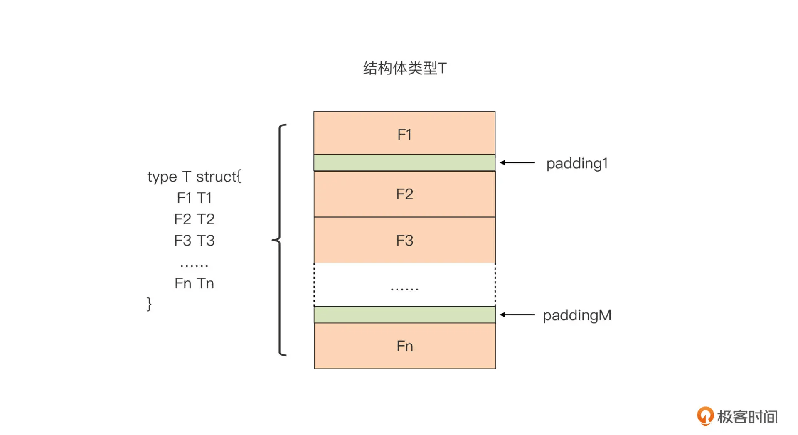

padding填充物

内存对齐的要求

各种内存对象的内存地址不是随意确定的，必须满足特定要求。
对于各种基本数据类型来说，它的变量的内存地址值必须是其类型本身大小的整数倍

对于结构体而言，它的变量的内存地址，只要是它最长字段长度与系统对齐系数两者之间较小的那个的整数倍就可以了。但对于结构体类型来说，我们还要让它每个字段的内存地址都严格满足内存对齐要求。

你在日常定义结构体时，一定要注意结构体中字段顺序，尽量合理排序，降低结构体对内存空间的占用。

```golang
type T struct {
    b byte
    i int64
    u uint16
}

type S struct {
    b byte
    u uint16
    i int64
}

func main() {
    var t T
    println(unsafe.Sizeof(t)) // 24
    var s S
    println(unsafe.Sizeof(s)) // 16
}
```


## 流程


### for循环

#### 带label的`continue`

跳转到外层循环并继续执行外层循环语句的下一个迭代

```golang
func main() {
    var sl = [][]int{
        {1, 34, 26, 35, 78},
        {3, 45, 13, 24, 99},
        {101, 13, 38, 7, 127},
        {54, 27, 40, 83, 81},
    }

outerloop:
    for i := 0; i < len(sl); i++ {
        for j := 0; j < len(sl[i]); j++ {
            if sl[i][j] == 13 {
                fmt.Printf("found 13 at [%d, %d]\n", i, j)
                continue outerloop
            }
        }
    }
}
```

如果将`continue`换成`goto`，不管是内层循环还是外层循环都会被终结，代码将会从 `outerloop` 这个 label 处，开始重新执行我们的嵌套循环语句

<br/>

#### 带label的break

```golang
var gold = 38

func main() {
    var sl = [][]int{
        {1, 34, 26, 35, 78},
        {3, 45, 13, 24, 99},
        {101, 13, 38, 7, 127},
        {54, 27, 40, 83, 81},
    }

outerloop:
    for i := 0; i < len(sl); i++ {
        for j := 0; j < len(sl[i]); j++ {
            if sl[i][j] == gold {
                fmt.Printf("found gold at [%d, %d]\n", i, j)
                break outerloop
            }
        }
    }
}
```

#### for range数组

for range数组时遍历的对象是数组的副本

```golang
func main() {
    var a = [5]int{1, 2, 3, 4, 5}
    var r [5]int

    fmt.Println("original a =", a)

    for i, v := range a { // 此处的a是原来a的一个副本
        if i == 0 {
            a[1] = 12
            a[2] = 13
        }
        r[i] = v
    }

    fmt.Println("after for range loop, r =", r) // [1 2 3 4 5]
    fmt.Println("after for range loop, a =", a) // [1 12 13 4 5]
}
```

### switch

考虑到 switch 语句是按照 case 出现的先后顺序对 case 表达式进行求值的，那么如果我们将匹配成功概率高的 case 表达式排在前面，就会有助于提升 switch 语句执行效率

<br/>

#### fallthrough

case匹配成功后，继续执行下一个case的代码

```golang
func case1() int {
    println("eval case1 expr")
    return 1
}

func case2() int {
    println("eval case2 expr")
    return 2
}

func switchexpr() int {
    println("eval switch expr")
    return 1
}

func main() {
    switch switchexpr() {
    case case1():
        println("exec case1")
        fallthrough
    case case2():
        println("exec case2")
        fallthrough
    default:
        println("exec default")
    }
}
```

#### type switch

```golang
func main() {
    var x interface{} = 13
    switch x.(type) {
    case nil:
        println("x is nil")
    case int:
        println("the type of x is int")
    case string:
        println("the type of x is string")
    case bool:
        println("the type of x is string")
    default:
        println("don't support the type")
    }
}
```

## 函数

```
s := T{}      // 使用复合类型字面值对结构体类型T的变量进行显式初始化
f := func(){} // 使用变量声明形式的函数声明
```

`func(){}`被称为`函数字面值`

<br/>

形式参数（Parameter，简称形参）

实际参数（Argument，简称实参）

<br/>

#### 变长参数

在 Go 中，变长参数实际上是通过切片来实现的。所以，我们在函数体中，就可以使用切片支持的所有操作来操作变长参数，这会大大简化了变长参数的使用复杂度。比如 myAppend 中，我们使用 len 函数就可以获取到传给变长参数的实参个数

<br/>

#### 函数是一等公民

一等公民的定义

> 如果一门编程语言对某种语言元素的创建和使用没有限制，我们可以像对待值（value）一样对待这种语法元素，那么我们就称这种语法元素是这门编程语言的“一等公民”。拥有“一等公民”待遇的语法元素可以存储在变量中，可以作为参数传递给函数，可以在函数内部创建并可以作为返回值从函数返回

- Go函数可以存储在变量中
- Go函数支持在函数内创建并通过返回值返回
- Go函数可以作为参数传给函数
- Go函数拥有自己的类型

```golang
// $GOROOT/src/net/http/server.go
type HandlerFunc func(ResponseWriter, *Request)

// $GOROOT/src/sort/genzfunc.go
type visitFunc func(ast.Node) ast.Visitor
```

#### 利用闭包简化函数调用

```golang
func times(x, y int) int {
  return x * y
}

func partialTimes(x int) func(int) int {
  return func(y int) int {
    return times(x, y)
  }
}

func main() {
  timesTwo := partialTimes(2)   // 以高频乘数2为固定乘数的乘法函数
  timesThree := partialTimes(3) // 以高频乘数3为固定乘数的乘法函数
  timesFour := partialTimes(4)  // 以高频乘数4为固定乘数的乘法函数
  fmt.Println(timesTwo(5))   // 10，等价于times(2, 5)
  fmt.Println(timesTwo(6))   // 12，等价于times(2, 6)
  fmt.Println(timesThree(5)) // 15，等价于times(3, 5)
  fmt.Println(timesThree(6)) // 18，等价于times(3, 6)
  fmt.Println(timesFour(5))  // 20，等价于times(4, 5)
  fmt.Println(timesFour(6))  // 24，等价于times(4, 6)
}
```

#### 构造error

```golang
err := errors.New("your first demo error")
errWithCtx = fmt.Errorf("index %d is out of bounds", i)
```

#### 封装错误

如果 error 类型变量的底层错误值是一个包装错误（Wrapped Error），errors.Is 方法会沿着该包装错误所在错误链（Error Chain)，与链上所有被包装的错误（Wrapped Error）进行比较，直至找到一个匹配的错误为止

```golang
var ErrSentinel = errors.New("the underlying sentinel error")

func main() {
  err1 := fmt.Errorf("wrap sentinel: %w", ErrSentinel)
  err2 := fmt.Errorf("wrap err1: %w", err1)
    println(err2 == ErrSentinel) //false
    println(errors.Is(err2, ErrSentinel)) // true
}
```

errors.As()：检视类型； errors.Is()：检视错误。

#### panic

panic可以提示潜在风险

```golang
func (d *decodeState) valueQuoted() any {
	switch d.opcode {
	default:
		panic(phasePanicMsg) // 潜在风险：未知类型

	case scanBeginArray, scanBeginObject:
		d.skip()
		d.scanNext()

	case scanBeginLiteral:
		v := d.literalInterface()
		switch v.(type) {
		case nil, string:
			return v
		}
	}
	return unquotedValue{}
} 
```

#### defer

defer 关键字后面只能接函数（或方法），这些函数被称为 deferred 函数。defer 将它们注册到其所在 Goroutine 中，用于存放 deferred 函数的栈数据结构中，这些 deferred 函数将在执行 defer 的函数退出前，按后进先出（LIFO）的顺序被程序调度执行（如下图所示）。

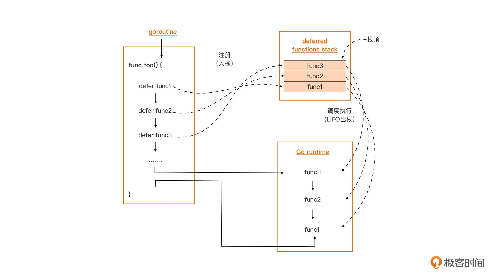

append、cap、len、make、new、imag 等内置函数都是不能直接作为 deferred 函数的，而 close、copy、delete、print、recover 等内置函数则可以直接被 defer 设置为 deferred 函数

<br/>

defer求值时机

```golang
func foo1() {
    for i := 0; i <= 3; i++ {
        defer fmt.Println(i) // 3 2 1 0 deferred函数是fmt.Println(0) fmt.Println(1) fmt.Println(2) fmt.Println(3)
    }
}

func foo2() {
    for i := 0; i <= 3; i++ {
        defer func(n int) {
            fmt.Println(n) // 3 2 1 0 deferred函数是 func(0) func(1) func(2) func(3)
        }(i)
    }
}

func foo3() {
    for i := 0; i <= 3; i++ {
        defer func() {
            fmt.Println(i) // 4 4 4 4 deferred函数是func func func func
        }()
    }
}

func main() {
    fmt.Println("foo1 result:")
    foo1()
    fmt.Println("\nfoo2 result:")
    foo2()
    fmt.Println("\nfoo3 result:")
    foo3()
}
```

#### 函数和方法

方法带接收器receiver

<br/>

打印方法集合

```golang
func dumpMethodSet(i interface{}) {
    dynTyp := reflect.TypeOf(i)

    if dynTyp == nil {
        fmt.Printf("there is no dynamic type\n")
        return
    }

    n := dynTyp.NumMethod()
    if n == 0 {
        fmt.Printf("%s's method set is empty!\n", dynTyp)
        return
    }

    fmt.Printf("%s's method set:\n", dynTyp)
    for j := 0; j < n; j++ {
        fmt.Println("-", dynTyp.Method(j).Name)
    }
    fmt.Printf("\n")
}
```

Go 语言规定，*T 类型的方法集合包含所有以 *T 为 receiver 参数类型的方法，以及所有以 T 为 receiver 参数类型的方法

<br/>

## 接口

### 类型嵌入

接口=方法集

接口类型的类型嵌入的本质，就是嵌入类型的方法集合并入到新接口类型的方法集合中

```golang
type S1 struct {
    T1 // 嵌入，S1可以调用T1的方法集
}

type S2 struct { 
    T1 T1  // 非嵌入，不可调用
}
```

结构体的方法集合不允许存在交集，但是接口的方法集合可以。因为接口只是方法定义，存在交集的方法的定义还是相同的；而结构体的方法涉及到实现，存在交集时编译器无法决定要用哪个实现。

<br/>

结构体类型的类型嵌入。通过在结构体定义中的嵌入字段，我们可以实现对嵌入类型的方法集合的“继承”。但这种“继承”并非经典面向对象范式中的那个继承，Go 中的“继承”实际是一种<u>组合</u>，更具体点是组合思想下<u>代理（delegate）模式</u>的运用，也就是新类型代理了其嵌入类型的所有方法。

<br/>

<u>结构体类型嵌入接口类型在日常编码中有一个妙用，就是可以简化单元测试的编写</u>

<br/>

可以在接口中嵌入接口

在结构体中嵌入接口

在结构体中嵌入结构体

<br/>

```
type T struct { T1 *T2 } 
```

类型 T 的方法集合 = T1 的方法集合 + `*T2` 的方法集合 

 类型`*T `的方法集合 = `*T1 `的方法集合 + `*T2` 的方法集合

<br/>

type T1 T   T1没有"继承"T的方法集

type T2=T  T2”继承“了T的方法集

<br/>

结构体类型的方法集合包含嵌入的接口类型的方法集合；

当结构体类型 T 包含嵌入字段 E 时，*T 的方法集合不仅包含类型 E 的方法集合，还要包含类型 *E 的方法集合

<br/>

<br/>

### 获取goroutine的ID

```golang
// trace2/trace.go
var goroutineSpace = []byte("goroutine ")

func curGoroutineID() uint64 {
    b := make([]byte, 64)
    b = b[:runtime.Stack(b, false)]
    // Parse the 4707 out of "goroutine 4707 ["
    b = bytes.TrimPrefix(b, goroutineSpace)
    i := bytes.IndexByte(b, ' ')
    if i < 0 {
        panic(fmt.Sprintf("No space found in %q", b))
    }
    b = b[:i]
    n, err := strconv.ParseUint(string(b), 10, 64)
    if err != nil {
        panic(fmt.Sprintf("Failed to parse goroutine ID out of %q: %v", b, err))
    }
    return n
}
```

<br/>

### 接口即契约

Go 规定：如果一个类型 T 的方法集合是某接口类型 I 的方法集合的等价集合或超集，我们就说类型 T 实现了接口类型 I，那么类型 T 的变量就可以作为合法的右值赋值给接口类型 I 的变量。


如果一个变量的类型是空接口类型，由于空接口类型的方法集合为空，这就意味着任何类型都实现了空接口的方法集合，所以我们可以将任何类型的值作为右值，赋值给空接口类型的变量。


类型断言

```go
v, ok := i.(T)  // 如果 i 之前被赋予的值不是 T 类型的值，那么这个语句执行后，变量 ok 的值为 false，变量 v 的类型还是那个要还原的类型，但它的值是类型 T 的零值。

v := i.(T)  // 一旦接口变量 i 之前被赋予的值不是 T 类型的值，那么这个语句将抛出 panic
```


隐式契约

Go 语言中接口类型与它的实现者之间的关系是隐式的，不需要像其他语言（比如 Java）那样要求实现者显式放置“implements”进行修饰，实现者只需要实现接口方法集合中的全部方法便算是遵守了契约，并立即生效了。


### 尽量定义小接口

小接口的好处

1. 接口越小，抽象能力越强

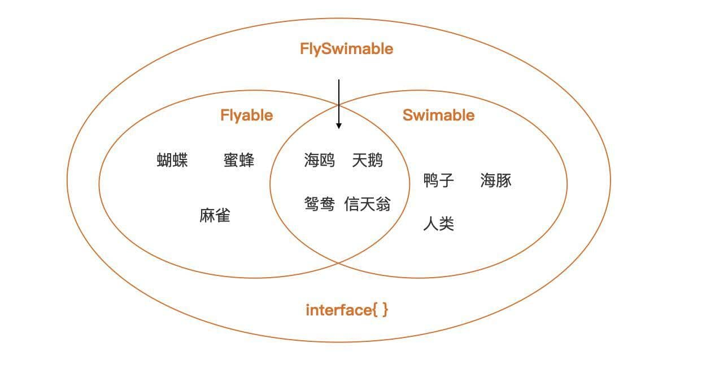

2. 小接口易于实现和测试
3. 小接口表示的“契约”职责单一，易于复用组合


如何定义小接口

第一步 别管接口大小，先抽象出接口

初期，我们先不要介意这个接口集合中方法的数量，因为对问题域的理解是循序渐进的，在第一版代码中直接定义出小接口可能并不现实。


第二步 将大接口拆分成小接口

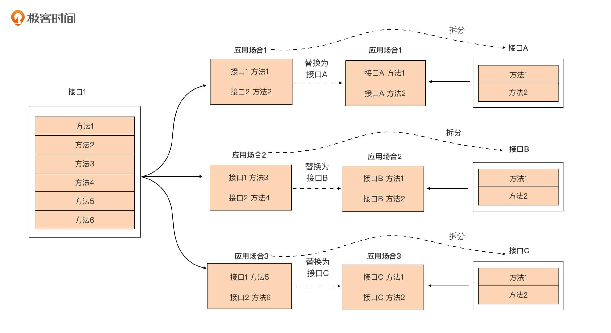

### 接口类型的内部表示

- eface 用于表示没有方法的空接口（empty interface）类型变量，也就是 interface{}类型的变量；

- iface 用于表示其余拥有方法的接口 interface 类型变量。

```golang
// $GOROOT/src/runtime/runtime2.go
type iface struct {
    tab  *itab
    data unsafe.Pointer
}

type eface struct {
    _type *_type
    data  unsafe.Pointer
}

// $GOROOT/src/runtime/type.go

type _type struct {
    size       uintptr
    ptrdata    uintptr // size of memory prefix holding all pointers
    hash       uint32
    tflag      tflag
    align      uint8
    fieldAlign uint8
    kind       uint8
    // function for comparing objects of this type
    // (ptr to object A, ptr to object B) -> ==?
    equal func(unsafe.Pointer, unsafe.Pointer) bool
    // gcdata stores the GC type data for the garbage collector.
    // If the KindGCProg bit is set in kind, gcdata is a GC program.
    // Otherwise it is a ptrmask bitmap. See mbitmap.go for details.
    gcdata    *byte
    str       nameOff
    ptrToThis typeOff
}

// $GOROOT/src/runtime/runtime2.go
type itab struct {
    inter *interfacetype
    _type *_type
    hash  uint32 // copy of _type.hash. Used for type switches.
    _     [4]byte
    fun   [1]uintptr // variable sized. fun[0]==0 means _type does not implement inter.
}

// $GOROOT/src/runtime/type.go
type interfacetype struct {
    typ     _type
    pkgpath name
    mhdr    []imethod
}
```

eface空接口在内存中的表示

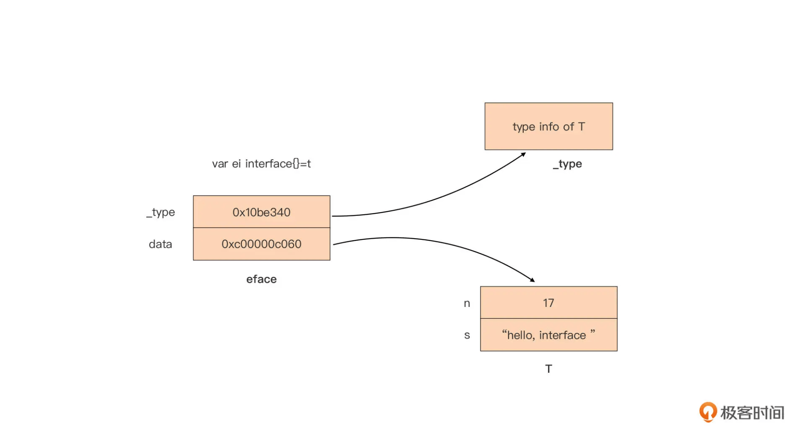

iface在内存中的表示

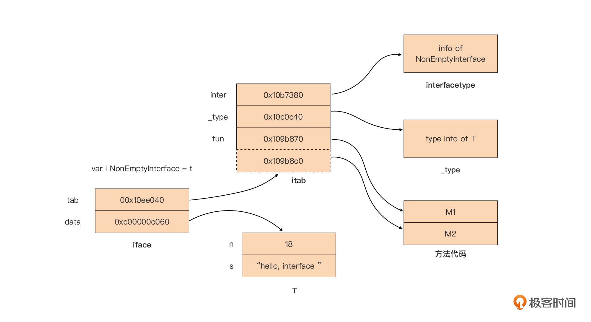

## 参考

1. [Go 语言之父 Rob Pike 的 Go 语言课程幻灯片](https://www.cs.cmu.edu/afs/cs.cmu.edu/academic/class/15440-f11/go/doc/GoCourseDay1.pdf)
