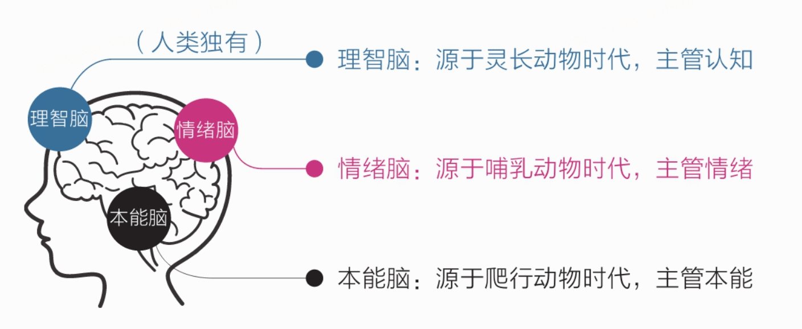
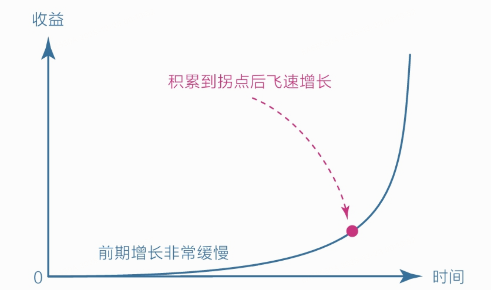
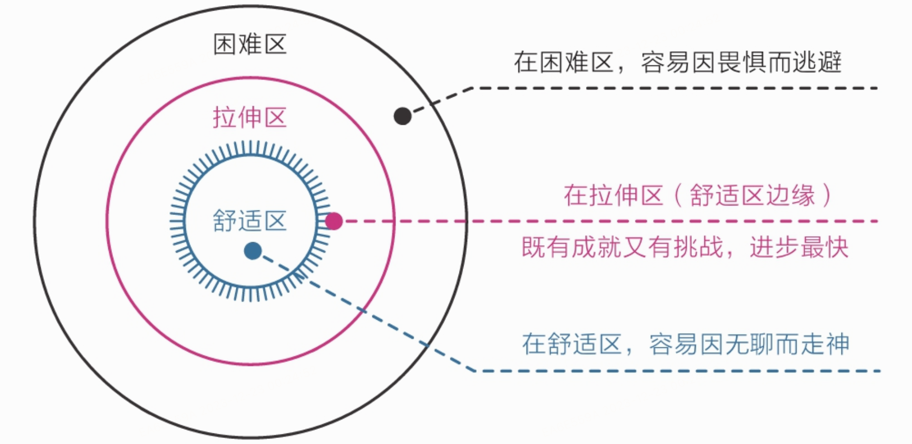
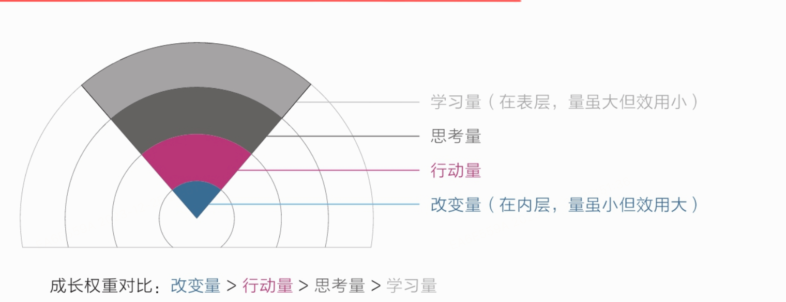
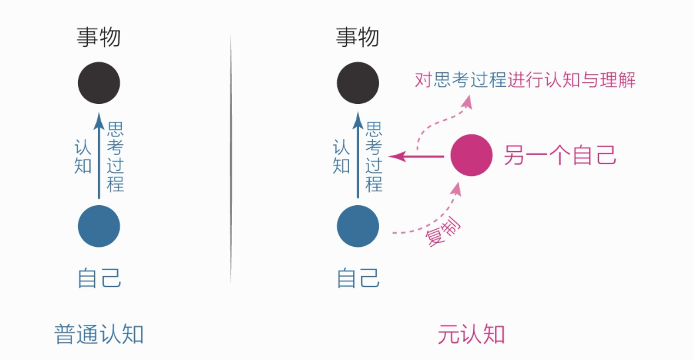
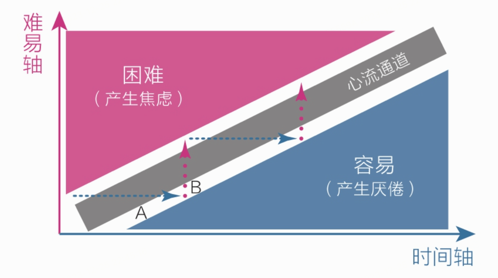
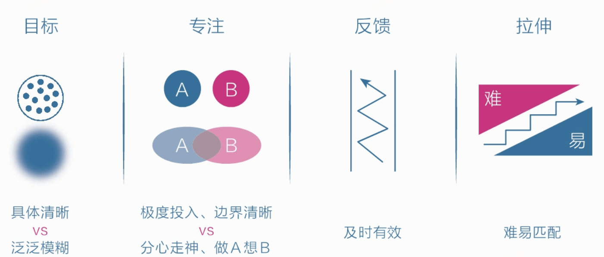
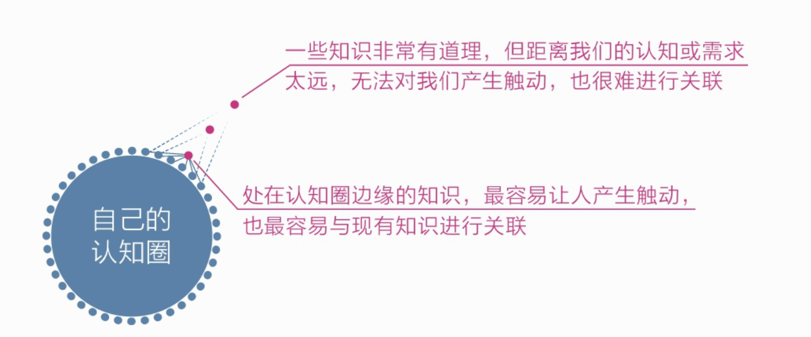
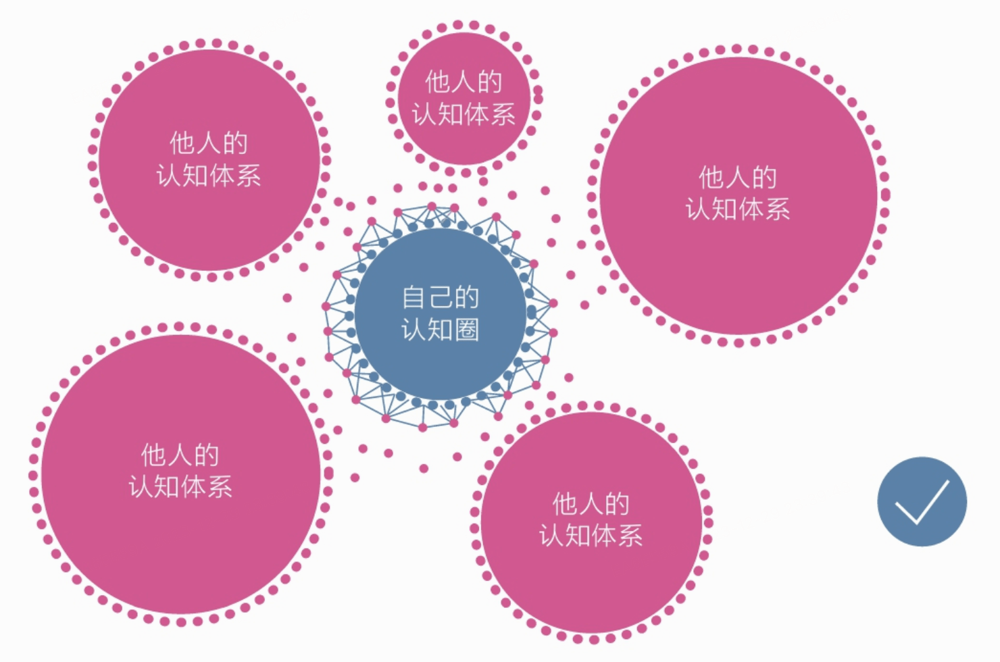
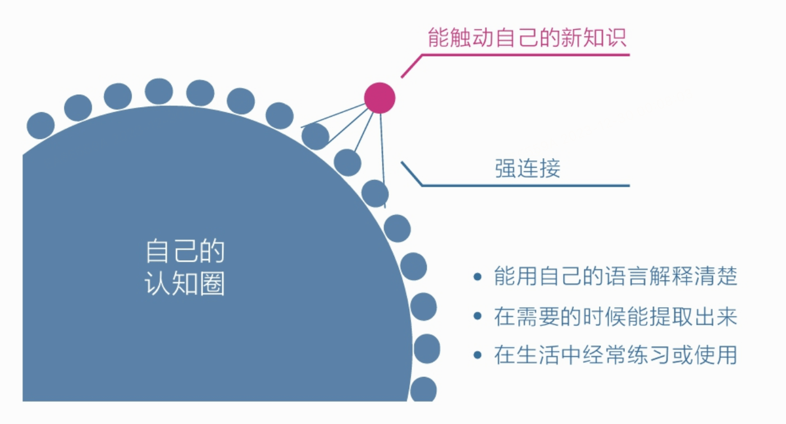

* TOC
{:toc}
### 三重大脑

理智脑对大脑的控制能力很弱，所以我们在生活中做的大部分决策往往源于本能和情绪，而非理智。

人的天性

- 避难趋易——只做简单和舒适的事，喜欢在核心区域周边打转，待在舒适区内逃避真正的困难。

- 急于求成——凡事希望立即看到结果，对不能马上看到结果的事往往缺乏耐心，非常容易放弃。

### 焦虑

不应该跟那些所谓的成功人士比现状，如果非要比，也应该跟他们刚起步时的状况比。事实上我更应该跟自己的过去比，哪怕好那么一点点，也是值得的！

### 复利曲线

### 舒适圈

### 成长权重

很多人之所以痛苦焦虑，就是因为只盯着表层的学习量。他们读了很多书、报了很多课，天天打卡、日日坚持，努力到感动自己，但就是没有深入关注过自己的思考、行动和改变，所以总是感到学无所获，甚至会认为是自己不够努力，应该继续加大学习量，结果陷入了“越学越焦虑，越焦虑越学”的恶性循环。

### 熔断不读书法

《好好学习》一书的作者成甲在第一篇文章中提到：他自创了一个“熔断不读书法”。所谓“熔断不读书法”，意思就是在读书时一旦看到有启发的内容，就触发熔断点，立刻停止读书。停止读书之后做什么呢？围绕这个触发点对自己提问。·为什么刚才这个点让我有启发？·我能够把这个启发点用在3个不同的事情上吗？·这个启发点有没有其他类似的知识？

### 元认知

### 专注

人为什么不能专注？

人类的大脑使用背景关联记忆的方法，即借助事情的背景或线索等提示信息来让我们想起特定内容。

背景关联记忆的一个副作用就是：我们感观所听到、看到、摸到、尝到、嗅到的任何信息，都会引出一些其他记忆内容，又因为感观受潜意识控制，而潜意识永不消失，所以只要我们醒着，这种分心走神随时都可能发生。

怎样才能专注？让感受回归行动。

只要一招即可扭转局面：让感受回归行动。跑步时，把感受收回来，悉心体会抬腿摆臂、呼吸吐纳和迎面的微风；睡觉时，把感受收回来，悉心感受身体的紧张与松弛；吃饭时，把感受收回来，感受每一口饭菜的香甜，体会味觉从有到无的整个过程，不要第一口还没吃完就急着往嘴里塞第二口饭菜。

### 心流通道

当人们对当前的活动感到厌倦时，说明应该提高难度；当人们对当前的活动感到焦虑时，说明应该保持这个水平专注练习，如此反复交替就可以让自己进入心流通道，沉浸其中。

### 刻意练习

### 认知体系

我们不需要全盘掌握他人的知识体系，只需要掌握那些最能触动自己、离自己需求最近的知识

怎么把触动自己的新知识加入自己的认知体系

